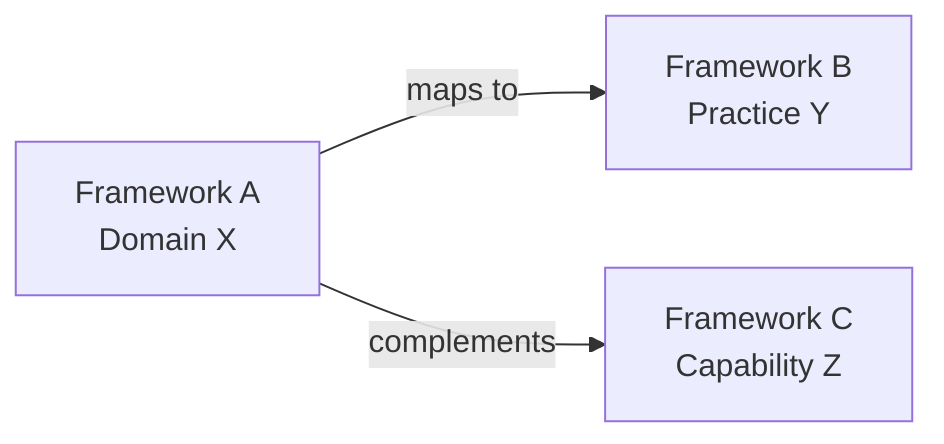

# Framework Comparison Skill

Use this skill when you need to **compare frameworks**, identify overlaps, or produce integration guidance for a consulting engagement.

## Prerequisites

- Read `.agent/rules.md` for content standards.
- Review the `README.md` of each framework being compared.
- Understand the client/audience context (e.g., banking/financial services, cloud-native, etc.).

## Comparison Methodology

### 1. Select Comparison Dimensions

Choose dimensions relevant to the audience. Common dimensions include:

| Dimension | Description |
|-----------|-------------|
| **Primary Focus** | What problem does the framework solve? |
| **Scope** | Operational ↔ Strategic range |
| **Governance Model** | How does it define governance vs. management? |
| **Key Components** | Core processes, practices, domains, capabilities |
| **Certification** | Who certifies? What levels exist? |
| **Maturity/Capability Model** | How does it measure organizational maturity? |
| **Implementation Approach** | Prescriptive vs. adaptive? Phased rollout? |
| **Industry Adoption** | Where is it most commonly used? |
| **Regulatory Alignment** | Which regulations does it help satisfy? |
| **Cost of Adoption** | Training, tooling, organizational change costs |

### 2. Build the Comparison Matrix

Produce a markdown table with one row per dimension and one column per framework:

```markdown
| Dimension | Framework A | Framework B | Framework C |
|-----------|-------------|-------------|-------------|
| Focus     | ...         | ...         | ...         |
| Scope     | ...         | ...         | ...         |
```

### 3. Map Overlaps and Synergies

Create a mapping that shows where frameworks complement each other:



Document specific mappings in a table:

```markdown
| Framework A Component | Framework B Equivalent | Relationship |
|-----------------------|------------------------|-------------|
| Domain X              | Practice Y             | Direct mapping |
| Process Z             | Capability W           | Complementary |
```

### 4. Identify Gaps

Note areas where one framework covers topics that others do not. This is valuable for consulting recommendations.

### 5. Produce Integration Guidance

For consulting engagements, answer:

- **Which framework should be the primary governance layer?**
- **How do the frameworks layer together?** (e.g., COBIT governs → ITIL operationalizes → ITSM executes)
- **What is the recommended adoption sequence?**
- **What are potential conflicts or overlaps to manage?**

## Output Format

The comparison output should be a standalone markdown file placed either:
- In the root directory (for cross-framework comparisons), or
- In a specific framework's directory (for targeted comparisons)

### File Structure

```markdown
# <Framework A> vs <Framework B> [vs <Framework C>]

**Last Updated:** <Month Year>

## Overview
<Why this comparison matters>

## Comparison Matrix
<Table from Step 2>

## Overlap & Synergy Map
<Diagram and table from Step 3>

## Gaps
<From Step 4>

## Integration Recommendations
<From Step 5>

## Sources
<Official references>
```

## Consulting Context Tips

- **Banking/Financial Services:** Emphasize regulatory compliance alignment (e.g., OJK, BI, Basel III/IV), risk management capabilities, and audit readiness.
- **Cloud Transformation:** Focus on FinOps integration, DevOps alignment, and agile service management.
- **Maturity Assessment:** When a client needs to know "where to start," recommend a maturity assessment using the most appropriate framework's model.

## Quality Checklist

- [ ] All selected dimensions are addressed
- [ ] Comparison matrix is factually accurate and version-specific
- [ ] At least one mermaid diagram showing relationships
- [ ] Integration guidance is actionable, not generic
- [ ] Client/industry context considered
- [ ] Sources cited for all factual claims
