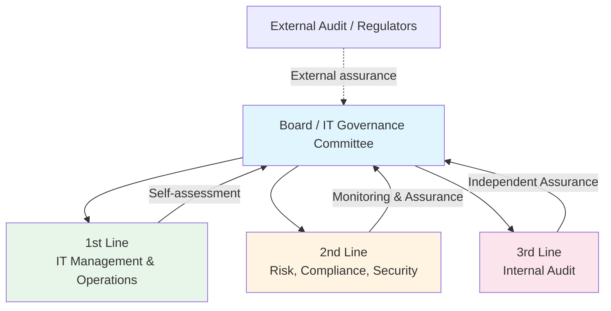

# COBIT 2019 Practical Operations Guide

**Last Updated:** February 2025  
**Version:** COBIT 2019  
**Level:** Advanced

---

## Overview

This guide covers the day-to-day operational work of governing IT using COBIT 2019 — the meetings, documents, tools, roles, and governance ceremonies. While COBIT provides the governance framework, this document shows what a consultant or IT governance practitioner actually does to make governance real and measurable.

---

## Meeting Cadence

| Meeting | COBIT Domain | Frequency | Duration | Attendees | Purpose |
|---------|-------------|-----------|----------|-----------|---------|
| **IT Governance Board** | EDM (Evaluate, Direct, Monitor) | Quarterly | 90 min | CIO, CFO, CISO, Head of Audit, Business execs | Set IT strategic direction; evaluate investments; monitor governance |
| **IT Management Committee** | APO (Align, Plan, Organize) | Monthly | 60 min | IT Directors, Domain leads, PMO lead | Operational planning, resource allocation, initiative tracking |
| **Risk & Compliance Review** | APO12 (Managed Risk) / MEA | Monthly | 60 min | CISO, Risk Manager, Compliance Officer, Internal Audit | Review IT risk register, compliance status, audit findings |
| **Architecture Review Board** | APO03 (Managed Architecture) | Monthly | 60 min | Enterprise Architect, Domain architects, IT Director | Review architecture compliance, approve exceptions |
| **Project/Program Review** | BAI01 (Managed Programs) | Bi-weekly | 60 min | PMO lead, Project Managers, Sponsors | Track project health, budget, risks, dependencies |
| **Change Review (CAB)** | BAI06 (Managed Changes) | Weekly | 60–90 min | Change Manager, Technical leads, Service Owners | Assess and authorize IT changes |
| **Security Operations Review** | DSS05 (Managed Security) | Weekly | 45 min | CISO, SOC lead, Security Engineers | Review security incidents, vulnerability status, threat intel |
| **Service Performance Review** | DSS (Deliver, Service, Support) | Monthly | 60 min | IT Service Manager, Service Owners, Business reps | SLA review, incident trends, capacity planning |
| **Audit & Assurance Meeting** | MEA (Monitor, Evaluate, Assess) | Quarterly | 90 min | Head of Audit, IT Governance Officer, CISO, External Auditors | Audit findings, control assessments, remediation tracking |

---

## Key Documents & Templates

### Governance-Level Documents

| Document | COBIT Domain | Purpose | Review Cycle |
|----------|-------------|---------|-------------|
| **IT Governance Charter** | EDM | Defines governance structure, authority, decision rights | Annually |
| **IT Strategic Plan** | APO02 (Managed Strategy) | Aligns IT direction with business strategy | Annually |
| **IT Investment Portfolio** | APO05 (Managed Portfolio) | Prioritized list of IT investments with business cases | Quarterly |
| **Enterprise Architecture Blueprint** | APO03 (Managed Architecture) | Current and target state architecture | Semi-annually |
| **IT Risk Register** | APO12 (Managed Risk) | Identified risks with likelihood, impact, mitigation plans | Monthly |
| **IT Policy Framework** | APO01 (Managed IT Framework) | Set of IT policies governing behavior and standards | Annually |

### Operational Documents

| Document | COBIT Domain | Purpose | Review Cycle |
|----------|-------------|---------|-------------|
| **Control Assessment Report** | MEA01 | Status of IT controls — effective, partially effective, ineffective | Quarterly |
| **Audit Findings & Remediation Tracker** | MEA02 | Open audit findings with remediation plans and target dates | Monthly |
| **Capability Maturity Assessment** | All domains | Assessment of current maturity level (0–5) per process | Annually |
| **Compliance Register** | MEA03 (Managed Compliance) | Regulatory requirements mapped to IT controls | Quarterly |
| **Business Case Template** | APO05 | Standard template for IT investment proposals | Per initiative |
| **RACI Matrix** | APO01 | Roles and responsibilities for each governance process | Annually |

---

## Tools & Technology Ecosystem

COBIT operations require tools that aggregate data, track compliance, and provide executive visibility. The primary category is GRC (Governance, Risk, and Compliance) software.

### 1. Integrated GRC Platforms
- **ServiceNow GRC (Integrated Risk Management):** Highly popular because it connects IT governance directly to the IT operational data (CMDB, Incidents, Changes) already living in ServiceNow. It is heavily utilized for policy management, risk registers, and automated control testing.
- **RSA Archer / MetricStream / OneTrust:** Enterprise GRC platforms used extensively to manage the MEA (Monitor, Evaluate, Assess) domain, tracking audit findings, regulatory mappings, and enterprise risks.

### 2. Strategic Portfolio & Enterprise Architecture
- **Tools:** ServiceNow SPM (Strategic Portfolio Management), LeanIX, Mega HOPEX, Planview.
- **Usage:** Supports the APO (Align, Plan, Organize) domain. Used to track IT investments, business cases, project health, and architecture roadmaps.

### 3. Audit Management Systems
- **Tools:** AuditBoard, TeamMate, Galvanize (HighBond).
- **Usage:** Supports internal and external audit teams in testing COBIT controls, gathering evidence, and tracking remediation plans.

### 4. Continuous Control Monitoring (CCM)
- **Tools:** Splunk, Varonis, Qualys.
- **Usage:** Automates the testing of security and operational controls (e.g., "Are all servers patched?", "Is sensitive data exposed?") and feeds this compliance data directly into the GRC platform dashboard.

---

## Roles & Responsibilities

| Role | COBIT Alignment | Key Responsibilities |
|------|----------------|---------------------|
| **IT Governance Officer** | EDM domain | Facilitate governance board; ensure COBIT adoption; report governance maturity |
| **CIO / IT Director** | EDM01 — Governance Direction | Set IT direction; ensure value delivery; manage risks |
| **CISO** | APO13 / DSS05 | Manage information security; operate SOC; report security posture |
| **Chief Risk Officer (CRO)** | APO12 | Own IT risk framework; chair risk reviews; report to board |
| **IT Audit Manager** | MEA02 | Plan and execute IT audits; track remediation; report assurance |
| **Compliance Officer** | MEA03 | Map regulatory requirements to IT controls; monitor compliance |
| **Enterprise Architect** | APO03 | Maintain architecture blueprint; enforce architecture standards |
| **IT Service Manager** | DSS domain | Manage service delivery operations; report service performance |
| **PMO Lead** | BAI01 | Manage project portfolio; track delivery; report project health |
| **Process Owner** | Per objective | Own specific COBIT processes; drive maturity improvement |

---

## Governance Ceremonies

### Three Lines Model (Adapted for COBIT)

### Control Assessment Cycle

| Activity | Frequency | Owner | Output |
|----------|-----------|-------|--------|
| **Control Self-Assessment (CSA)** | Quarterly | Process Owners | CSA reports per process |
| **Internal Audit Review** | Per audit plan | IT Audit Manager | Audit findings report |
| **External Audit** | Annually | External Auditors | Audit opinion and management letter |
| **Regulatory Examination** | Per regulator schedule | Regulators | Examination findings |
| **Maturity Assessment** | Annually | IT Governance Officer | Maturity scorecard (0–5 per domain) |

---

## Reporting & Metrics

### Governance Dashboard

| Metric | Scope | Target | Frequency |
|--------|-------|--------|-----------|
| **Overall IT Governance Maturity** | All 40 objectives | Level 3+ (Defined) | Annually |
| **Open Audit Findings** | MEA02 | <10 high/critical open | Monthly |
| **Audit Remediation On-Time %** | MEA02 | ≥90% | Monthly |
| **IT Risk Items (High/Critical)** | APO12 | <5 unmitigated | Monthly |
| **Compliance Coverage** | MEA03 | 100% of required regulations mapped | Quarterly |
| **IT Investment ROI** | APO05 | Positive for ≥80% of investments | Annually |
| **Architecture Compliance Rate** | APO03 | ≥90% for new projects | Quarterly |
| **Change Success Rate** | BAI06 | ≥95% | Monthly |
| **Security Incidents (Critical)** | DSS05 | Zero uncontained P1 | Monthly |

---

## Banking / Financial Services Context

> [!IMPORTANT]
> COBIT in banking directly supports regulatory compliance obligations:

| Regulation | COBIT Mapping | Practical Requirement |
|-----------|--------------|----------------------|
| **OJK POJK (Indonesia)** | MEA03, APO12, DSS05 | IT risk management, information security, quarterly reporting |
| **Bank Indonesia (BI)** | APO13, DSS05 | IT security framework, cyber incident reporting |
| **Basel III/IV** | APO12, MEA01 | Operational risk management, control adequacy |
| **PCI DSS** | DSS05, BAI06 | Cardholder data protection, change management controls |
| **SOX / SOC Compliance** | MEA02, BAI06 | IT general controls, access management, change management |
| **GDPR / Data Privacy** | APO14 (Managed Data) | Data governance, privacy controls, breach notification |

### Banking-Specific Governance Add-Ons

- **Regulator Liaison Role** — Dedicated person to interface with OJK, BI, or equivalent
- **Board-Level IT Risk Reporting** — Quarterly IT risk dashboard to Board Risk Committee
- **Three Lines of Defense** — Explicitly implement the three lines model for IT governance
- **Annual Regulatory Self-Assessment** — Map COBIT controls to regulatory requirements and self-assess

---

## Key Takeaways

- COBIT governance operates on **quarterly strategic → monthly tactical → weekly operational** cadence
- The **GRC platform** (e.g., ServiceNow GRC, RSA Archer) is the central tool for COBIT operations
- **Control assessments, audit tracking, and risk registers** are the core operational artifacts
- In banking, COBIT directly maps to **OJK, BI, Basel, and PCI DSS** requirements
- The **Three Lines Model** provides clear assurance and accountability structure

## Cross-References

- [COBIT Foundation](../01_foundation/)
- [COBIT Implementation Guide](./01_implementation_guide.md)
- [ITIL Practical Operations](../ITIL/04_practices/04_practical_operations.md)
- [TOGAF Practical Operations](../TOGAF/03_advanced/02_practical_operations.md)
