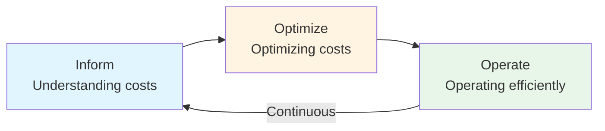

# Introduction to FinOps

**Level:** Foundation  
**Framework:** FinOps Foundation  
**Last Updated:** January 2025

---

## Learning Objectives

By the end of this document, you should understand:
- What FinOps is
- Why FinOps is needed
- Key concepts and terminology
- FinOps vs traditional IT finance
- Benefits of FinOps

---

## What is FinOps?

**FinOps** (Financial Operations) is a **cultural practice** and **operating model** that brings together Finance, Technology, and Business teams to manage cloud costs effectively.

### Definition

FinOps brings financial accountability to the variable spend model of cloud, enabling teams to make business trade-offs between speed, cost, and quality.

### Key Characteristics

- **Cultural Practice:** Requires cultural change, not just tools
- **Collaborative:** Cross-functional teams working together
- **Data-Driven:** Decisions based on data and metrics
- **Continuous:** Ongoing practice, not a one-time project
- **Cloud-Focused:** Primarily for cloud spending

---

## Why FinOps?

### The Cloud Cost Challenge

**Traditional IT:**
- Fixed costs
- Predictable spending
- Long-term contracts
- Centralized procurement

**Cloud IT:**
- Variable costs
- Unpredictable spending
- Pay-as-you-go model
- Distributed spending

### The Problem

- **Lack of Visibility:** Don't know where money is being spent
- **Lack of Control:** Can't control cloud spending
- **Lack of Accountability:** No one owns cloud costs
- **Waste:** Significant waste in cloud spending
- **Slow Decisions:** Slow decision-making process

### The Solution: FinOps

FinOps addresses these challenges by:
- Providing visibility into cloud costs
- Enabling control over cloud spending
- Creating accountability for cloud costs
- Optimizing cloud spending
- Enabling fast, data-driven decisions

---

## FinOps Framework (2024 Update)

The FinOps Framework consists of:

### Four Domains

1. **Understand** - Understanding cloud costs and usage
2. **Quantify** - Quantifying value and performance
3. **Optimize** - Optimizing costs and usage
4. **Manage** - Managing cloud spending

### Six Capabilities

1. **Understanding Cloud Usage and Cost**
2. **Performance Tracking and Benchmarking**
3. **Real-Time Decision Making**
4. **Cloud Rate Optimization**
5. **Cloud Usage Optimization**
6. **Organizational Alignment**

### FinOps Scopes (2025)

- **Public Cloud:** AWS, Azure, GCP, etc.
- **Private/Datacenter Cloud:** On-premises cloud
- **SaaS:** Software as a Service

---

## FinOps Lifecycle

The FinOps lifecycle consists of **3 phases**:

### Phase 1: Inform

**Purpose:** Understanding costs and usage.

**Activities:**
- Allocate costs
- Report on costs
- Understand usage
- Identify waste

### Phase 2: Optimize

**Purpose:** Optimizing costs and usage.

**Activities:**
- Optimize rates
- Optimize usage
- Rightsize resources
- Eliminate waste

### Phase 3: Operate

**Purpose:** Operating efficiently.

**Activities:**
- Make decisions
- Execute optimizations
- Monitor performance
- Maintain efficiency

**Note:** These phases are **iterative** and **continuous**.

---

## FinOps vs Traditional IT Finance

| Aspect | Traditional IT Finance | FinOps |
|--------|------------------------|--------|
| **Cost Model** | Fixed, predictable | Variable, unpredictable |
| **Visibility** | Limited, monthly | Real-time, continuous |
| **Ownership** | Centralized | Distributed |
| **Decision Making** | Slow, monthly | Fast, real-time |
| **Optimization** | Periodic | Continuous |
| **Focus** | Cost reduction | Value optimization |
| **Teams** | Finance only | Finance + Tech + Business |

---

## Key Concepts

### Cloud Cost Allocation

Assigning cloud costs to teams, projects, or business units.

### Showback vs Chargeback

- **Showback:** Showing costs without charging
- **Chargeback:** Charging teams for their cloud usage

### Unit Economics

Understanding the cost per unit of value delivered.

### Anomaly Detection

Identifying unusual spending patterns.

### Rightsizing

Matching resources to actual needs.

### Reserved Instances / Savings Plans

Commitment-based discounts for predictable workloads.

### Spot Instances

Using spare capacity at lower prices.

---

## Benefits of FinOps

1. **Cost Visibility**
   - Understand where money is being spent
   - Real-time visibility into costs

2. **Cost Optimization**
   - Optimize cloud spending
   - Reduce waste

3. **Better Decisions**
   - Make data-driven decisions
   - Balance speed, cost, and quality

4. **Accountability**
   - Teams take ownership of costs
   - Distributed accountability

5. **Efficiency**
   - Operate more efficiently
   - Continuous optimization

6. **Value**
   - Maximize business value from cloud
   - Focus on value, not just cost

---

## FinOps Personas

### Core Personas

- **FinOps Practitioner:** Implements FinOps practices
- **Engineering/Technology:** Uses cloud resources
- **Finance/Business:** Manages budgets and costs
- **Product/Business Owner:** Makes business decisions

### Allied Personas

- **Executive Leadership:** Provides support
- **Procurement:** Manages vendor relationships
- **Security:** Ensures security compliance
- **Compliance:** Ensures regulatory compliance

---

## Common Challenges

### Challenge 1: Lack of Visibility

**Problem:** Don't know where money is being spent.  
**Solution:** Implement cost allocation and reporting.

### Challenge 2: Lack of Control

**Problem:** Can't control cloud spending.  
**Solution:** Implement budgets, alerts, and policies.

### Challenge 3: Lack of Accountability

**Problem:** No one owns cloud costs.  
**Solution:** Assign cost ownership to teams.

### Challenge 4: Waste

**Problem:** Significant waste in cloud spending.  
**Solution:** Implement optimization practices.

### Challenge 5: Slow Decisions

**Problem:** Slow decision-making process.  
**Solution:** Enable real-time decision making.

---

## Key Takeaways

1. **FinOps is a cultural practice** that brings Finance, Technology, and Business together
2. **Four domains:** Understand, Quantify, Optimize, Manage
3. **Six capabilities** cover all aspects of FinOps
4. **Three-phase lifecycle:** Inform, Optimize, Operate (iterative)
5. **Benefits:** Visibility, optimization, better decisions, accountability, efficiency, value
6. **Cloud-focused:** Primarily for managing cloud costs

---

## Practice Questions

1. What is FinOps?
2. Why is FinOps needed?
3. What are the four domains of FinOps?
4. What are the three phases of the FinOps lifecycle?
5. How does FinOps differ from traditional IT finance?

---

## Related Topics

- FinOps Principles
- FinOps Capabilities
- FinOps Lifecycle
- Key Terminology

---

## References

- FinOps Foundation website: finops.org
- FinOps Framework documentation
- FinOps Foundation publications

---

**Remember:** FinOps is about bringing financial accountability to cloud spending. It requires collaboration, data-driven decisions, and continuous optimization.
