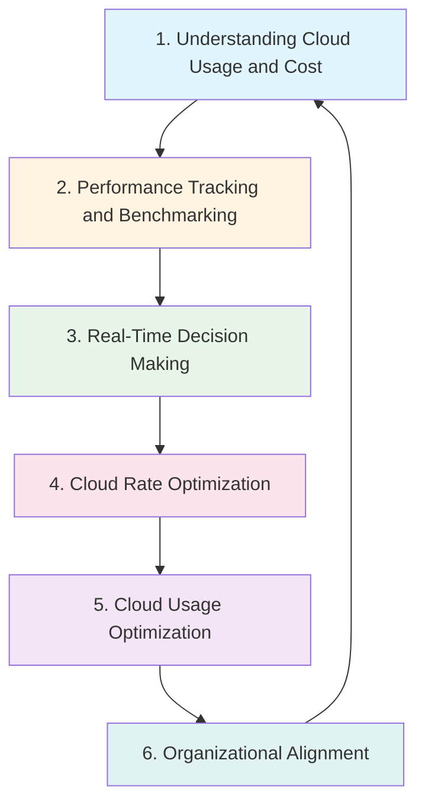
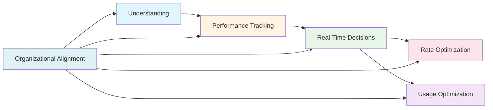

# FinOps Capabilities

**Level:** Foundation  
**Framework:** FinOps Foundation  
**Last Updated:** January 2025

---

## Learning Objectives

By the end of this document, you should understand:
- What FinOps capabilities are
- The six FinOps capabilities
- Purpose of each capability
- How capabilities work together

---

## What are FinOps Capabilities?

**FinOps Capabilities** are the functional areas that organizations need to master to practice FinOps effectively.

### Key Characteristics

- **Comprehensive:** Cover all aspects of FinOps
- **Interrelated:** Work together
- **Mature Over Time:** Develop maturity over time
- **Context-Dependent:** Vary by organization

---

## The Six FinOps Capabilities

---

## Capability 1: Understanding Cloud Usage and Cost

**Purpose:**  
Understand where cloud costs are coming from and what drives them.

**Key Activities:**
- Cost allocation
- Cost reporting
- Cost attribution
- Understanding usage patterns
- Identifying cost drivers

**Key Outputs:**
- Allocated costs
- Cost reports
- Usage reports
- Cost attribution

**Maturity Levels:**
- **Crawl:** Basic cost visibility
- **Walk:** Detailed cost allocation
- **Run:** Real-time cost understanding

**Example:**  
Allocate AWS costs by team → Report costs to teams → Teams understand their spending → Teams can make decisions.

---

## Capability 2: Performance Tracking and Benchmarking

**Purpose:**  
Track performance and benchmark against targets and peers.

**Key Activities:**
- Define metrics
- Track performance
- Benchmark internally
- Benchmark externally
- Report performance

**Key Outputs:**
- Performance metrics
- Benchmark reports
- Performance dashboards
- Trend analysis

**Maturity Levels:**
- **Crawl:** Basic metrics
- **Walk:** Comprehensive metrics
- **Run:** Real-time benchmarking

**Example:**  
Track cost per transaction → Benchmark against industry → Compare teams → Identify opportunities.

---

## Capability 3: Real-Time Decision Making

**Purpose:**  
Enable real-time decision making about cloud spending.

**Key Activities:**
- Provide real-time data
- Enable decision-making
- Set up alerts
- Create decision frameworks
- Support decisions

**Key Outputs:**
- Real-time dashboards
- Alerts and notifications
- Decision frameworks
- Decision support

**Maturity Levels:**
- **Crawl:** Weekly decisions
- **Walk:** Daily decisions
- **Run:** Real-time decisions

**Example:**  
Real-time cost dashboard → Alert on anomaly → Team makes decision → Executes immediately.

---

## Capability 4: Cloud Rate Optimization

**Purpose:**  
Optimize the rates paid for cloud resources.

**Key Activities:**
- Negotiate discounts
- Use reserved instances
- Use savings plans
- Use spot instances
- Optimize commitments

**Key Outputs:**
- Optimized rates
- Reserved instance strategy
- Savings plan strategy
- Rate optimization reports

**Maturity Levels:**
- **Crawl:** Basic rate optimization
- **Walk:** Comprehensive rate optimization
- **Run:** Continuous rate optimization

**Example:**  
Analyze usage patterns → Purchase reserved instances → Use savings plans → Optimize commitments → Reduce rates.

---

## Capability 5: Cloud Usage Optimization

**Purpose:**  
Optimize how cloud resources are used.

**Key Activities:**
- Rightsize resources
- Eliminate waste
- Optimize architecture
- Automate optimization
- Continuous optimization

**Key Outputs:**
- Rightsized resources
- Waste elimination
- Optimized architecture
- Optimization reports

**Maturity Levels:**
- **Crawl:** Manual optimization
- **Walk:** Automated optimization
- **Run:** Continuous optimization

**Example:**  
Identify over-provisioned resources → Rightsize resources → Eliminate unused resources → Optimize architecture → Reduce usage costs.

---

## Capability 6: Organizational Alignment

**Purpose:**  
Align organization around FinOps practices.

**Key Activities:**
- Define roles and responsibilities
- Create FinOps team
- Establish processes
- Enable collaboration
- Build culture

**Key Outputs:**
- Organizational structure
- Roles and responsibilities
- Processes and procedures
- Collaboration framework

**Maturity Levels:**
- **Crawl:** Basic alignment
- **Walk:** Good alignment
- **Run:** Excellent alignment

**Example:**  
Define FinOps roles → Create FinOps team → Establish processes → Enable collaboration → Build FinOps culture.

---

## How Capabilities Work Together

### Capability Relationships

### Example Flow

1. **Understanding** → Know where costs are
2. **Performance Tracking** → Track performance
3. **Real-Time Decisions** → Make decisions
4. **Rate Optimization** → Optimize rates
5. **Usage Optimization** → Optimize usage
6. **Organizational Alignment** → Enable all capabilities

---

## Capability Maturity

### Maturity Model

Each capability has three maturity levels:

- **Crawl:** Basic capability
- **Walk:** Good capability
- **Run:** Excellent capability

### Maturity Progression

Organizations typically progress:
1. Start with Understanding (Crawl)
2. Add Performance Tracking (Crawl)
3. Enable Real-Time Decisions (Crawl)
4. Optimize Rates (Crawl)
5. Optimize Usage (Crawl)
6. Align Organization (Crawl)
7. Progress each to Walk, then Run

---

## Key Takeaways

1. **Six capabilities:** Cover all aspects of FinOps
2. **Interrelated:** Capabilities work together
3. **Maturity:** Each capability has maturity levels
4. **Progressive:** Develop capabilities over time
5. **Organizational Alignment:** Enables all other capabilities

---

## Practice Questions

1. What are the six FinOps capabilities?
2. What is the purpose of "Understanding Cloud Usage and Cost"?
3. How do capabilities work together?
4. What are the maturity levels for capabilities?
5. Which capability enables all others?

---

## Related Topics

- Introduction to FinOps
- FinOps Principles
- FinOps Lifecycle
- Organizational Alignment

---

## References

- FinOps Framework documentation
- FinOps Capabilities guide

---

**Remember:** Master all six capabilities to practice FinOps effectively. Start with Understanding and Organizational Alignment, then progress to others.
