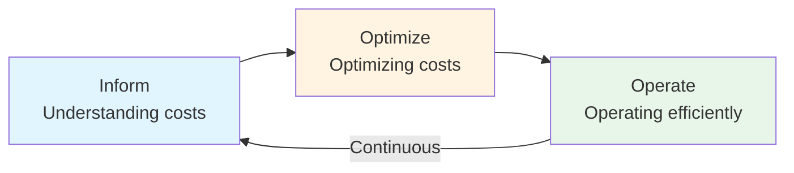

# FinOps Lifecycle

**Level:** Foundation  
**Framework:** FinOps Foundation  
**Last Updated:** January 2025

---

## Learning Objectives

By the end of this document, you should understand:
- What the FinOps lifecycle is
- The three phases of the lifecycle
- Activities in each phase
- How phases work together
- How lifecycle is iterative

---

## What is the FinOps Lifecycle?

The **FinOps Lifecycle** describes the iterative process of managing cloud costs. It consists of three phases that organizations continuously cycle through.

### Key Characteristics

- **Iterative:** Phases repeat continuously
- **Not Sequential:** Can be in multiple phases simultaneously
- **Continuous:** Never-ending process
- **Adaptive:** Adapts to changing needs

---

## The Three Phases

---

## Phase 1: Inform

**Purpose:** Understanding costs and usage.

**Key Activities:**
- Allocate costs
- Report on costs
- Understand usage
- Identify waste
- Create visibility

**Key Questions:**
- Where is money being spent?
- Who is spending it?
- What are they spending on?
- Why are they spending it?

**Key Outputs:**
- Cost allocation
- Cost reports
- Usage reports
- Dashboards
- Visibility

**Example Activities:**
- Allocate AWS costs by team
- Create cost reports
- Build dashboards
- Identify unused resources
- Understand spending patterns

**When to Use:**
- Starting FinOps
- New cloud adoption
- After major changes
- Regularly (ongoing)

---

## Phase 2: Optimize

**Purpose:** Optimizing costs and usage.

**Key Activities:**
- Optimize rates
- Optimize usage
- Rightsize resources
- Eliminate waste
- Implement optimizations

**Key Questions:**
- How can we reduce costs?
- What optimizations are available?
- What waste can we eliminate?
- How can we optimize rates?

**Key Outputs:**
- Optimization plans
- Rightsizing recommendations
- Waste elimination
- Cost savings
- Optimized resources

**Example Activities:**
- Purchase reserved instances
- Rightsize over-provisioned resources
- Eliminate unused resources
- Optimize architecture
- Implement automation

**When to Use:**
- After understanding costs (Inform)
- When waste is identified
- Regularly (ongoing)
- After optimization opportunities identified

---

## Phase 3: Operate

**Purpose:** Operating efficiently.

**Key Activities:**
- Make decisions
- Execute optimizations
- Monitor performance
- Maintain efficiency
- Continuous improvement

**Key Questions:**
- Are we operating efficiently?
- Are optimizations working?
- What decisions need to be made?
- How can we maintain efficiency?

**Key Outputs:**
- Decisions made
- Optimizations executed
- Performance reports
- Efficiency metrics
- Continuous improvements

**Example Activities:**
- Make resource decisions
- Execute rightsizing
- Monitor cost trends
- Maintain optimizations
- Improve processes

**When to Use:**
- After optimizations (Optimize)
- Daily operations
- Continuously
- When making decisions

---

## How Phases Work Together

### Iterative Process

The lifecycle is **iterative** - organizations continuously cycle through phases:

1. **Inform** → Understand costs
2. **Optimize** → Optimize costs
3. **Operate** → Operate efficiently
4. **Inform** → Understand again (new data)
5. **Optimize** → Optimize again (new opportunities)
6. **Operate** → Operate again (maintain)
7. Repeat...

### Not Sequential

Organizations can be in **multiple phases simultaneously**:

- **Inform:** Understanding new areas
- **Optimize:** Optimizing other areas
- **Operate:** Operating optimized areas

### Continuous

The lifecycle is **continuous** - never stops:

- Always informing (understanding)
- Always optimizing (improving)
- Always operating (executing)

---

## Lifecycle in Practice

### Example: New Cloud Service

1. **Inform:** Understand costs of new service
2. **Optimize:** Optimize new service costs
3. **Operate:** Operate new service efficiently
4. **Inform:** Monitor and understand ongoing costs
5. **Optimize:** Continue optimizing
6. **Operate:** Maintain efficiency

### Example: Monthly Cycle

**Week 1: Inform**
- Review previous month's costs
- Allocate costs
- Create reports
- Identify opportunities

**Week 2: Optimize**
- Implement optimizations
- Rightsize resources
- Purchase commitments
- Eliminate waste

**Week 3-4: Operate**
- Monitor performance
- Make decisions
- Execute optimizations
- Maintain efficiency

**Next Month: Repeat**

---

## Phase Activities by Capability

### Understanding Cloud Usage and Cost
- **Inform:** Allocate and report costs
- **Optimize:** Identify optimization opportunities
- **Operate:** Monitor cost trends

### Performance Tracking and Benchmarking
- **Inform:** Track performance
- **Optimize:** Benchmark optimizations
- **Operate:** Monitor performance

### Real-Time Decision Making
- **Inform:** Provide data for decisions
- **Optimize:** Enable optimization decisions
- **Operate:** Support operational decisions

### Cloud Rate Optimization
- **Inform:** Understand rate opportunities
- **Optimize:** Optimize rates
- **Operate:** Manage rate commitments

### Cloud Usage Optimization
- **Inform:** Identify usage waste
- **Optimize:** Optimize usage
- **Operate:** Maintain optimized usage

### Organizational Alignment
- **Inform:** Enable cost visibility
- **Optimize:** Enable optimization
- **Operate:** Enable operations

---

## Key Takeaways

1. **Three phases:** Inform, Optimize, Operate
2. **Iterative:** Phases repeat continuously
3. **Not sequential:** Can be in multiple phases
4. **Continuous:** Never-ending process
5. **All capabilities:** Each capability supports all phases

---

## Practice Questions

1. What are the three phases of the FinOps lifecycle?
2. What is the purpose of the Inform phase?
3. How do phases work together?
4. Can you be in multiple phases simultaneously?
5. Why is the lifecycle iterative?

---

## Related Topics

- Introduction to FinOps
- FinOps Capabilities
- FinOps Principles
- Understanding Cloud Costs

---

## References

- FinOps Framework documentation
- FinOps Lifecycle guide

---

**Remember:** The FinOps lifecycle is iterative and continuous. Always be informing, optimizing, and operating.
