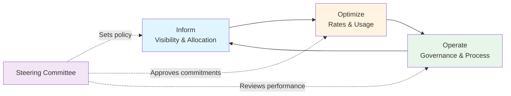

# FinOps Practical Operations Guide

**Last Updated:** February 2025  
**Version:** FinOps Framework  
**Level:** Advanced

---

## Overview

This guide covers the operational cadence for running a FinOps practice — the meetings, documents, tools, roles, and governance ceremonies that make cloud financial management real. FinOps is a cultural practice that brings finance, technology, and business together. This document describes what a FinOps team actually does day-to-day.

---

## Meeting Cadence

| Meeting | FinOps Phase | Frequency | Duration | Attendees | Purpose |
|---------|-------------|-----------|----------|-----------|---------|
| **Cloud Cost Daily Check** | Inform | Daily | 15 min | FinOps Analyst | Review anomalies, spike alerts, daily burn rate |
| **FinOps Team Standup** | All phases | Weekly | 30 min | FinOps team | Sync on optimization projects, anomalies, stakeholder requests |
| **Cost Optimization Sprint** | Optimize | Weekly | 60 min | FinOps Engineer, Cloud Engineers, App owners | Review and execute optimization recommendations (rightsizing, reserved instances, spot) |
| **Showback/Chargeback Review** | Operate | Bi-weekly | 45 min | FinOps Analyst, Finance, Business unit leads | Review cost allocation, validate tagging, resolve unallocated spend |
| **Cloud Budget Review** | Operate | Monthly | 60 min | FinOps Lead, Finance, Business unit owners | Review actual vs. budget, forecast next month, flag variances |
| **Cloud Architecture Cost Review** | Optimize | Monthly | 60 min | FinOps Engineer, Cloud Architects, Platform team | Review architecture decisions for cost impact, approve cost-heavy designs |
| **FinOps Steering Committee** | All phases | Quarterly | 90 min | CTO, CFO, FinOps Lead, Cloud leaders, Business VPs | Strategic direction, commitment reviews, policy decisions |
| **Reserved Instance / Savings Plan Review** | Optimize | Quarterly | 60 min | FinOps Lead, Procurement, Cloud Engineers | Review RI/SP coverage, utilization, and purchase recommendations |

### Weekly Rhythm

```
Monday:    Daily Cost Check → FinOps Team Standup
Tuesday:   Daily Cost Check → Cost Optimization Sprint
Wednesday: Daily Cost Check → Showback Review (bi-weekly)
Thursday:  Daily Cost Check → Architecture Cost Review (monthly)
Friday:    Daily Cost Check → Weekly Report Generation
```

---

## Key Documents & Templates

### Strategic Documents

| Document | Purpose | Owner | Review Cycle |
|----------|---------|-------|-------------|
| **FinOps Policy** | Cloud financial governance rules (tagging, procurement, waste tolerance) | FinOps Lead | Annually |
| **Cloud Financial Plan** | Annual cloud budget by business unit, with growth projections | FinOps Lead + Finance | Annually (monthly forecast updates) |
| **RI/SP Purchase Strategy** | Commitment-based discount purchase plan with coverage targets | FinOps Lead + Procurement | Quarterly |
| **Cloud Unit Economics Model** | Cost-per-transaction / cost-per-user / cost-per-service metrics | FinOps Analyst | Quarterly |

### Operational Documents

| Document | Purpose | Owner | Update Frequency |
|----------|---------|-------|-----------------|
| **Monthly Cloud Cost Report** | Actual spend vs. budget, trend analysis, top movers | FinOps Analyst | Monthly |
| **Showback / Chargeback Report** | Allocated costs per business unit / team / service | FinOps Analyst | Monthly |
| **Optimization Recommendations Log** | Active recommendations with estimated savings, owner, status | FinOps Engineer | Weekly |
| **Anomaly Report** | Cost spikes, unexpected charges, and root cause | FinOps Analyst | Per event |
| **Tagging Compliance Report** | % of resources properly tagged; unallocated spend breakdown | FinOps Analyst | Weekly |
| **Rate Optimization Report** | RI/SP coverage, utilization, on-demand vs. committed spend | FinOps Lead | Monthly |
| **Waste Report** | Idle resources, oversized instances, unused storage, orphaned snapshots | FinOps Engineer | Weekly |

---

## Tools & Technology Ecosystem

FinOps requires tools capable of ingesting massive daily cloud billing data, normalizing it, and generating actionable optimization recommendations.

### 1. Multi-Cloud FinOps Platforms (Cloud Cost Management)
- **Apptio Cloudability / Flexera One / CloudHealth (VMware):** The enterprise standards. These tools ingest billing data from AWS, Azure, and GCP, apply custom organizational mapping (showback/chargeback), and provide unified dashboards.
- **ServiceNow Cloud Observability / Cloud Cost Management:** Integrates cloud spend data directly into the central IT platform, linking costs and usage to specific business services mapped in the CMDB.

### 2. Native Cloud Billing & Anomaly Detection
- **Tools:** AWS Cost Explorer & CUR (Cost & Usage Report), Azure Cost Management, GCP Billing.
- **Usage:** Essential for daily monitoring, granular query generation, native budget alerts, and anomaly detection (e.g., AWS Cost Anomaly Detection).

### 3. Automated Optimization & Rightsizing
- **Tools:** Spot by NetApp, AWS Compute Optimizer, Azure Advisor.
- **Usage:** Continuously analyzes CPU/Memory usage to identify oversized instances, idle resources, and container scaling opportunities. Spot.io specifically automates the bidding and usage of cheap Spot (ephemeral) instances.

### 4. Automated Commitment Management
- **Tools:** ProsperOps, Zesty, Usage.ai.
- **Usage:** "Set and forget" tools that programmatically buy, exchange, and sell Reserved Instances (RIs) and Savings Plans (SPs) on cloud providers to maximize discount coverage dynamically as compute usage fluctuates.

---

## Roles & Responsibilities

| Role | Scope | Key Responsibilities |
|------|-------|---------------------|
| **FinOps Lead / Director** | Practice-wide | Own FinOps strategy; chair steering committee; report to CTO/CFO |
| **FinOps Analyst** | Cost visibility & reporting | Produce cost reports; manage showback/chargeback; track budgets |
| **FinOps Engineer** | Optimization & automation | Execute rightsizing; manage RI/SP; automate cost governance; enforce tagging |
| **Cloud Architect** | Architecture cost impact | Review architecture for cost efficiency; design cost-optimal solutions |
| **Finance Partner** | Budgeting & accounting | Cloud budgeting; variance analysis; amortization of commitments |
| **Engineering Team Leads** | Per-team cost ownership | Own team's cloud spend; respond to optimization recommendations; enforce tagging |
| **Procurement** | Commitment purchasing | Negotiate enterprise agreements; execute RI/SP purchases |

### RACI: Monthly Cloud Budget Review

| Activity | FinOps Lead | FinOps Analyst | Finance | Business Unit Owner | Cloud Architect |
|----------|-------------|----------------|---------|-------------------|-----------------|
| Prepare Cost Report | A | R | C | I | I |
| Forecast Next Period | A | R | R | C | C |
| Identify Variances | I | R | R | C | C |
| Present to Stakeholders | R | C | C | I | I |
| Approve Budget Adjustments | C | I | A | R | I |

---

## Governance Ceremonies

### FinOps Lifecycle Governance



### Cost Approval Thresholds

| Spend Level | Approval Required | Example |
|-------------|-------------------|---------|
| **<$500/month** | Team lead | Dev/test instance |
| **$500–$5,000/month** | Engineering manager + FinOps review | New production service |
| **$5,000–$50,000/month** | Director + FinOps + Finance | New platform or significant scale-up |
| **>$50,000/month** | VP/CTO + FinOps Steering Committee | Major cloud workload migration |

---

## Reporting & Metrics

### FinOps KPIs

| Metric | Target | Frequency |
|--------|--------|-----------|
| **Cost vs. Budget Variance** | <10% monthly | Monthly |
| **RI/SP Coverage** | ≥70% of eligible compute | Monthly |
| **RI/SP Utilization** | ≥90% | Monthly |
| **Waste Ratio** | <15% of total spend | Weekly |
| **Tagging Compliance** | ≥95% of resources tagged | Weekly |
| **Unallocated Spend** | <5% of total spend | Monthly |
| **Cost per Unit** | Trending down or stable | Monthly |
| **Optimization Savings Realized** | ≥$X per quarter (org-specific) | Quarterly |
| **Anomaly Detection Speed** | <4 hours to detect and alert | Per event |

---

## Banking / Financial Services Context

> [!IMPORTANT]
> FinOps in banking has additional considerations:

| Area | Banking Requirement | FinOps Impact |
|------|-------------------|---------------|
| **Data Residency** | Customer data in specific regions only | Cloud spend may be higher due to region constraints; architecture reviews must consider cost of compliance |
| **Encryption & Key Management** | HSM and customer-managed keys required | KMS costs and dedicated HSM instances can be significant; track as a compliance cost category |
| **DR/Multi-Region** | Active-active or active-passive DR required | DR infrastructure is a major cost driver; optimize DR spend separately from production |
| **Regulatory Reporting** | Cloud cost reporting for OJK/BI regulatory submissions | Cloud costs must be categorizable by regulatory line items |
| **Vendor Concentration Risk** | Regulators may scrutinize single-cloud dependency | Multi-cloud strategy increases FinOps complexity; cross-cloud tools become essential |
| **Cloud Exit Planning** | Regulators may require credible cloud exit strategy | Exit cost modeling must be part of the FinOps practice |

---

## Key Takeaways

- FinOps runs on a **daily anomaly monitoring → weekly optimization → monthly budget review → quarterly strategic** cadence
- The **Inform → Optimize → Operate** lifecycle governs all FinOps activities
- **Tagging compliance** is foundational — without accurate tags, cost allocation is impossible
- **RI/SP management** is the highest-impact optimization lever for most organizations
- In banking, **data residency, DR costs, and vendor concentration risk** add complexity to FinOps

## Cross-References

- [FinOps Foundation Materials](../01_foundation/)
- [FinOps Tools](./05_finops_tools.md)
- [TOGAF Technology Architecture](../TOGAF/02_intermediate/02_architecture_domains.md)
- [COBIT Practical Operations](../COBIT/03_implementation/05_practical_operations.md)
