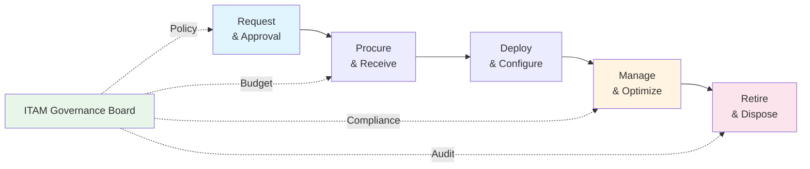

# ITAM Practical Operations Guide

**Last Updated:** February 2025  
**Version:** ITAM Best Practices  
**Level:** Advanced

---

## Overview

This guide covers the day-to-day operational work of running IT Asset Management — the meetings, documents, tools, roles, and governance ceremonies. ITAM is the practice of managing the lifecycle of IT assets (hardware, software, cloud, and contracts) to maximize value, manage risk, and ensure compliance. This document shows what an ITAM team actually does week-to-week.

---

## Meeting Cadence

| Meeting | ITAM Area | Frequency | Duration | Attendees | Purpose |
|---------|----------|-----------|----------|-----------|---------|
| **ITAM Team Standup** | All | Weekly | 30 min | ITAM Manager, SAM Analyst, HAM Analyst | Sync on current activities, audit prep, license alerts |
| **Software License Compliance Review** | SAM | Monthly | 60 min | SAM Analyst, Procurement, Vendor Manager | Review license positions, identify over/under-licensing, plan true-ups |
| **Hardware Asset Review** | HAM | Monthly | 45 min | HAM Analyst, IT Operations, Facilities | Review asset lifecycle, refresh planning, disposal queue |
| **Procurement & Contract Review** | All | Monthly | 60 min | ITAM Manager, Procurement, Finance, Legal | Review expiring contracts, renewal strategy, new acquisition requests |
| **Cloud Asset & Cost Review** | Cloud/SaaS | Monthly | 45 min | ITAM Analyst, FinOps, Cloud team | Review SaaS subscriptions, cloud entitlements, usage vs. licenses |
| **ITAM Governance Board** | All | Quarterly | 90 min | IT Director, ITAM Manager, Procurement, Finance, Audit | Strategic review of asset portfolio, compliance status, budget alignment |
| **Vendor Relationship Review** | Vendor Mgmt | Quarterly | 60 min | Vendor Manager, ITAM Manager, Procurement | Review vendor performance, contract health, negotiation strategy |
| **Audit Readiness Review** | Compliance | Quarterly | 60 min | ITAM Manager, SAM Analyst, Legal | Prepare for vendor audits; verify license positions; gather evidence |

---

## Key Documents & Templates

### Strategic Documents

| Document | Purpose | Owner | Review Cycle |
|----------|---------|-------|-------------|
| **ITAM Policy** | Governance rules for asset acquisition, usage, and disposal | ITAM Manager | Annually |
| **Software License Strategy** | Licensing approach per vendor (EA, subscription, perpetual, open source) | SAM Analyst | Annually |
| **Hardware Refresh Plan** | Lifecycle replacement schedule for devices and infrastructure | HAM Analyst | Annually |
| **Vendor Management Plan** | Relationship strategy per strategic vendor | Vendor Manager | Annually |

### Operational Documents

| Document | Purpose | Owner | Update Frequency |
|----------|---------|-------|-----------------|
| **Asset Register / CMDB** | Authoritative inventory of all IT assets (HW, SW, cloud) | ITAM Manager | Ongoing (automated discovery) |
| **Software License Position Report** | Entitlements vs. installations per product — compliance status | SAM Analyst | Monthly |
| **Effective License Position (ELP)** | Detailed calculation of license compliance for a specific vendor | SAM Analyst | Per vendor audit cycle |
| **Hardware Inventory Report** | Physical asset count, location, age, warranty status | HAM Analyst | Monthly |
| **Contract Register** | All IT contracts with terms, expiry dates, renewal options | Procurement / ITAM | Ongoing |
| **SaaS Subscription Register** | All SaaS applications with user counts, costs, renewal dates | ITAM Analyst | Monthly |
| **Disposal / WEEE Report** | Assets marked for disposal, data wipe status, recycling certification | HAM Analyst | Per batch |
| **Audit Response Package** | Evidence and documentation prepared for a specific vendor audit | SAM Analyst | Per audit |

---

## Tools & Technology Ecosystem

ITAM requires precision tooling capable of discovering assets across the network, normalizing software titles, and calculating complex license entitlements.

### 1. Comprehensive ITAM Platforms
- **ServiceNow SAM & HAM Pro:** Heavily adopted because it integrates directly with the ServiceNow CMDB and ITSM workflows. Automates hardware lifecycle flows (Deploy → Recover → Retire) and calculates software compliance against publisher packs (Microsoft, Oracle, IBM).
- **Flexera One / Snow Software (Flexera):** The traditional market leaders for deep, complex Software Asset Management (SAM). Unmatched in identifying obscure software installations and navigating convoluted enterprise license agreements.

### 2. Discovery & Inventory Scanning
- **Tools:** Microsoft Endpoint Configuration Manager (SCCM/Intune), Lansweeper, Device42, ServiceNow Discovery.
- **Usage:** The foundational capability of ITAM. These tools crawl the network without agents (or via agents) to identify every physical server, VM, desktop, and installed software binary.

### 3. SaaS Management Platforms (SMP)
- **Tools:** Zylo, Productiv, Torii, BetterCloud.
- **Usage:** Specifically targets "Shadow IT." These tools integrate with Azure AD / Okta and scan expense reports to discover unauthorized SaaS applications, track exact login activity, and automatically reclaim unused licenses (e.g., Salesforce, Zoom seats).

### 4. Cloud Entitlement & Contract Management
- **Tools:** AWS License Manager, Agiloft, Icertis, ServiceNow Contract Management.
- **Usage:** Tracks "Bring Your Own License" (BYOL) rules for the cloud, and manages the entire lifecycle of software and hardware contracts, ensuring renewals are negotiated proactively.

---

## Roles & Responsibilities

| Role | Scope | Key Responsibilities |
|------|-------|---------------------|
| **ITAM Manager** | Practice-wide | Own ITAM strategy; manage team; report to IT Director; chair ITAM governance |
| **Software Asset Management (SAM) Analyst** | Software | Manage license compliance; optimize licensing; prepare for vendor audits |
| **Hardware Asset Management (HAM) Analyst** | Hardware | Manage hardware lifecycle; track warranty/refresh; oversee disposal |
| **Cloud/SaaS Asset Analyst** | Cloud & SaaS | Track SaaS subscriptions; manage cloud entitlements; identify shadow IT |
| **Vendor/Contract Manager** | Vendor relations | Negotiate contracts; manage renewals; track vendor performance |
| **Procurement Specialist** | Acquisition | Process purchase requests; manage PO lifecycle; ensure policy compliance |
| **CMDB Administrator** | Configuration | Maintain CMDB accuracy; run discovery scans; manage CI relationships |

---

## Governance Ceremonies

### Asset Lifecycle Governance

### Vendor Audit Response Process

| Step | Activity | Owner | Timeline |
|------|----------|-------|----------|
| 1 | Receive audit notification | ITAM Manager | Day 0 |
| 2 | Engage legal counsel | Legal / ITAM Manager | Day 1–3 |
| 3 | Scope the audit (products, entities, date range) | SAM Analyst + Legal | Day 3–7 |
| 4 | Run discovery and reconciliation | SAM Analyst | Day 7–21 |
| 5 | Prepare Effective License Position (ELP) | SAM Analyst | Day 21–30 |
| 6 | Internal review and approval | ITAM Manager + Legal | Day 30–35 |
| 7 | Submit response to vendor | ITAM Manager | Day 35–45 |
| 8 | Negotiate findings (if non-compliant) | Vendor Manager + Legal + Procurement | Day 45–90 |

---

## Reporting & Metrics

### ITAM KPIs

| Metric | Target | Frequency |
|--------|--------|-----------|
| **Software License Compliance Rate** | ≥95% per vendor | Monthly |
| **Discovery Coverage** | ≥98% of devices scanned | Monthly |
| **Shelfware / Unused Licenses** | <10% of total entitlements | Quarterly |
| **SaaS Utilization** | ≥80% adoption for purchased seats | Monthly |
| **Hardware Within Lifecycle** | ≥85% of devices within supported lifecycle | Quarterly |
| **Contract Renewal On-Time** | 100% renewed/terminated before expiry | Monthly |
| **Asset Tagging Compliance** | ≥95% of assets tagged in CMDB | Monthly |
| **Cost Avoidance (optimization)** | Track $ saved from license optimization, renegotiation | Quarterly |
| **Audit Exposure (estimated)** | $0 unmitigated audit liability | Per audit cycle |

---

## Banking / Financial Services Context

> [!IMPORTANT]
> ITAM in banking has heightened compliance and security requirements:

| Area | Banking Requirement | ITAM Impact |
|------|-------------------|-------------|
| **Software Compliance** | Regulators and auditors check software licensing as part of IT audits | SAM must maintain audit-ready license positions at all times |
| **Data Wiping / Disposal** | Customer data must be securely destroyed when assets are retired (NIST 800-88) | HAM must ensure certified data wiping and maintain chain-of-custody records |
| **BYOD / Shadow IT** | Regulators require visibility into all IT assets processing customer data | SaaS/cloud discovery must identify shadow IT and unapproved applications |
| **Vendor Concentration** | Regulators scrutinize dependency on single vendors | ITAM should track vendor concentration metrics and flag over-reliance |
| **Regulatory Licensing** | Some banking software has specific regulatory licensing requirements (e.g., SWIFT) | SAM must track regulatory licenses separately and ensure compliance |
| **End-of-Life (EOL) Risk** | Running unsupported software is an audit finding | HAM/SAM must flag EOL/EOS assets and escalate for remediation |

---

## Key Takeaways

- ITAM runs on a **weekly standup → monthly compliance/procurement → quarterly governance** cadence
- The **license position report** is the single most important operational artifact
- **Vendor audit readiness** should be maintained continuously, not prepared reactively
- **SaaS management** is an increasingly critical area as shadow IT grows
- In banking, **data wiping compliance, audit-ready license positions, and EOL risk tracking** are non-negotiable

## Cross-References

- [ITAM Foundation](../01_foundation/)
- [ITAM Implementation Guide](./01_implementation_guide.md)
- [ITAM Assessment & Discovery](./03_assessment_discovery.md)
- [ITIL Practical Operations](../ITIL/04_practices/04_practical_operations.md)
- [COBIT Practical Operations](../COBIT/03_implementation/05_practical_operations.md)
