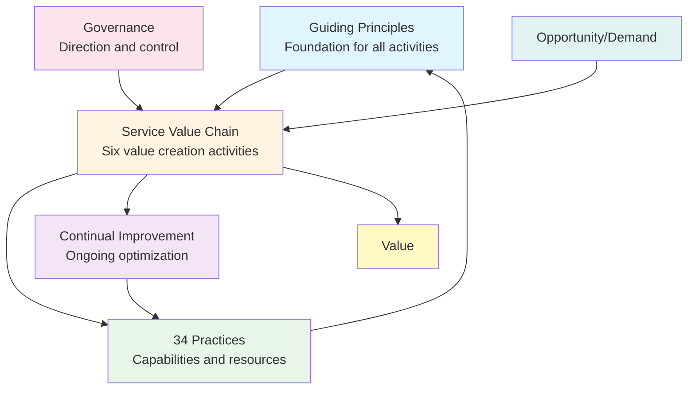

# Service Value System (SVS)

**Level:** Foundation  
**Framework:** ITIL 4  
**Last Updated:** January 2025

---

## Learning Objectives

By the end of this document, you should understand:
- What the Service Value System (SVS) is
- Components of the SVS
- How components work together
- How the SVS creates value
- Relationship between SVS components

---

## What is the Service Value System?

The **Service Value System (SVS)** is a model that shows how all components and activities work together to create value. It replaces the Service Lifecycle from ITIL v3 with a more flexible, holistic approach.

### Key Characteristics

- **Holistic:** Considers all aspects of service management
- **Flexible:** Adaptable to different contexts
- **Value-Focused:** Everything aims to create value
- **Integrated:** Components work together

---

## Components of the SVS

---

## Component 1: Guiding Principles

**Purpose:** Foundation for all activities and decisions.

**Description:**  
Seven principles that guide all service management activities. They apply to all situations and contexts.

**Principles:**
1. Focus on value
2. Start where you are
3. Progress iteratively with feedback
4. Collaborate and promote visibility
5. Think and work holistically
6. Keep it simple and practical
7. Optimize and automate

**Role in SVS:**  
Guiding principles influence all other components and ensure consistent approach.

**Example:**  
"Focus on value" principle influences how services are designed, how processes are implemented, and how improvements are prioritized.

---

## Component 2: Governance

**Purpose:** Direct and control the organization.

**Description:**  
Governance ensures that organizational activities are aligned with strategy and objectives. It provides direction and control.

**Key Activities:**
- Setting direction
- Making decisions
- Monitoring performance
- Ensuring compliance
- Managing risk

**Role in SVS:**  
Governance provides direction and control for the Service Value Chain and practices.

**Example:**  
Governance sets strategy for IT services, approves major changes, monitors service performance, ensures compliance with regulations.

---

## Component 3: Service Value Chain

**Purpose:** Six activities that create value.

**Description:**  
The Service Value Chain is a flexible operating model with six activities that can be combined in different ways to create value streams.

**Activities:**
1. **Plan** - Understanding vision and direction
2. **Improve** - Continual improvement
3. **Engage** - Stakeholder engagement
4. **Design & Transition** - Design and build services
5. **Obtain/Build** - Acquire or build components
6. **Deliver & Support** - Deliver and support services

**Role in SVS:**  
The Service Value Chain is the core of the SVS, where value is created through activities.

**Example:**  
A new service request flows through: Engage (understand requirements) → Plan (plan delivery) → Design & Transition (design service) → Obtain/Build (build components) → Deliver & Support (deliver service) → Improve (improve service).

---

## Component 4: Practices

**Purpose:** Capabilities and resources for service management.

**Description:**  
34 practices provide capabilities and resources needed for service management. They support the Service Value Chain activities.

**Categories:**
- **General Management Practices** (14)
- **Service Management Practices** (17)
- **Technical Management Practices** (3)

**Role in SVS:**  
Practices provide the capabilities and resources needed to perform Service Value Chain activities.

**Example:**  
Incident Management practice supports the "Deliver & Support" activity by restoring services quickly. Change Enablement practice supports "Design & Transition" and "Obtain/Build" activities.

---

## Component 5: Continual Improvement

**Purpose:** Ongoing optimization.

**Description:**  
Continual Improvement ensures that services and practices are continuously improved to meet changing needs.

**Key Activities:**
- Identify improvement opportunities
- Measure performance
- Implement improvements
- Review results
- Learn and adapt

**Role in SVS:**  
Continual Improvement applies to all components and ensures the SVS evolves and improves.

**Example:**  
Continual Improvement identifies that incident resolution time is too long → Implements improvements → Measures results → Further improves.

---

## How Components Work Together

### Input: Opportunity and Demand

**Opportunity:**  
A situation that could lead to value creation.

**Demand:**  
Need or desire for products or services.

**Example:**  
Opportunity: New technology can improve customer service.  
Demand: Business needs better customer service tools.

### Through the SVS

1. **Guiding Principles** guide all activities
2. **Governance** provides direction and control
3. **Service Value Chain** creates value through activities
4. **Practices** provide capabilities and resources
5. **Continual Improvement** optimizes everything

### Output: Value

**Value:**  
The perceived benefits, usefulness, and importance of something.

**Value is co-created** between service provider and customer.

**Example:**  
Input: Need for better email service  
→ Through SVS: Design, build, deliver email service  
→ Output: Value (improved communication, productivity)

---

## SVS in Practice

### Example: New Service Request

1. **Opportunity/Demand:** Business needs new CRM system
2. **Guiding Principles:** Focus on value, start where you are
3. **Governance:** Approve project, allocate budget
4. **Service Value Chain:**
   - Engage: Understand requirements
   - Plan: Plan implementation
   - Design & Transition: Design CRM
   - Obtain/Build: Build or buy CRM
   - Deliver & Support: Deploy and support
   - Improve: Continuously improve
5. **Practices:** Use relevant practices (Change Enablement, Release Management, etc.)
6. **Continual Improvement:** Measure, improve, optimize
7. **Value:** Business gets CRM system that improves sales

---

## Key Relationships

### Guiding Principles → All Components

Guiding principles influence:
- How governance is applied
- How Service Value Chain activities are performed
- How practices are used
- How improvements are made

### Governance → Service Value Chain

Governance:
- Sets direction for activities
- Controls activities
- Monitors performance
- Ensures compliance

### Service Value Chain → Practices

Service Value Chain activities:
- Use practices for capabilities
- Combine practices as needed
- Create value streams

### Practices → Service Value Chain

Practices:
- Support Service Value Chain activities
- Provide capabilities and resources
- Enable value creation

### Continual Improvement → All Components

Continual Improvement:
- Applies to all components
- Optimizes everything
- Ensures evolution

---

## SVS vs Service Lifecycle (ITIL v3)

| Aspect | Service Lifecycle (v3) | Service Value System (v4) |
|--------|------------------------|---------------------------|
| **Structure** | Linear lifecycle | Flexible system |
| **Focus** | Processes | Practices |
| **Approach** | Prescriptive | Flexible |
| **Value** | Service delivery | Value co-creation |
| **Integration** | Limited | DevOps, Agile, Lean |

---

## Key Takeaways

1. **SVS is holistic:** Considers all aspects together
2. **Five components:** Guiding Principles, Governance, Service Value Chain, Practices, Continual Improvement
3. **Value-focused:** Everything aims to create value
4. **Flexible:** Adaptable to different contexts
5. **Integrated:** Components work together
6. **Input → SVS → Output:** Opportunity/Demand flows through SVS to create Value

---

## Practice Questions

1. What are the five components of the SVS?
2. What is the role of the Service Value Chain?
3. How do Guiding Principles influence the SVS?
4. What is the relationship between Practices and Service Value Chain?
5. How does Continual Improvement relate to other components?

---

## Related Topics

- Service Value Chain
- Guiding Principles
- Four Dimensions
- 34 Practices
- Continual Improvement

---

## References

- ITIL 4 Foundation Guide
- ITIL 4: Create, Deliver & Support
- ITIL 4: Direct, Plan & Improve

---

**Remember:** The SVS shows how everything works together to create value. Understanding the SVS is fundamental to understanding ITIL 4.
