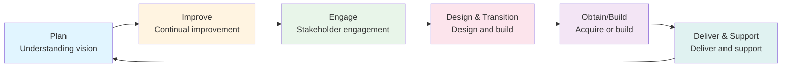

# Service Value Chain

**Level:** Foundation  
**Framework:** ITIL 4  
**Last Updated:** January 2025

---

## Learning Objectives

By the end of this document, you should understand:
- What the Service Value Chain is
- The six activities of the Service Value Chain
- How activities work together
- How to create value streams
- How activities relate to practices

---

## What is the Service Value Chain?

The **Service Value Chain** is a flexible operating model with six activities that can be combined in different ways to create value streams. It is the core of the Service Value System.

### Key Characteristics

- **Flexible:** Activities can be combined in different ways
- **Universal:** Applies to all services and value streams
- **Activity-Based:** Focuses on what needs to be done
- **Value-Focused:** All activities create value

---

## The Six Activities

---

## Activity 1: Plan

**Purpose:** Understanding vision and direction, and planning how to achieve objectives.

**Key Activities:**
- Understand vision and strategy
- Set objectives
- Plan activities
- Allocate resources
- Plan value streams
- Plan improvements

**Key Outputs:**
- Plans
- Strategies
- Objectives
- Resource allocations

**Practices That Support:**
- Strategy Management
- Portfolio Management
- Architecture Management
- Risk Management

**Example:**  
Planning a new email service: Understand business needs → Set objectives → Plan implementation → Allocate resources.

---

## Activity 2: Improve

**Purpose:** Continual improvement of services, practices, and products.

**Key Activities:**
- Identify improvement opportunities
- Measure performance
- Analyze data
- Implement improvements
- Review results
- Learn and adapt

**Key Outputs:**
- Improvement plans
- Performance reports
- Lessons learned
- Improved services

**Practices That Support:**
- Continual Improvement
- Measurement and Reporting
- Problem Management

**Example:**  
Improving email service: Measure availability → Identify issues → Implement improvements → Review results → Further improve.

---

## Activity 3: Engage

**Purpose:** Engaging with stakeholders to understand their needs and ensure satisfaction.

**Key Activities:**
- Understand stakeholder needs
- Communicate with stakeholders
- Manage relationships
- Gather feedback
- Manage expectations
- Coordinate stakeholders

**Key Outputs:**
- Stakeholder requirements
- Communication plans
- Relationship agreements
- Feedback reports

**Practices That Support:**
- Relationship Management
- Service Level Management
- Supplier Management

**Example:**  
Engaging with business unit: Understand requirements → Communicate plans → Manage expectations → Gather feedback.

---

## Activity 4: Design & Transition

**Purpose:** Designing and building services and products to meet requirements.

**Key Activities:**
- Design services
- Design products
- Design processes
- Build services
- Test services
- Transition to operation

**Key Outputs:**
- Service designs
- Products
- Test results
- Transitioned services

**Practices That Support:**
- Service Design
- Change Enablement
- Release Management
- Service Validation and Testing

**Example:**  
Designing email service: Design service → Build components → Test → Transition to production.

---

## Activity 5: Obtain/Build

**Purpose:** Acquiring or building components needed for services.

**Key Activities:**
- Acquire components
- Build components
- Develop software
- Procure hardware
- Integrate components
- Manage suppliers

**Key Outputs:**
- Components
- Software
- Hardware
- Integrated systems

**Practices That Support:**
- Supplier Management
- Development and Management
- Infrastructure and Platform Management

**Example:**  
Obtaining email components: Procure servers → Acquire software licenses → Build integrations → Integrate components.

---

## Activity 6: Deliver & Support

**Purpose:** Delivering and supporting services to meet agreed service levels.

**Key Activities:**
- Deliver services
- Support services
- Handle incidents
- Fulfill requests
- Monitor services
- Maintain services

**Key Outputs:**
- Delivered services
- Resolved incidents
- Fulfilled requests
- Service reports

**Practices That Support:**
- Incident Management
- Service Request Management
- Service Desk
- Monitoring and Event Management

**Example:**  
Delivering email service: Monitor service → Handle incidents → Fulfill requests → Maintain service → Report performance.

---

## How Activities Work Together

### Value Streams

**Value Stream:** A series of steps an organization takes to create and deliver value.

**Activities can be combined** in different ways to create value streams for different scenarios.

### Example Value Stream: New Service Request

1. **Engage:** Understand customer requirements
2. **Plan:** Plan service delivery
3. **Design & Transition:** Design the service
4. **Obtain/Build:** Acquire or build components
5. **Deliver & Support:** Deliver and support the service
6. **Improve:** Continuously improve the service

### Example Value Stream: Incident Resolution

1. **Engage:** Communicate with user
2. **Obtain/Build:** Get information/resources
3. **Deliver & Support:** Resolve incident
4. **Improve:** Learn from incident

### Example Value Stream: Change Implementation

1. **Plan:** Plan the change
2. **Engage:** Coordinate stakeholders
3. **Design & Transition:** Design change
4. **Obtain/Build:** Build change
5. **Deliver & Support:** Implement and support
6. **Improve:** Review and improve

---

## Activity Relationships

### All Activities Can Connect

Activities are not sequential - they can connect in any order as needed for the value stream.

### Common Patterns

- **Plan → Design & Transition → Obtain/Build → Deliver & Support**
- **Engage → Plan → Design & Transition**
- **Deliver & Support → Improve**
- **Improve → Plan → Design & Transition**

### Improve Activity

**Improve** can connect to any other activity:
- Improve → Plan (improve planning)
- Improve → Design & Transition (improve design)
- Improve → Deliver & Support (improve delivery)

---

## Key Takeaways

1. **Six activities:** Plan, Improve, Engage, Design & Transition, Obtain/Build, Deliver & Support
2. **Flexible:** Activities can be combined in different ways
3. **Value streams:** Activities create value streams
4. **Universal:** Applies to all services
5. **Practice support:** Practices support activities
6. **Not sequential:** Activities can connect in any order

---

## Practice Questions

1. What are the six Service Value Chain activities?
2. What is the purpose of the "Engage" activity?
3. How do activities create value streams?
4. What is the relationship between activities and practices?
5. Can activities connect in any order?

---

## Related Topics

- Service Value System
- Guiding Principles
- 34 Practices
- Value Streams
- Continual Improvement

---

## References

- ITIL 4 Foundation Guide
- ITIL 4: Create, Deliver & Support
- ITIL 4: Direct, Plan & Improve

---

**Remember:** The Service Value Chain is flexible - combine activities as needed to create value streams for your specific context.
