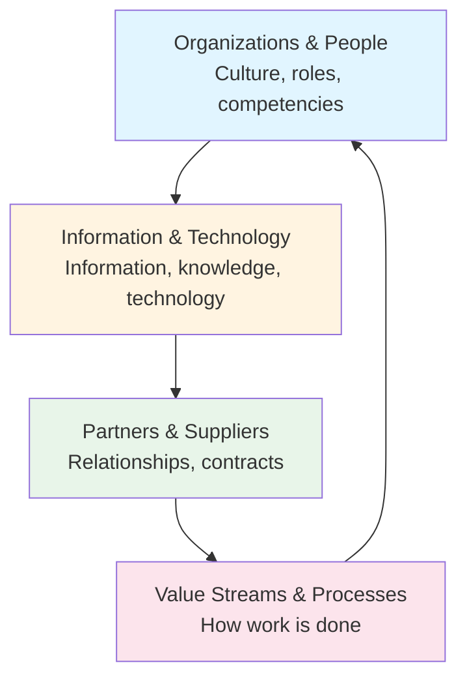

# Four Dimensions of Service Management

**Level:** Foundation  
**Framework:** ITIL 4  
**Last Updated:** January 2025

---

## Learning Objectives

By the end of this document, you should understand:
- What the four dimensions are
- Why they're important
- Each dimension in detail
- How dimensions work together
- How to apply dimensions

---

## What are the Four Dimensions?

The **Four Dimensions** provide a holistic view of service management. They ensure that all aspects of service management are considered.

### Why Four Dimensions?

Service management is complex and involves many aspects. The four dimensions ensure nothing is overlooked.

### Key Principle

**All four dimensions must be considered** when designing, delivering, and improving services. Ignoring any dimension can lead to failure.

---

## The Four Dimensions

---

## Dimension 1: Organizations & People

**Purpose:** Ensure the organization has the right culture, roles, and competencies.

### Key Aspects

**Culture:**
- Values and beliefs
- Attitudes and behaviors
- Ways of working
- Organizational culture

**Roles:**
- Defined roles and responsibilities
- Clear accountability
- Authority levels
- Reporting structures

**Competencies:**
- Skills and knowledge
- Experience
- Training and development
- Capabilities

**Communication:**
- Communication channels
- Information sharing
- Collaboration
- Feedback mechanisms

### Key Questions

- What culture is needed?
- What roles are required?
- What competencies are needed?
- How do people communicate?
- How are people motivated?

### Example

**Email Service:**
- **Culture:** Customer-focused, collaborative
- **Roles:** Service Owner, Service Desk, Technical Support
- **Competencies:** Email administration, customer service, troubleshooting
- **Communication:** Regular meetings, knowledge sharing, feedback

### Common Issues

- Unclear roles and responsibilities
- Lack of skills
- Poor culture
- Inadequate communication
- Resistance to change

---

## Dimension 2: Information & Technology

**Purpose:** Ensure the right information and technology are available.

### Key Aspects

**Information:**
- Data and information
- Knowledge management
- Information systems
- Data quality

**Technology:**
- Hardware and software
- Tools and platforms
- Infrastructure
- Technology architecture

**Automation:**
- Automated processes
- Self-service capabilities
- Integration
- Efficiency improvements

**Security:**
- Information security
- Access controls
- Data protection
- Compliance

### Key Questions

- What information is needed?
- What technology is required?
- How is information managed?
- What can be automated?
- How is security ensured?

### Example

**Email Service:**
- **Information:** User data, email content, service metrics
- **Technology:** Email servers, storage, network
- **Automation:** Automated backups, monitoring, alerts
- **Security:** Encryption, access controls, threat detection

### Common Issues

- Poor data quality
- Outdated technology
- Lack of automation
- Security vulnerabilities
- Integration problems

---

## Dimension 3: Partners & Suppliers

**Purpose:** Ensure effective relationships with partners and suppliers.

### Key Aspects

**Relationships:**
- Partner relationships
- Supplier relationships
- Collaboration
- Trust and communication

**Contracts:**
- Service contracts
- SLAs with suppliers
- Underpinning contracts
- Contract management

**Integration:**
- System integration
- Process integration
- Data integration
- Seamless operations

**Value:**
- Value from partners
- Value from suppliers
- Cost optimization
- Risk management

### Key Questions

- Who are our partners and suppliers?
- What relationships do we need?
- What contracts are required?
- How do we integrate?
- How do we manage value?

### Example

**Email Service:**
- **Partners:** Cloud provider, security vendor
- **Suppliers:** Hardware vendor, software vendor
- **Contracts:** Cloud service agreement, support contracts
- **Integration:** Cloud integration, security integration

### Common Issues

- Poor supplier relationships
- Inadequate contracts
- Integration problems
- Value not realized
- Risk exposure

---

## Dimension 4: Value Streams & Processes

**Purpose:** Ensure work is done effectively and efficiently.

### Key Aspects

**Value Streams:**
- End-to-end value creation
- Customer journey
- Value creation steps
- Flow of work

**Processes:**
- Defined processes
- Process documentation
- Process execution
- Process improvement

**Procedures:**
- Detailed procedures
- Work instructions
- Standard operating procedures
- Guidelines

**Efficiency:**
- Process efficiency
- Waste elimination
- Optimization
- Automation

### Key Questions

- What value streams exist?
- What processes are needed?
- How is work done?
- How efficient are processes?
- How can we improve?

### Example

**Email Service:**
- **Value Stream:** Request → Provision → Deliver → Support
- **Processes:** Incident Management, Change Management, Request Fulfillment
- **Procedures:** Incident handling, change implementation
- **Efficiency:** Automated provisioning, self-service

### Common Issues

- Unclear processes
- Inefficient workflows
- Poor documentation
- Waste in processes
- Lack of improvement

---

## How Dimensions Work Together

### All Dimensions Are Required

All four dimensions must be considered together. They are interdependent:

- **Organizations & People** need **Information & Technology** to work effectively
- **Value Streams & Processes** require **Organizations & People** to execute
- **Partners & Suppliers** provide **Information & Technology**
- **Value Streams & Processes** integrate with **Partners & Suppliers**

### Example: Implementing a New Service

1. **Organizations & People:** Define roles, train staff, establish culture
2. **Information & Technology:** Implement systems, manage data, ensure security
3. **Partners & Suppliers:** Engage suppliers, establish contracts, integrate systems
4. **Value Streams & Processes:** Define processes, create value streams, optimize workflows

All four dimensions must be addressed for success.

---

## Applying the Four Dimensions

### When Designing Services

Consider all four dimensions:
- What people and organization are needed?
- What information and technology are required?
- What partners and suppliers are involved?
- What value streams and processes are needed?

### When Improving Services

Assess all four dimensions:
- Are people and organization adequate?
- Is information and technology sufficient?
- Are partners and suppliers effective?
- Are value streams and processes efficient?

### When Troubleshooting

Check all four dimensions:
- People/organization issues?
- Information/technology problems?
- Partner/supplier issues?
- Process/value stream problems?

---

## Key Takeaways

1. **Four dimensions:** Organizations & People, Information & Technology, Partners & Suppliers, Value Streams & Processes
2. **Holistic view:** All dimensions must be considered
3. **Interdependent:** Dimensions work together
4. **Universal:** Apply to all services and practices
5. **Practical:** Use for design, improvement, troubleshooting

---

## Practice Questions

1. What are the four dimensions?
2. Why are four dimensions important?
3. What does "Organizations & People" include?
4. How do dimensions work together?
5. Give an example of applying all four dimensions

---

## Related Topics

- Service Value System
- Service Value Chain
- Guiding Principles
- 34 Practices

---

## References

- ITIL 4 Foundation Guide
- ITIL 4: Create, Deliver & Support
- ITIL 4: Direct, Plan & Improve

---

**Remember:** Always consider all four dimensions when designing, delivering, or improving services. Ignoring any dimension can lead to failure.
