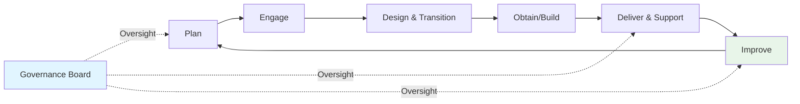

# ITIL 4 Practical Operations Guide

**Last Updated:** February 2025  
**Version:** ITIL 4  
**Level:** Advanced

---

## Overview

This guide covers the real-world operational cadence for organizations implementing ITIL 4 — the meetings, documents, tools, and governance ceremonies that bring the 34 practices to life. While ITIL provides the framework, this document shows what the day-to-day consulting and operating rhythm looks like.

---

## Meeting Cadence

### Practice-Driven Meetings

| Meeting | ITIL Practice | Frequency | Duration | Attendees | Purpose |
|---------|--------------|-----------|----------|-----------|---------|
| **Daily Ops Standup** | Monitoring & Event Management | Daily | 15 min | Operations team, NOC | Review overnight events, active alerts, priorities |
| **Incident Triage** | Incident Management | Daily | 30 min | Incident Manager, Service Desk, Tech leads | Prioritize and assign incidents, review SLA status |
| **Change Advisory Board** | Change Enablement | Weekly | 60–90 min | Change Manager, Release Manager, App owners, Security | Assess and authorize changes |
| **Problem Review Board** | Problem Management | Bi-weekly | 60 min | Problem Manager, Technical SMEs | Review open problems, RCA progress, known errors |
| **Release Planning** | Release Management | Bi-weekly | 60 min | Release Manager, Dev leads, QA, Ops | Plan and coordinate upcoming releases |
| **Service Level Review** | Service Level Management | Monthly | 60 min | SLM, Service Owners, Customer reps | Review SLA/XLA performance and improvement actions |
| **Continual Improvement Board** | Continual Improvement | Monthly | 60 min | CI Manager, Practice Owners, Service Owners | Prioritize and review improvement initiatives |
| **Capacity & Performance Review** | Capacity & Performance Mgmt | Monthly | 45 min | Capacity Manager, Infra leads | Review utilisation, forecast demand, plan capacity |
| **Service Value Stream Review** | Value Stream Management | Quarterly | 90 min | SVS Lead, Practice Owners, Business stakeholders | Assess end-to-end value streams, identify bottlenecks |
| **IT Governance / Steering** | Governance | Quarterly | 90 min | CIO, IT Directors, Business execs | Strategic direction, investment decisions, portfolio review |

### Value Stream Ceremonies (Agile ITIL)

For organizations blending ITIL with Agile/DevOps:

| Ceremony | Frequency | Purpose |
|----------|-----------|---------|
| **Sprint Planning** | Bi-weekly | Plan improvement and development work |
| **Sprint Review / Demo** | Bi-weekly | Demonstrate completed improvements |
| **Retrospective** | Bi-weekly | Identify process improvements |
| **PI Planning** (SAFe integration) | Quarterly | Align multiple teams on priorities |

---

## Key Documents & Templates

### Strategic Documents

| Document | ITIL Practice | Purpose | Review Cycle |
|----------|--------------|---------|-------------|
| **Service Value System (SVS) Map** | Overall | Visual representation of how value is created | Annually |
| **Service Portfolio** | Portfolio Management | Complete catalog of services (pipeline, live, retired) | Quarterly |
| **IT Strategy & Roadmap** | Strategy Management | Strategic direction and planned initiatives | Annually |

### Operational Documents

| Document | ITIL Practice | Purpose | Review Cycle |
|----------|--------------|---------|-------------|
| **Service Catalog** | Service Catalog Management | Published menu of available services | Quarterly |
| **SLA / XLA** | Service Level Management | Service targets and experience-level agreements | Annually (reviewed quarterly) |
| **Change Schedule** | Change Enablement | Calendar of all approved/planned changes | Weekly |
| **Known Error Database** | Problem Management | Repository of known issues and workarounds | Ongoing |
| **Release Plan** | Release Management | Schedule and scope of upcoming releases | Per release cycle |
| **Capacity Plan** | Capacity & Performance | Demand forecasting and capacity recommendations | Quarterly |
| **Continual Improvement Register** | Continual Improvement | Prioritized list of improvement initiatives | Monthly |
| **Risk Register** | Risk Management | Identified risks with assessment and mitigation plans | Monthly |

### Per-Incident / Per-Change Documents

| Document | When Produced | Key Content |
|----------|--------------|-------------|
| **Major Incident Report (PIR)** | After every P1/P2 | Timeline, root cause, impact, actions, lessons learned |
| **Request for Change (RFC)** | Per change | Description, risk, impact, rollback plan, approvals |
| **Post-Implementation Review** | After major changes/releases | Success criteria check, issues found, follow-up actions |

---

## Tools & Technology Ecosystem

ITIL 4 emphasizes automation and integration. The tooling landscape is structured horizontally across practices:

### 1. Enterprise Service Management Platforms
- **ServiceNow:** The dominant ITIL platform. Maps directly to ITIL practices:
  - *Service Operations Workspace* for Incident and Event Management
  - *CAB Workbench* for Change Enablement
  - *Service Portfolio Management (SPM)* for Portfolio and Strategy Management
  - *Hardware/Software Asset Management (HAM/SAM)* for IT Asset Management
- **Jira Service Management (JSM):** Integrates ITIL practices seamlessly with agile development workflows.
- **BMC Helix:** Strong, AI-driven service management platform tailored for mature ITIL environments.

### 2. Observability & Event Management
- **Tools:** Datadog, Splunk, Dynatrace, ServiceNow ITOM.
- **Usage:** Supports the *Monitoring & Event Management* practice by aggregating logs/metrics, identifying anomalies, and triggering automated remediation or incident tickets.

### 3. CI/CD & Deployment Management
- **Tools:** Jenkins, GitLab CI, Azure DevOps, Argo CD.
- **Usage:** Automates the *Release Management* and *Deployment Management* practices, ensuring code moves safely from repository to production with automated testing gates.

### 4. Knowledge & Collaboration
- **Tools:** Confluence, Notion, ServiceNow Knowledge.
- **Usage:** Central to the *Knowledge Management* practice, storing runbooks, self-service portals, and Known Error Databases (KEDBs).

---

## Roles & Responsibilities

### ITIL 4 Practice Roles

| Role | Scope | Key Responsibilities |
|------|-------|---------------------|
| **Service Owner** | Per service | Accountable for end-to-end service delivery; represents service in governance |
| **Practice Owner** | Per practice | Accountable for practice design, adoption, and effectiveness |
| **Process Manager** | Per process | Manage day-to-day execution of a process within a practice |
| **Change Manager** | Change Enablement | Chair CAB; assess risk; manage change lifecycle |
| **Release Manager** | Release Management | Plan, build, test, and deploy releases |
| **Problem Manager** | Problem Management | Drive root cause analysis; manage known errors |
| **Service Level Manager** | Service Level Management | Negotiate SLAs/XLAs; monitor and report performance |
| **Continual Improvement Manager** | Continual Improvement | Maintain CSI register; coordinate improvement initiatives |
| **Service Desk Manager** | Service Desk | Manage frontline support; ensure first-contact resolution |
| **IT Service Manager** | Cross-practice | Overall coordination of ITIL practices and service delivery |

### RACI Example: Change Enablement

| Activity | Change Manager | CAB | Service Owner | Release Manager | Security |
|----------|---------------|-----|---------------|----------------|----------|
| Submit RFC | I | I | R | C | I |
| Risk Assessment | R | C | C | C | C |
| Approve Change | A | R | C | I | C |
| Schedule Change | R | I | I | C | I |
| Implement Change | I | I | I | R | I |
| Post-Implementation Review | R | I | C | R | C |

*R=Responsible, A=Accountable, C=Consulted, I=Informed*

---

## Governance Ceremonies

### Service Value Chain Governance

### Governance Tiers

| Tier | Body | Frequency | Scope |
|------|------|-----------|-------|
| **Strategic** | IT Governance / Steering Committee | Quarterly | Portfolio, investment, strategy alignment |
| **Tactical** | Service Management Board | Monthly | Cross-practice performance, improvement prioritization |
| **Operational** | Practice-level meetings (CAB, Problem Board, etc.) | Weekly/Bi-weekly | Day-to-day execution and issue resolution |

---

## Reporting & Metrics

### Practice-Level KPIs

| Practice | KPI | Target |
|----------|-----|--------|
| **Incident Management** | MTTR (P1) | <4 hours |
| **Incident Management** | SLA Compliance | ≥95% |
| **Change Enablement** | Change Success Rate | ≥95% |
| **Change Enablement** | Emergency Change % | <10% of total |
| **Problem Management** | Known Errors with Workaround | 100% |
| **Release Management** | Failed Deployments | <5% |
| **Service Level Management** | SLA/XLA Achievement | ≥95% |
| **Service Desk** | First Contact Resolution | ≥70% |
| **Continual Improvement** | Improvement Items Completed (quarterly) | ≥80% of target |

### Experience-Level Agreements (XLAs)

> [!TIP]
> Modern ITIL 4 implementations supplement SLAs with XLAs — measuring **user experience** rather than just technical metrics.

| XLA Metric | Measurement | Target |
|-----------|-------------|--------|
| **Employee Satisfaction (ESAT)** | Post-interaction survey | ≥4.2/5.0 |
| **Digital Experience Score** | End-user computing performance index | ≥85/100 |
| **IT Happiness Index** | Quarterly sentiment survey | ≥75% positive |

---

## Banking / Financial Services Context

> [!IMPORTANT]
> ITIL in banking requires additional considerations:

| Area | Banking Requirement | ITIL Practice Impact |
|------|-------------------|---------------------|
| **Change Freeze** | No changes during financial close (month-end, quarter-end, year-end) | Change Enablement must enforce freeze calendar in ITSM tool |
| **Regulatory Changes** | OJK/BI/MAS directives may mandate IT changes with tight deadlines | Change Enablement needs a "regulatory change" fast-track category |
| **Core Banking Releases** | Core banking changes are high-risk, multi-system events | Release Management needs phased rollout with rollback plans and extended hypercare |
| **Cyber Incident Response** | Regulatory requirement to report cyber incidents within hours | Incident Management must integrate with CSIRT and regulatory notification process |
| **Business Continuity** | Annual DR testing mandated by regulators | Service Continuity Management must schedule and execute recovery tests |
| **Vendor Management** | Third-party/outsourced IT must conform to same service standards | Supplier Management must include SLA cascading and vendor audit rights |

---

## Key Takeaways

- ITIL 4 operations run on a **layered cadence**: daily ops → weekly CAB → monthly service reviews → quarterly governance
- **XLAs** complement SLAs by measuring actual user experience
- The **ITSM platform** (e.g., ServiceNow) is the operational backbone — configure it to enforce the practices
- In banking, **change freeze calendars, regulatory fast-tracks, and CSIRT integration** are non-negotiable

## Cross-References

- [ITIL Practices Overview](./01_general_management_practices.md)
- [ITSM Practical Operations](../ITSM/03_advanced/04_practical_operations.md)
- [COBIT Practical Operations](../COBIT/03_implementation/05_practical_operations.md)
