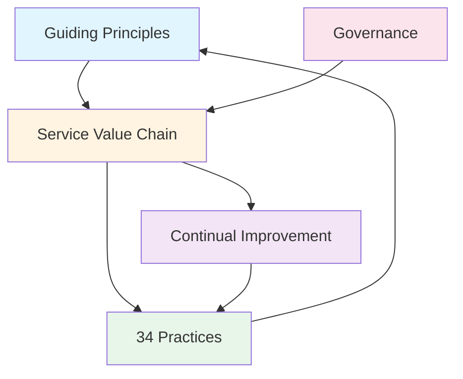

# ITIL 4 Learning Materials

**Version:** ITIL 4 (2019, updated 2024-2025)  
**Last Updated:** January 2025

---

## Overview

ITIL 4 (Information Technology Infrastructure Library) is the most widely adopted framework for IT Service Management. ITIL 4 provides a practical, flexible approach to service management that integrates modern practices like DevOps, Agile, and Lean.

---

## What is ITIL 4?

ITIL 4 is a framework that provides:
- **Best practices** for IT service management
- **Guiding principles** for service management
- **34 practices** for managing services
- **Service Value System** for creating value
- **Service Value Chain** for value creation activities

### Key Changes from ITIL v3

- **Service Value System** replaces Service Lifecycle
- **34 Practices** replace processes
- **Four Dimensions** provide holistic view
- **Guiding Principles** guide all activities
- **Integration** with modern practices (DevOps, Agile, Lean)

---

## ITIL 4 Structure

### Service Value System (SVS)

The SVS shows how all components work together to create value:

### Components

1. **Guiding Principles:** Seven principles for service management
2. **Governance:** How organization is directed and controlled
3. **Service Value Chain:** Six activities that create value
4. **34 Practices:** General, Service Management, and Technical practices
5. **Continual Improvement:** Ongoing improvement

---

## Certification Paths

### ITIL 4 Foundation

**Level:** Entry  
**Prerequisites:** None  
**Duration:** 2-3 days training + exam  
**Exam:** 40 multiple-choice questions, 60 minutes, 65% to pass

**Covers:**
- Service Value System
- Service Value Chain
- Guiding Principles
- Four Dimensions
- Key practices overview

### ITIL 4 Managing Professional (MP)

**Level:** Intermediate  
**Prerequisites:** ITIL 4 Foundation  
**Duration:** 4 modules, each 2-3 days + exam

**Modules:**
1. **Create, Deliver & Support (CDS)**
2. **Drive Stakeholder Value (DSV)**
3. **High-Velocity IT (HVIT)**
4. **Direct, Plan & Improve (DPI)**

**Exam:** Each module has separate exam

### ITIL 4 Strategic Leader (SL)

**Level:** Advanced  
**Prerequisites:** ITIL 4 Foundation  
**Duration:** 2 modules, each 2-3 days + exam

**Modules:**
1. **Digital & IT Strategy (DITS)**
2. **Leader: Digital & IT Strategy**

**Exam:** Each module has separate exam

### ITIL 4 Master

**Level:** Expert  
**Prerequisites:** Both MP and SL tracks  
**Requirements:** Demonstrate experience and knowledge across ITIL practices

---

## Learning Path

### Foundation Level (01_foundation/)

Start here for ITIL 4 Foundation certification:
1. `service_value_system.md` - Understanding the SVS
2. `service_value_chain.md` - Six value creation activities
3. `guiding_principles.md` - Seven principles
4. `four_dimensions.md` - Holistic view of service management
5. `key_practices_overview.md` - Overview of 34 practices
6. `foundation_exam_prep.md` - Exam preparation guide

### Managing Professional (02_managing_professional/)

For operational and tactical management:
1. `create_deliver_support.md` - CDS module
2. `drive_stakeholder_value.md` - DSV module
3. `high_velocity_it.md` - HVIT module
4. `direct_plan_improve.md` - DPI module

### Strategic Leader (03_strategic_leader/)

For strategic leadership:
1. `digital_it_strategy.md` - DITS module
2. `leading_digital_transformation.md` - Leadership module

### Practices (04_practices/)

Detailed coverage of all 34 practices:
1. `general_management_practices.md` - 14 general practices
2. `service_management_practices.md` - 17 service management practices
3. `technical_management_practices.md` - 3 technical practices

### References (references/)

- Official resources
- Certification paths
- Books and publications
- Practice exams

---

## Key Concepts

### Service Value System (SVS)

How all components work together to create value:
- **Guiding Principles:** Foundation for all activities
- **Governance:** Direction and control
- **Service Value Chain:** Value creation activities
- **Practices:** Capabilities and resources
- **Continual Improvement:** Ongoing optimization

### Service Value Chain

Six activities that create value:
1. **Plan** - Understanding vision and direction
2. **Improve** - Continual improvement
3. **Engage** - Stakeholder engagement
4. **Design & Transition** - Design and build services
5. **Obtain/Build** - Acquire or build components
6. **Deliver & Support** - Deliver and support services

### Guiding Principles

Seven principles that guide all activities:
1. Focus on value
2. Start where you are
3. Progress iteratively with feedback
4. Collaborate and promote visibility
5. Think and work holistically
6. Keep it simple and practical
7. Optimize and automate

### Four Dimensions

Holistic view of service management:
1. **Organizations & People** - Culture, roles, competencies
2. **Information & Technology** - Information, knowledge, technology
3. **Partners & Suppliers** - Relationships, contracts
4. **Value Streams & Processes** - How work is done

### 34 Practices

Organized into three categories:
- **General Management Practices** (14)
- **Service Management Practices** (17)
- **Technical Management Practices** (3)

---

## ITIL 4 vs ITIL v3

| Aspect | ITIL v3 | ITIL 4 |
|--------|---------|--------|
| **Structure** | Service Lifecycle | Service Value System |
| **Focus** | Processes | Practices |
| **Practices** | 26 processes | 34 practices |
| **Integration** | Limited | DevOps, Agile, Lean |
| **Flexibility** | Prescriptive | Flexible |
| **Value Focus** | Service delivery | Value co-creation |

---

## Benefits of ITIL 4

1. **Modern Approach:** Integrates DevOps, Agile, Lean
2. **Flexible:** Adaptable to different contexts
3. **Value-Focused:** Emphasizes value creation
4. **Holistic:** Four dimensions provide complete view
5. **Practical:** Real-world guidance
6. **Widely Adopted:** Industry standard

---

## Getting Started

1. **Start with Foundation:** Read `01_foundation/` materials
2. **Understand SVS:** Core to ITIL 4 thinking
3. **Learn Practices:** Study relevant practices
4. **Prepare for Exam:** Use `foundation_exam_prep.md`
5. **Progress to MP/SL:** After Foundation certification

---

## Related Frameworks

- **COBIT:** IT governance (complements ITIL)
- **ISO/IEC 20000:** ITSM standard (aligned with ITIL)
- **DevOps:** Development and operations integration
- **Agile:** Iterative development
- **Lean:** Eliminate waste, maximize value

---

## Next Steps

1. Review foundation materials in `01_foundation/`
2. Study for ITIL 4 Foundation certification
3. Progress to Managing Professional or Strategic Leader
4. Study practices relevant to your role
5. Check `references/` for official resources

---

**Remember:** ITIL 4 is about creating value through services. Focus on understanding how components work together to deliver value to customers and stakeholders.
