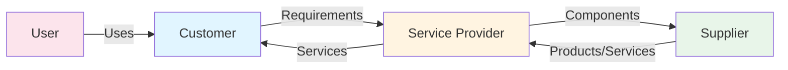

# ITSM Concepts and Principles

**Level:** Foundation  
**Last Updated:** January 2025

---

## Learning Objectives

By the end of this document, you should understand:
- What IT Service Management (ITSM) is
- Core concepts and principles of ITSM
- The difference between services and products
- Value, outcomes, costs, and risks
- The role of ITSM in organizations

---

## What is IT Service Management?

IT Service Management (ITSM) is a **discipline** that focuses on:
- Designing, delivering, managing, and improving IT services
- Aligning IT services with business needs
- Ensuring efficient and effective service delivery
- Creating value for customers and stakeholders

### Key Characteristics
- **Customer-focused:** Services are designed around customer needs
- **Process-oriented:** Uses structured processes and procedures
- **Value-driven:** Focuses on delivering value, not just technology
- **Continuous improvement:** Always looking to improve services

---

## Core Concepts

### Service

A **service** is a means of delivering value to customers by facilitating outcomes customers want to achieve **without the ownership of specific costs and risks**.

#### Characteristics of a Service
- **Intangible:** Services cannot be touched or stored
- **Perishable:** Services are consumed at the time of delivery
- **Inseparable:** Production and consumption happen simultaneously
- **Variable:** Service quality can vary

#### Example: Email Service
- **Service:** Email communication platform
- **Outcome:** Users can send and receive emails
- **Value:** Improved communication and collaboration
- **Costs:** Infrastructure, licensing, support (borne by IT)
- **Risks:** Downtime, security breaches (managed by IT)

### Product vs Service

| Aspect | Product | Service |
|--------|---------|---------|
| **Nature** | Tangible, physical | Intangible, experience |
| **Ownership** | Customer owns it | Customer uses it |
| **Storage** | Can be stored | Cannot be stored |
| **Example** | Laptop computer | Email service |

---

## Value, Outcomes, Costs, and Risks

### Value

**Value** is the perceived benefits, usefulness, and importance of something.

In ITSM context:
- Value = **Outcomes** - **Costs** - **Risks**
- Value is co-created between service provider and customer
- Value is subjective and varies by stakeholder

### Outcomes

**Outcomes** are the results that customers want to achieve.

**Example:** For an email service
- **Outcome:** Employees can communicate effectively
- **Business Outcome:** Improved collaboration, faster decision-making

### Costs

**Costs** include:
- **Service Costs:** Infrastructure, licensing, support
- **Customer Costs:** Time, effort, training
- **Hidden Costs:** Downtime impact, productivity loss

### Risks

**Risks** are potential negative outcomes:
- **Service Risks:** Downtime, security breaches, data loss
- **Business Risks:** Loss of revenue, reputation damage
- **Customer Risks:** Productivity loss, missed opportunities

---

## Service Provider Types

### Type I: Internal Service Provider
- Part of the same organization as the customer
- Example: IT department serving internal business units

### Type II: Shared Services Provider
- Separate organization but still part of same parent company
- Example: Shared IT services across multiple subsidiaries

### Type III: External Service Provider
- Completely separate organization
- Example: Cloud providers, managed service providers

---

## ITSM Principles

### 1. Focus on Value
- Everything should create value for customers
- Understand what customers value
- Measure and communicate value delivered

### 2. Start Where You Are
- Don't start from scratch
- Assess current state
- Build on existing capabilities

### 3. Progress Iteratively with Feedback
- Make small, incremental improvements
- Gather feedback continuously
- Adjust based on feedback

### 4. Collaborate and Promote Visibility
- Work together across teams
- Share information transparently
- Break down silos

### 5. Think and Work Holistically
- Consider the whole system
- Understand relationships and dependencies
- Avoid optimizing parts at expense of whole

### 6. Keep It Simple and Practical
- Avoid unnecessary complexity
- Use simplest approach that works
- Focus on practical solutions

### 7. Optimize and Automate
- Automate repetitive tasks
- Optimize processes continuously
- Free people for value-added work

---

## Service Management

**Service Management** is a set of specialized organizational capabilities for providing value to customers in the form of services.

### Capabilities Include:
- **Processes:** Structured activities
- **Functions:** Teams with specific roles
- **Tools:** Technology to support processes
- **Knowledge:** Understanding and expertise

---

## Stakeholders

### Customer
The person who defines requirements and takes responsibility for outcomes.

### User
The person who uses the service on a day-to-day basis.

### Service Provider
The organization that provides services to customers.

### Supplier
Third-party organizations that provide components or services.

**Example:**
- **Customer:** Head of Sales (defines requirements)
- **User:** Sales representatives (use CRM system)
- **Service Provider:** IT department (provides CRM service)
- **Supplier:** Salesforce (provides CRM platform)

---

## Service Relationships

---

## Key Takeaways

1. **ITSM is a discipline** focused on managing IT services to deliver value
2. **Services facilitate outcomes** without customers owning costs/risks
3. **Value = Outcomes - Costs - Risks**
4. **Service providers** can be internal, shared, or external
5. **Seven principles** guide ITSM implementation
6. **Stakeholders** include customers, users, providers, and suppliers

---

## Practice Questions

1. What is the difference between a product and a service?
2. How is value calculated in ITSM?
3. Name three types of service providers.
4. What are the seven ITSM principles?
5. Explain the difference between a customer and a user.

---

## Related Topics

- Service Lifecycle Overview
- Key Terminology
- Service Design
- ITIL 4 Framework

---

## References

- ITIL 4 Foundation Guide
- ISO/IEC 20000 Standard
- ITSM Best Practices
