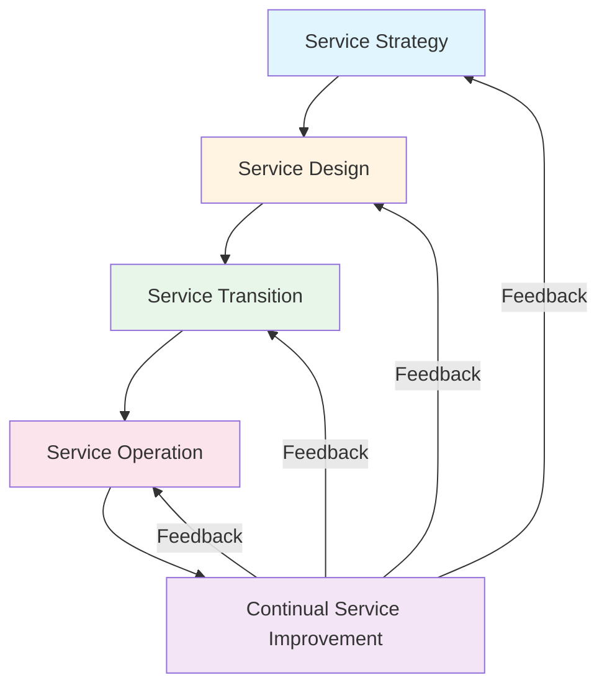
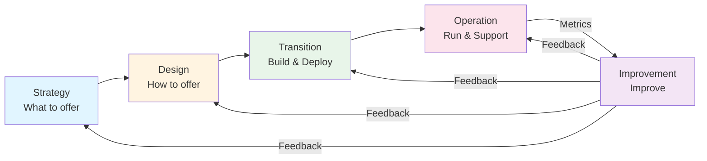

# Service Lifecycle Overview

**Level:** Foundation  
**Last Updated:** January 2025

---

## Learning Objectives

By the end of this document, you should understand:
- The five stages of the service lifecycle
- Purpose and objectives of each lifecycle stage
- How stages relate to each other
- Key processes in each stage
- The continuous nature of service management

---

## What is the Service Lifecycle?

The **Service Lifecycle** represents the journey of an IT service from conception to retirement. It consists of five stages that services progress through, with continual improvement as an ongoing activity.

---

## Stage 1: Service Strategy

**Purpose:** To understand market and customer needs, and develop strategy for services.

### Key Objectives
- Understand customer needs and market conditions
- Define service portfolio
- Develop service strategy
- Financial management
- Demand management

### Key Questions
- What services should we offer?
- Who are our customers?
- What are our capabilities?
- How do we compete?
- What is our value proposition?

### Key Processes
- **Strategy Management:** Developing service strategy
- **Service Portfolio Management:** Managing service portfolio
- **Financial Management:** Managing IT finances
- **Demand Management:** Understanding and influencing demand
- **Business Relationship Management:** Managing customer relationships

### Outputs
- Service strategy
- Service portfolio
- Financial plans
- Service catalog

---

## Stage 2: Service Design

**Purpose:** To design services and processes to meet business requirements.

### Key Objectives
- Design new or changed services
- Design supporting processes
- Design service management systems
- Design technology architectures
- Design measurement systems

### Key Questions
- How should services be designed?
- What processes are needed?
- What technology is required?
- How will we measure success?
- What are the service levels?

### Key Processes
- **Service Level Management:** Managing service agreements
- **Service Catalog Management:** Maintaining service catalog
- **Capacity Management:** Ensuring adequate capacity
- **Availability Management:** Ensuring service availability
- **IT Service Continuity Management:** Planning for disasters
- **Information Security Management:** Managing security
- **Supplier Management:** Managing suppliers

### Key Design Aspects
1. **Service Solutions:** How services work
2. **Management Information Systems:** Tools and systems
3. **Technology Architectures:** Technical design
4. **Processes:** Service management processes
5. **Measurement Methods:** How to measure success

### Outputs
- Service design packages
- Service level agreements (SLAs)
- Service catalog
- Capacity plans
- Availability plans

---

## Stage 3: Service Transition

**Purpose:** To build and deploy services into production safely and effectively.

### Key Objectives
- Plan and manage service changes
- Build and test services
- Deploy services to production
- Transfer knowledge
- Manage risks

### Key Questions
- How do we build services?
- How do we test services?
- How do we deploy safely?
- How do we manage changes?
- How do we transfer knowledge?

### Key Processes
- **Change Management:** Managing changes
- **Release and Deployment Management:** Deploying releases
- **Service Validation and Testing:** Testing services
- **Change Evaluation:** Evaluating changes
- **Knowledge Management:** Managing knowledge
- **Service Asset and Configuration Management:** Managing assets
- **Transition Planning and Support:** Planning transitions

### Key Activities
- Building services
- Testing services
- Training users
- Deploying to production
- Managing changes
- Documenting knowledge

### Outputs
- Deployed services
- Change records
- Release documentation
- Test results
- Knowledge base articles

---

## Stage 4: Service Operation

**Purpose:** To run services day-to-day and deliver value to customers.

### Key Objectives
- Deliver services according to SLAs
- Manage incidents and problems
- Handle service requests
- Monitor services
- Maintain service stability

### Key Questions
- How do we operate services?
- How do we handle incidents?
- How do we solve problems?
- How do we fulfill requests?
- How do we monitor services?

### Key Processes
- **Incident Management:** Restoring service quickly
- **Problem Management:** Finding root causes
- **Event Management:** Monitoring events
- **Request Fulfillment:** Handling requests
- **Access Management:** Managing access

### Key Functions
- **Service Desk:** Single point of contact
- **Technical Management:** Managing technology
- **IT Operations Management:** Day-to-day operations
- **Application Management:** Managing applications

### Key Activities
- Monitoring services
- Handling incidents
- Fulfilling requests
- Managing problems
- Maintaining services

### Outputs
- Resolved incidents
- Solved problems
- Fulfilled requests
- Service reports
- Operational metrics

---

## Stage 5: Continual Service Improvement

**Purpose:** To continuously improve services and processes.

### Key Objectives
- Identify improvement opportunities
- Measure and analyze performance
- Implement improvements
- Review and learn
- Align with business goals

### Key Questions
- Where are we now?
- Where do we want to be?
- How do we get there?
- Did we get there?
- How do we keep momentum?

### Key Process
- **The 7-Step Improvement Process:**
  1. Identify improvement opportunities
  2. Define measurable targets
  3. Gather baseline data
  4. Process and analyze data
  5. Present and use information
  6. Implement improvements
  7. Measure and review

### Key Activities
- Measuring performance
- Analyzing data
- Identifying improvements
- Implementing changes
- Reviewing results

### Outputs
- Improvement plans
- Performance reports
- Lessons learned
- Updated processes
- Improved services

---

## Lifecycle Relationships

### How Stages Connect

### Key Relationships
- **Strategy → Design:** Strategy defines what to design
- **Design → Transition:** Design packages guide transition
- **Transition → Operation:** Transition delivers to operation
- **Operation → Improvement:** Operation provides data for improvement
- **Improvement → All Stages:** Improvement feeds back to all stages

---

## Lifecycle in Practice

### Example: New Email Service

1. **Strategy:** Business needs better collaboration → Email service strategy
2. **Design:** Design email service with SLAs, capacity, security
3. **Transition:** Build, test, and deploy email service
4. **Operation:** Run email service, handle incidents, fulfill requests
5. **Improvement:** Analyze performance, improve availability, optimize costs

### Example: Service Change

1. **Strategy:** Review if change aligns with strategy
2. **Design:** Design the change
3. **Transition:** Build, test, and deploy the change
4. **Operation:** Operate with the change
5. **Improvement:** Measure impact and improve further

---

## Key Takeaways

1. **Five stages:** Strategy, Design, Transition, Operation, Improvement
2. **Continuous cycle:** Services move through stages continuously
3. **Feedback loops:** Improvement feeds back to all stages
4. **Each stage has purpose:** Clear objectives and processes
5. **Not linear:** Services can be in multiple stages simultaneously
6. **Improvement is ongoing:** Not a one-time activity

---

## Common Mistakes

1. **Skipping stages:** Don't skip Strategy or Design
2. **No improvement:** Forgetting Continual Service Improvement
3. **Silo thinking:** Not seeing lifecycle as whole
4. **No feedback:** Not feeding improvement back to earlier stages
5. **Focus on technology only:** Missing business perspective

---

## Practice Questions

1. What are the five stages of the service lifecycle?
2. What is the purpose of Service Transition?
3. How does Continual Service Improvement relate to other stages?
4. What happens in Service Operation?
5. Why is Service Strategy important?

---

## Related Topics

- Service Design (detailed)
- Service Transition (detailed)
- Service Operation (detailed)
- Continual Service Improvement (detailed)
- ITIL 4 Service Value System

---

## References

- ITIL v3 Service Lifecycle (foundation for this model)
- ITIL 4 Service Value System (modern evolution)
- ITSM Best Practices
