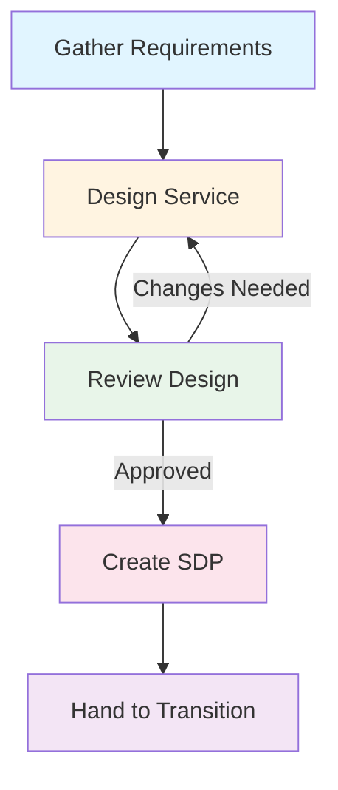

# Service Design

**Level:** Intermediate  
**Last Updated:** January 2025

---

## Learning Objectives

By the end of this document, you should understand:
- Purpose and objectives of Service Design
- Five aspects of service design
- Key service design processes
- Service design principles
- How to design effective services

---

## Purpose of Service Design

**Service Design** ensures that new or changed services are designed effectively to meet customer requirements and business objectives.

### Key Objectives
- Design services that meet customer needs
- Design supporting processes
- Design service management systems
- Design technology architectures
- Design measurement systems
- Ensure services are cost-effective
- Ensure services are manageable and maintainable

---

## Five Aspects of Service Design

### 1. Service Solutions
The design of the service itself - how it works, what it does, and how it delivers value.

**Includes:**
- Service functionality
- Service features
- Service capabilities
- Service interfaces

**Example:** Email service solution includes email storage, sending, receiving, calendar integration.

### 2. Management Information Systems and Tools
The tools and systems needed to manage the service.

**Includes:**
- Service management tools
- Monitoring tools
- Reporting systems
- Knowledge management systems

**Example:** ServiceNow for incident management, monitoring tools for availability.

### 3. Technology Architectures
The technical design of the service infrastructure.

**Includes:**
- Hardware architecture
- Software architecture
- Network architecture
- Security architecture

**Example:** Email service architecture includes mail servers, storage, load balancers, firewalls.

### 4. Processes
The service management processes needed to support the service.

**Includes:**
- Incident management
- Problem management
- Change management
- Service level management
- Capacity management
- Availability management

**Example:** Processes for handling email outages, managing email capacity, ensuring availability.

### 5. Measurement Methods and Metrics
How to measure service performance and success.

**Includes:**
- Service level targets
- Key performance indicators (KPIs)
- Metrics and measurements
- Reporting mechanisms

**Example:** Metrics for email availability, response time, user satisfaction.

---

## Key Service Design Processes

### Service Level Management

**Purpose:** To negotiate, agree, and document service level targets and responsibilities.

**Key Activities:**
- Negotiate SLAs with customers
- Create OLAs with internal teams
- Create UCs with suppliers
- Monitor service performance
- Review and report on service levels
- Identify improvement opportunities

**Key Documents:**
- Service Level Agreement (SLA)
- Operational Level Agreement (OLA)
- Underpinning Contract (UC)
- Service Level Requirements (SLR)

**Example:** SLA for email service: 99.9% availability, < 2 second response time, 24/7 support.

### Service Catalog Management

**Purpose:** To provide a single source of information about services.

**Key Activities:**
- Maintain service catalog
- Ensure catalog is accurate
- Make catalog accessible
- Update catalog regularly

**Service Catalog Includes:**
- Service descriptions
- Service availability
- Service costs
- How to request services
- Service owners

**Example:** Service catalog lists all IT services with descriptions, SLAs, and request procedures.

### Capacity Management

**Purpose:** To ensure adequate capacity to meet current and future demand.

**Key Activities:**
- Monitor current capacity
- Forecast future demand
- Plan capacity changes
- Optimize capacity utilization
- Manage capacity costs

**Sub-Processes:**
- **Business Capacity Management:** Understanding business needs
- **Service Capacity Management:** Managing service capacity
- **Component Capacity Management:** Managing IT component capacity

**Example:** Planning email storage capacity based on user growth projections.

### Availability Management

**Purpose:** To ensure services meet availability requirements.

**Key Activities:**
- Define availability requirements
- Design for availability
- Monitor availability
- Analyze availability data
- Improve availability

**Key Concepts:**
- **Availability:** Ability to perform when needed
- **Reliability:** Ability to perform consistently
- **Maintainability:** Ability to be maintained
- **Serviceability:** Supplier's ability to meet requirements

**Example:** Designing email service for 99.9% availability with redundancy and failover.

### IT Service Continuity Management

**Purpose:** To ensure IT services can recover from disasters.

**Key Activities:**
- Assess risks
- Develop continuity plans
- Test continuity plans
- Maintain continuity plans
- Coordinate with business continuity

**Key Documents:**
- Business Impact Analysis (BIA)
- Risk Assessment
- Continuity Plans
- Recovery Procedures

**Example:** Plan for email service recovery after data center failure.

### Information Security Management

**Purpose:** To manage information security.

**Key Activities:**
- Define security policies
- Assess security risks
- Implement security controls
- Monitor security
- Respond to security incidents

**Key Concepts:**
- **Confidentiality:** Information is not disclosed
- **Integrity:** Information is accurate
- **Availability:** Information is accessible

**Example:** Email service security includes encryption, access controls, threat monitoring.

### Supplier Management

**Purpose:** To manage suppliers and contracts.

**Key Activities:**
- Select suppliers
- Negotiate contracts
- Manage supplier relationships
- Monitor supplier performance
- Review contracts

**Key Documents:**
- Supplier contracts
- Underpinning Contracts (UCs)
- Supplier performance reports

**Example:** Managing cloud provider contract for email infrastructure.

---

## Service Design Principles

### 1. Design for Functionality
Services must meet functional requirements.

### 2. Design for Performance
Services must meet performance requirements.

### 3. Design for Usability
Services must be easy to use.

### 4. Design for Supportability
Services must be easy to support.

### 5. Design for Maintainability
Services must be easy to maintain.

### 6. Design for Cost-Effectiveness
Services must provide value for money.

### 7. Design for Compliance
Services must meet regulatory requirements.

---

## Service Design Package (SDP)

A **Service Design Package** documents all aspects of a service design.

**Contents:**
- Service overview
- Service requirements
- Service design
- Service architecture
- Service processes
- Service metrics
- Service risks
- Service costs
- Service transition plan

**Purpose:** To provide complete information for building and deploying the service.

---

## Service Design Activities

### Key Activities
1. **Gather Requirements:** Understand customer needs
2. **Design Service:** Design all five aspects
3. **Review Design:** Validate design meets requirements
4. **Create SDP:** Document complete design
5. **Hand to Transition:** Pass design for building

---

## Common Design Challenges

### 1. Unclear Requirements
**Problem:** Requirements are vague or incomplete.  
**Solution:** Use structured requirements gathering, involve stakeholders.

### 2. Over-Engineering
**Problem:** Designing more than needed.  
**Solution:** Focus on requirements, avoid unnecessary complexity.

### 3. Under-Designing
**Problem:** Missing important aspects.  
**Solution:** Use five aspects checklist, involve all stakeholders.

### 4. Poor Integration
**Problem:** Service doesn't integrate well.  
**Solution:** Consider dependencies, design interfaces carefully.

### 5. Ignoring Operations
**Problem:** Service is hard to operate.  
**Solution:** Involve operations team, design for supportability.

---

## Key Takeaways

1. **Five aspects:** Service solutions, tools, architecture, processes, metrics
2. **Seven processes:** SLM, catalog, capacity, availability, continuity, security, suppliers
3. **Design principles:** Functionality, performance, usability, supportability, maintainability, cost, compliance
4. **Service Design Package:** Complete documentation of design
5. **Involve stakeholders:** Customers, users, operations, suppliers

---

## Practice Questions

1. What are the five aspects of service design?
2. Name three service design processes.
3. What is a Service Design Package?
4. What is the purpose of Capacity Management?
5. How does Service Design relate to Service Transition?

---

## Related Topics

- Service Transition
- Service Operation
- Service Level Management
- Capacity Management
- Availability Management

---

## References

- ITIL Service Design publication
- ITIL 4 Service Design practice
- ITSM Best Practices
