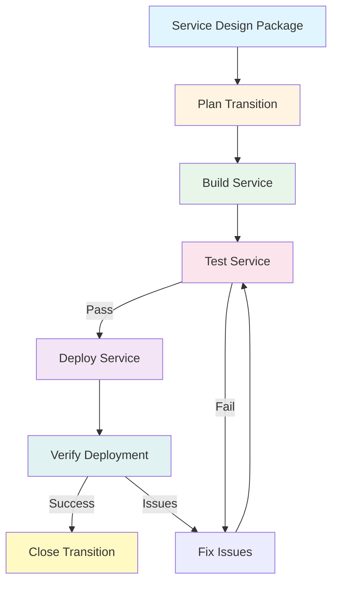
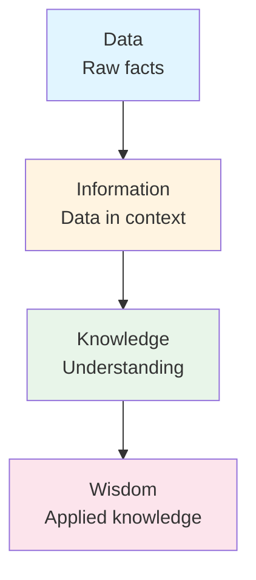

# Service Transition

**Level:** Intermediate  
**Last Updated:** January 2025

---

## Learning Objectives

By the end of this document, you should understand:
- Purpose and objectives of Service Transition
- Key Service Transition processes
- How to build and deploy services safely
- Change management principles
- Knowledge management importance

---

## Purpose of Service Transition

**Service Transition** ensures that new or changed services are built and deployed into production safely and effectively, with minimal disruption to operations.

### Key Objectives
- Build services according to design
- Test services thoroughly
- Deploy services safely
- Manage changes effectively
- Transfer knowledge
- Manage risks
- Minimize disruption

---

## Key Service Transition Processes

### Change Management

**Purpose:** To ensure changes are assessed, approved, and implemented in a controlled manner.

**Key Activities:**
- Receive change requests
- Assess changes
- Approve or reject changes
- Coordinate change implementation
- Review changes
- Close changes

**Change Types:**
- **Normal Change:** Standard approval process
- **Standard Change:** Pre-approved, low risk
- **Emergency Change:** Urgent, fast-tracked approval

**Change Advisory Board (CAB):**
- Group that approves changes
- Includes stakeholders
- Reviews change impact
- Makes approval decisions

**Example:** Upgrading email server requires change request, assessment, CAB approval, implementation.

### Release and Deployment Management

**Purpose:** To build, test, and deploy releases into production.

**Key Activities:**
- Plan releases
- Build releases
- Test releases
- Deploy releases
- Verify deployments
- Review releases

**Release Types:**
- **Major Release:** Significant new functionality
- **Minor Release:** Small enhancements
- **Emergency Fix:** Urgent fixes

**Deployment Options:**
- **Big Bang:** Deploy to all at once
- **Phased:** Deploy in phases
- **Pilot:** Deploy to small group first
- **Parallel:** Run old and new together

**Example:** Deploying new email service version: build, test in staging, deploy to production.

### Service Validation and Testing

**Purpose:** To ensure services meet requirements and are fit for purpose.

**Key Activities:**
- Plan testing
- Design test cases
- Execute tests
- Record results
- Analyze results
- Report findings

**Test Types:**
- **Unit Testing:** Test individual components
- **Integration Testing:** Test component integration
- **System Testing:** Test entire system
- **User Acceptance Testing (UAT):** Test with users
- **Operational Testing:** Test in operational environment

**Example:** Testing email service: functionality, performance, security, user acceptance.

### Change Evaluation

**Purpose:** To evaluate changes before and after implementation.

**Key Activities:**
- Evaluate change proposals
- Assess change impact
- Evaluate change success
- Learn from changes

**Evaluation Criteria:**
- Does change meet objectives?
- What are the risks?
- What is the impact?
- Is change successful?

**Example:** Evaluating email upgrade: Did it improve performance? Any issues?

### Knowledge Management

**Purpose:** To ensure the right information is available to the right people at the right time.

**Key Activities:**
- Capture knowledge
- Store knowledge
- Share knowledge
- Use knowledge
- Maintain knowledge

**Knowledge Types:**
- **Explicit:** Documented knowledge
- **Tacit:** Personal knowledge
- **Implicit:** Knowledge in processes

**Knowledge Management Systems:**
- Knowledge base
- Known Error Database (KEDB)
- Service Knowledge Management System (SKMS)

**Example:** Documenting email service procedures, known errors, workarounds.

### Service Asset and Configuration Management

**Purpose:** To manage service assets and configurations.

**Key Activities:**
- Identify CIs
- Control CIs
- Maintain CMDB
- Verify configurations
- Audit configurations

**Configuration Items (CIs):**
- Hardware
- Software
- Documentation
- Services
- People (in some cases)

**Configuration Management Database (CMDB):**
- Database of CIs
- Relationships between CIs
- Attributes of CIs
- Status of CIs

**Example:** Tracking email servers, applications, network components in CMDB.

### Transition Planning and Support

**Purpose:** To plan and coordinate service transitions.

**Key Activities:**
- Plan transitions
- Coordinate activities
- Manage resources
- Monitor progress
- Resolve issues

**Transition Planning Includes:**
- Timeline
- Resources needed
- Dependencies
- Risks
- Communication plan

**Example:** Planning email service migration: timeline, resources, risks, communication.

---

## Service Transition Activities

---

## Change Management Process

### Change Lifecycle

1. **Request for Change (RFC):** Change is requested
2. **Review:** Initial review and categorization
3. **Assessment:** Impact and risk assessment
4. **Approval:** CAB or change authority approves
5. **Planning:** Implementation planning
6. **Implementation:** Change is implemented
7. **Review:** Post-implementation review
8. **Closure:** Change is closed

### Change Models

**Change Model:** A repeatable way of handling a particular type of change.

**Example:** Standard change model for password resets: automated, no approval needed.

---

## Release Management

### Release Strategy

**Release Strategy:** Approach for releasing services.

**Options:**
- **Big Bang:** All at once
- **Phased:** Gradual rollout
- **Pilot:** Test with small group
- **Push:** Provider pushes to users
- **Pull:** Users pull when ready

### Release Package

**Release Package:** Collection of components deployed together.

**Includes:**
- Software components
- Hardware components
- Documentation
- Procedures
- Training materials

---

## Testing Strategy

### Test Levels

1. **Unit Testing:** Individual components
2. **Integration Testing:** Component integration
3. **System Testing:** Entire system
4. **User Acceptance Testing:** User validation
5. **Operational Testing:** Operational readiness

### Test Types

- **Functional:** Does it work?
- **Performance:** How fast?
- **Security:** Is it secure?
- **Usability:** Is it usable?
- **Compatibility:** Does it work with other systems?

---

## Knowledge Management

### Data-Information-Knowledge-Wisdom (DIKW)

**Example:**
- **Data:** Server CPU at 80%
- **Information:** Server CPU high during business hours
- **Knowledge:** Email server needs more capacity during peak hours
- **Wisdom:** Add capacity before peak season

---

## Common Transition Challenges

### 1. Incomplete Design
**Problem:** Service Design Package is incomplete.  
**Solution:** Ensure complete SDP before transition starts.

### 2. Insufficient Testing
**Problem:** Not enough testing before deployment.  
**Solution:** Comprehensive test strategy, adequate time for testing.

### 3. Poor Change Management
**Problem:** Changes not properly managed.  
**Solution:** Follow change management process, get approvals.

### 4. Knowledge Not Captured
**Problem:** Knowledge lost during transition.  
**Solution:** Document everything, transfer knowledge systematically.

### 5. Inadequate Planning
**Problem:** Transition not properly planned.  
**Solution:** Detailed transition planning, consider all aspects.

---

## Key Takeaways

1. **Seven processes:** Change, Release, Testing, Evaluation, Knowledge, Configuration, Planning
2. **Safety first:** Minimize risk and disruption
3. **Test thoroughly:** Comprehensive testing before deployment
4. **Manage changes:** Controlled change management
5. **Capture knowledge:** Document and share knowledge
6. **Plan carefully:** Detailed transition planning

---

## Practice Questions

1. What are the key Service Transition processes?
2. What is the purpose of Change Management?
3. What is a Release Package?
4. Why is Knowledge Management important?
5. What is the Configuration Management Database (CMDB)?

---

## Related Topics

- Service Design
- Service Operation
- Change Management
- Release Management
- Knowledge Management

---

## References

- ITIL Service Transition publication
- ITIL 4 Change Enablement practice
- ITIL 4 Release Management practice
- ITSM Best Practices
