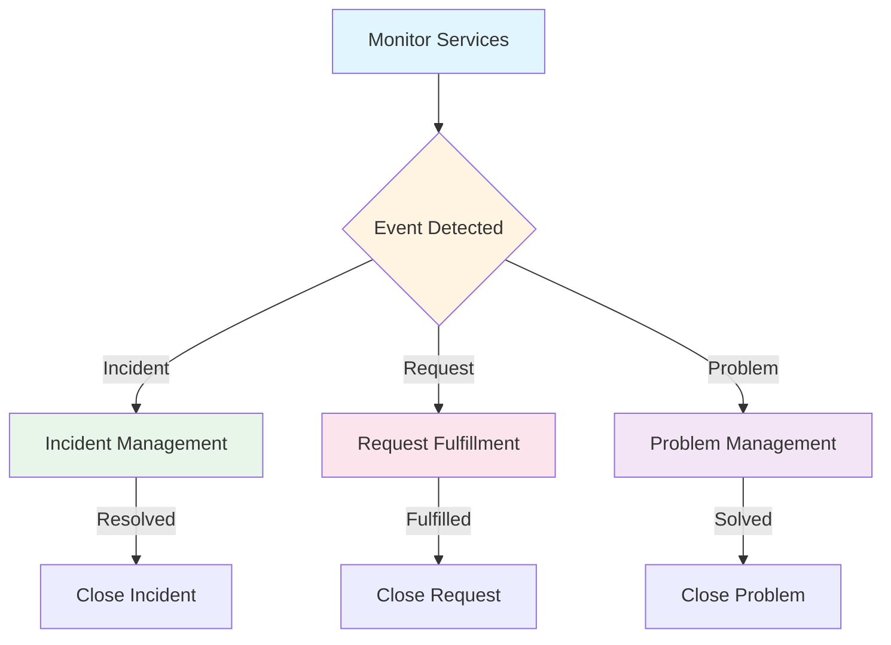

# Service Operation

**Level:** Intermediate  
**Last Updated:** January 2025

---

## Learning Objectives

By the end of this document, you should understand:
- Purpose and objectives of Service Operation
- Key Service Operation processes
- Service Operation functions
- How to operate services effectively
- Balancing stability and responsiveness

---

## Purpose of Service Operation

**Service Operation** ensures that IT services are delivered effectively and efficiently, meeting service level agreements and customer expectations.

### Key Objectives
- Deliver services according to SLAs
- Manage incidents and restore service quickly
- Solve problems and prevent recurrence
- Fulfill service requests
- Monitor services and events
- Maintain service stability
- Balance cost and quality

---

## Key Service Operation Processes

### Incident Management

**Purpose:** To restore normal service operation as quickly as possible.

**Key Activities:**
- Detect incidents
- Log incidents
- Categorize incidents
- Prioritize incidents
- Investigate incidents
- Resolve incidents
- Close incidents

**Incident Priority:**
- **Impact:** Effect on business
- **Urgency:** How quickly resolution is needed
- **Priority = Impact × Urgency**

**Priority Levels:**
- **P1 - Critical:** Major impact, immediate attention
- **P2 - High:** Significant impact, urgent
- **P3 - Medium:** Moderate impact, normal priority
- **P4 - Low:** Minor impact, low priority

**Example:** Email service down → P1 incident → Immediate investigation → Restore service → Close incident.

### Problem Management

**Purpose:** To find and eliminate root causes of incidents.

**Key Activities:**
- Detect problems
- Log problems
- Investigate problems
- Identify root causes
- Resolve problems
- Close problems
- Review problems

**Problem Management Types:**
- **Reactive:** Responding to incidents
- **Proactive:** Preventing incidents

**Known Error:**
- Problem with identified root cause
- Workaround available
- Permanent fix being developed

**Example:** Multiple email outages → Problem identified → Root cause: database corruption → Known error created → Fix developed → Problem resolved.

### Event Management

**Purpose:** To detect events and determine appropriate action.

**Key Activities:**
- Detect events
- Filter events
- Categorize events
- Correlate events
- Respond to events

**Event Types:**
- **Informational:** No action needed
- **Warning:** May need attention
- **Exception:** Requires action

**Example:** Server CPU > 90% → Warning event → Monitor → If persists, create incident.

### Request Fulfillment

**Purpose:** To handle service requests.

**Key Activities:**
- Receive requests
- Log requests
- Fulfill requests
- Close requests

**Service Request Examples:**
- Password reset
- Account creation
- Software installation
- Access request
- Information request

**Request Types:**
- **Standard:** Pre-approved, standard procedure
- **Normal:** Requires approval
- **Emergency:** Urgent request

**Example:** User requests software installation → Log request → Check approval → Install software → Close request.

### Access Management

**Purpose:** To grant authorized users access to services.

**Key Activities:**
- Verify identity
- Grant access
- Monitor access
- Revoke access
- Review access

**Access Management Principles:**
- **Identity:** Who is the user?
- **Access:** What can they access?
- **Rights:** What can they do?

**Example:** New employee → Verify identity → Grant email access → Monitor usage → Review periodically.

---

## Service Operation Functions

### Service Desk

**Purpose:** Single point of contact between service provider and users.

**Key Activities:**
- Receive contacts (calls, emails, chats)
- Log incidents and requests
- Provide first-line support
- Escalate when needed
- Communicate with users
- Close incidents and requests

**Service Desk Types:**
- **Call Center:** High volume, phone-based
- **Help Desk:** Focus on fixing issues
- **Service Desk:** Full service management

**Service Desk Structures:**
- **Local:** Single location
- **Centralized:** One location for all
- **Virtual:** Distributed, connected
- **Follow the Sun:** 24/7 coverage across time zones

**Example:** Service Desk receives call → Logs incident → Provides first-line support → Escalates if needed → Communicates resolution.

### Technical Management

**Purpose:** To manage IT infrastructure and provide technical expertise.

**Key Activities:**
- Maintain infrastructure
- Provide technical expertise
- Support other processes
- Manage technical teams
- Ensure technical quality

**Technical Management Areas:**
- Network Management
- Server Management
- Database Management
- Application Management

**Example:** Technical team maintains email servers, provides expertise for incidents, supports changes.

### IT Operations Management

**Purpose:** To perform day-to-day operational activities.

**Key Activities:**
- Monitor services
- Perform routine tasks
- Execute operational procedures
- Maintain operational documentation
- Manage backups

**IT Operations Types:**
- **IT Operations Control:** Monitoring and control
- **Facilities Management:** Data center management

**Example:** Operations team monitors email service 24/7, performs backups, executes maintenance procedures.

### Application Management

**Purpose:** To manage applications throughout their lifecycle.

**Key Activities:**
- Support applications
- Maintain applications
- Optimize applications
- Provide application expertise
- Manage application teams

**Application Management Role:**
- Supports Application Development
- Manages applications in operation
- Provides application expertise

**Example:** Application team supports email application, provides expertise, manages application lifecycle.

---

## Service Operation Activities

---

## Balancing Stability and Responsiveness

Service Operation must balance:
- **Stability:** Keeping services running smoothly
- **Responsiveness:** Responding quickly to issues
- **Cost:** Operating efficiently
- **Quality:** Meeting service levels

**Challenge:** Too much stability = slow response  
**Challenge:** Too much responsiveness = instability

**Solution:** Balanced approach with:
- Proactive monitoring
- Quick incident response
- Effective problem management
- Controlled changes

---

## Common Operation Challenges

### 1. High Incident Volume
**Problem:** Too many incidents to handle.  
**Solution:** Improve problem management, automate where possible, improve documentation.

### 2. Slow Incident Resolution
**Problem:** Incidents take too long to resolve.  
**Solution:** Better knowledge base, improved skills, faster escalation.

### 3. Poor Communication
**Problem:** Users not informed about issues.  
**Solution:** Regular communication, status updates, service status page.

### 4. Knowledge Gaps
**Problem:** Lack of knowledge causes delays.  
**Solution:** Knowledge management, documentation, training.

### 5. Uncontrolled Changes
**Problem:** Changes cause incidents.  
**Solution:** Better change management, more testing, controlled deployment.

---

## Key Performance Indicators

### Incident Management KPIs
- Average incident resolution time
- Percentage resolved within SLA
- First-line resolution rate
- Incident backlog

### Problem Management KPIs
- Problems resolved
- Average problem resolution time
- Percentage of incidents with problems
- Known errors in KEDB

### Request Fulfillment KPIs
- Requests fulfilled
- Average fulfillment time
- Percentage fulfilled within SLA
- Request backlog

---

## Key Takeaways

1. **Five processes:** Incident, Problem, Event, Request, Access Management
2. **Four functions:** Service Desk, Technical, Operations, Application Management
3. **Balance:** Stability vs responsiveness
4. **Focus:** Restore service quickly, solve problems permanently
5. **Communication:** Keep users informed
6. **Knowledge:** Capture and share knowledge

---

## Practice Questions

1. What is the difference between Incident and Problem Management?
2. What are the Service Operation functions?
3. What is the purpose of the Service Desk?
4. How do you balance stability and responsiveness?
5. What are the key Service Operation processes?

---

## Related Topics

- Service Design
- Service Transition
- Continual Service Improvement
- Incident Management
- Problem Management

---

## References

- ITIL Service Operation publication
- ITIL 4 Incident Management practice
- ITIL 4 Problem Management practice
- ITSM Best Practices
