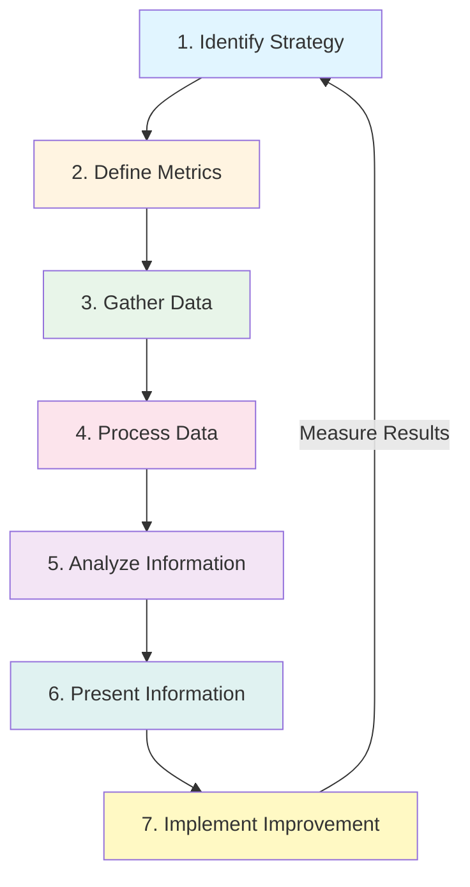

# Continual Service Improvement

**Level:** Intermediate  
**Last Updated:** January 2025

---

## Learning Objectives

By the end of this document, you should understand:
- Purpose and objectives of Continual Service Improvement
- The 7-Step Improvement Process
- How to measure and improve services
- CSI principles and approach
- How to implement improvements

---

## Purpose of Continual Service Improvement

**Continual Service Improvement (CSI)** ensures that services and processes are continuously improved to meet changing business needs and deliver increasing value.

### Key Objectives
- Identify improvement opportunities
- Measure and analyze performance
- Implement improvements
- Review and learn
- Align with business goals
- Increase value delivered
- Reduce costs
- Improve quality

---

## The 7-Step Improvement Process

### Step 1: Identify the Strategy for Improvement

**Purpose:** Understand what to improve and why.

**Key Activities:**
- Review business strategy
- Identify improvement opportunities
- Prioritize improvements
- Define improvement strategy

**Questions to Ask:**
- What are business goals?
- Where are we not meeting goals?
- What improvements are needed?
- What are the priorities?

**Example:** Business goal: Improve customer satisfaction → Identify: Email service issues affecting satisfaction → Priority: Fix email service reliability.

### Step 2: Define What You Will Measure

**Purpose:** Define metrics to measure improvement.

**Key Activities:**
- Identify what to measure
- Define metrics
- Set targets
- Define measurement methods

**Metrics Should Be:**
- Relevant to business goals
- Measurable
- Actionable
- Timely

**Example:** Measure email service availability → Target: 99.9% → Method: Monitor uptime.

### Step 3: Gather the Data

**Purpose:** Collect data for measurement.

**Key Activities:**
- Identify data sources
- Collect data
- Validate data
- Store data

**Data Sources:**
- Monitoring tools
- Service desk systems
- Surveys
- Reports
- Logs

**Example:** Gather email service data: uptime from monitoring, incidents from service desk, user feedback from surveys.

### Step 4: Process the Data

**Purpose:** Convert data into information.

**Key Activities:**
- Analyze data
- Identify trends
- Compare with targets
- Create reports

**Analysis Techniques:**
- Trend analysis
- Root cause analysis
- Gap analysis
- Benchmarking

**Example:** Process email data: Calculate availability percentage, identify downtime patterns, compare with 99.9% target.

### Step 5: Analyze the Information and Data

**Purpose:** Understand what the information means.

**Key Activities:**
- Analyze information
- Identify issues
- Find root causes
- Understand relationships

**Analysis Questions:**
- What does the data tell us?
- Why are we not meeting targets?
- What are the root causes?
- What needs to change?

**Example:** Analyze email availability: 98.5% (below target) → Root cause: Database issues → Need: Improve database reliability.

### Step 6: Present and Use the Information

**Purpose:** Share information and use it for improvement.

**Key Activities:**
- Create reports
- Present findings
- Share with stakeholders
- Use for decision-making

**Presentation Methods:**
- Dashboards
- Reports
- Presentations
- Meetings

**Example:** Present email availability findings: Current 98.5%, target 99.9%, gap 1.4%, root cause database issues, recommendation improve database.

### Step 7: Implement Improvement

**Purpose:** Make improvements and measure results.

**Key Activities:**
- Plan improvements
- Implement improvements
- Measure results
- Review effectiveness

**Implementation Steps:**
- Plan the improvement
- Get approval
- Implement
- Measure results
- Review

**Example:** Implement database improvements: Upgrade database, add redundancy → Measure: Availability improves to 99.8% → Review: Good progress, continue improvements.

---

## The 7-Step Process Flow

---

## CSI Approach

### Where Are We Now? (Baseline)

**Purpose:** Understand current state.

**Activities:**
- Measure current performance
- Identify current issues
- Document current state
- Establish baseline

**Example:** Current email availability: 98.5%, response time: 3 seconds, user satisfaction: 75%.

### Where Do We Want to Be? (Target)

**Purpose:** Define desired state.

**Activities:**
- Define targets
- Set goals
- Identify desired outcomes
- Align with business goals

**Example:** Target email availability: 99.9%, response time: < 2 seconds, user satisfaction: 90%.

### How Do We Get There? (Plan)

**Purpose:** Plan improvements.

**Activities:**
- Identify improvements needed
- Create improvement plan
- Allocate resources
- Set timeline

**Example:** Plan: Improve database reliability, optimize response time, improve user communication.

### Did We Get There? (Measure)

**Purpose:** Measure improvement results.

**Activities:**
- Measure results
- Compare with targets
- Assess success
- Identify gaps

**Example:** Measure: Availability 99.8%, response time 1.8 seconds, user satisfaction 88% → Progress made, continue.

### How Do We Keep Momentum? (Sustain)

**Purpose:** Maintain improvements.

**Activities:**
- Embed improvements
- Monitor continuously
- Continue improving
- Share lessons learned

**Example:** Sustain: Monitor continuously, continue improvements, share best practices.

---

## CSI Principles

### 1. Focus on Value
- All improvements should create value
- Understand what customers value
- Measure value delivered

### 2. Start Where You Are
- Don't start from scratch
- Build on existing capabilities
- Use current data

### 3. Progress Iteratively
- Make small improvements
- Build on successes
- Don't try to fix everything at once

### 4. Collaborate
- Involve stakeholders
- Work together
- Share knowledge

### 5. Think Holistically
- Consider whole system
- Understand relationships
- Avoid optimizing parts

### 6. Keep It Simple
- Simple improvements
- Avoid complexity
- Focus on what works

### 7. Measure and Validate
- Measure everything
- Validate improvements
- Use data to decide

---

## Improvement Opportunities

### Sources of Improvement Ideas
- Service level reviews
- Incident analysis
- Problem analysis
- Customer feedback
- Staff feedback
- Benchmarking
- Audits
- Risk assessments

### Types of Improvements
- **Service Improvements:** Improve service quality
- **Process Improvements:** Improve processes
- **Technology Improvements:** Improve technology
- **People Improvements:** Improve skills and knowledge
- **Cost Improvements:** Reduce costs

---

## Measurement and Metrics

### Types of Metrics
- **Technology Metrics:** Technical performance
- **Process Metrics:** Process performance
- **Service Metrics:** Service performance

### The Three Types of Metrics

**Technology Metrics:**
- Server CPU usage
- Network bandwidth
- Database performance

**Process Metrics:**
- Incident resolution time
- Change success rate
- Problem resolution time

**Service Metrics:**
- Service availability
- Service response time
- Customer satisfaction

### Balanced Scorecard

Measure from multiple perspectives:
- **Financial:** Cost, ROI
- **Customer:** Satisfaction, retention
- **Internal Process:** Efficiency, quality
- **Learning and Growth:** Skills, innovation

---

## Common CSI Challenges

### 1. No Baseline
**Problem:** Don't know where we are.  
**Solution:** Establish baseline before improving.

### 2. Wrong Metrics
**Problem:** Measuring wrong things.  
**Solution:** Align metrics with business goals.

### 3. No Action
**Problem:** Data collected but no action taken.  
**Solution:** Use data for decision-making, implement improvements.

### 4. Too Many Improvements
**Problem:** Trying to improve everything.  
**Solution:** Prioritize, focus on high-impact improvements.

### 5. No Follow-Up
**Problem:** Improvements not sustained.  
**Solution:** Monitor continuously, embed improvements.

---

## Key Takeaways

1. **7-Step Process:** Systematic approach to improvement
2. **CSI Approach:** Where are we now? Where do we want to be? How do we get there?
3. **Measure Everything:** Use metrics to guide improvements
4. **Continuous:** Improvement never stops
5. **Value Focus:** All improvements should create value
6. **Iterative:** Small, continuous improvements

---

## Practice Questions

1. What are the 7 steps of the improvement process?
2. What is the CSI approach?
3. What are the three types of metrics?
4. How do you identify improvement opportunities?
5. Why is measurement important for improvement?

---

## Related Topics

- Service Strategy
- Service Design
- Service Operation
- Measurement and Metrics
- ITIL 4 Continual Improvement practice

---

## References

- ITIL Continual Service Improvement publication
- ITIL 4 Continual Improvement practice
- ITSM Best Practices
- Balanced Scorecard methodology
