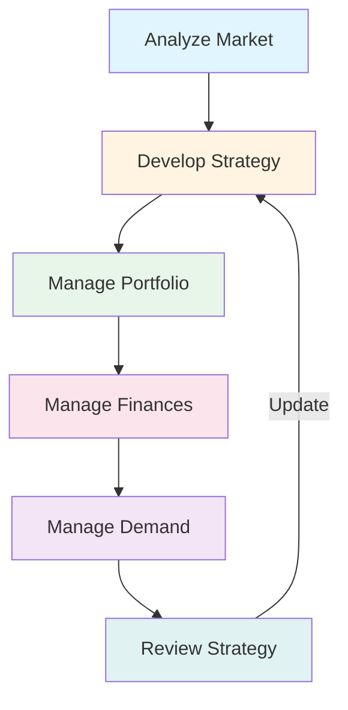

# Service Strategy

**Level:** Advanced  
**Last Updated:** January 2025

---

## Learning Objectives

By the end of this document, you should understand:
- Purpose and objectives of Service Strategy
- Key Service Strategy processes
- How to develop service strategy
- Service portfolio management
- Financial management in IT services
- Demand management

---

## Purpose of Service Strategy

**Service Strategy** helps organizations understand market and customer needs, develop service strategy, and make strategic decisions about IT services.

### Key Objectives
- Understand customer needs
- Understand market conditions
- Develop service strategy
- Define service portfolio
- Manage IT finances
- Manage demand
- Build capabilities
- Make strategic decisions

---

## Key Service Strategy Processes

### Strategy Management for IT Services

**Purpose:** To develop and maintain service strategy.

**Key Activities:**
- Analyze market and customer needs
- Assess capabilities
- Develop strategy
- Communicate strategy
- Review and update strategy

**Strategy Components:**
- **Vision:** What we want to achieve
- **Mission:** What we do
- **Objectives:** Specific goals
- **Policies:** Guidelines
- **Plans:** How to achieve objectives

**Example:** Strategy: Become leading provider of cloud-based IT services → Vision: Cloud-first organization → Objectives: Migrate 80% to cloud by 2026.

### Service Portfolio Management

**Purpose:** To manage the service portfolio.

**Key Activities:**
- Define service portfolio
- Categorize services
- Evaluate services
- Prioritize services
- Retire services
- Review portfolio

**Service Portfolio Components:**
- **Service Pipeline:** Services in development
- **Service Catalog:** Live services
- **Retired Services:** Services no longer offered

**Portfolio Analysis:**
- **Strategic Fit:** Aligns with strategy?
- **Value:** Creates value?
- **Risk:** What are the risks?
- **Cost:** What does it cost?
- **Demand:** Is there demand?

**Example:** Portfolio: Email (live), CRM (live), New AI service (pipeline), Old mainframe (retired).

### Financial Management for IT Services

**Purpose:** To manage IT finances.

**Key Activities:**
- Budget planning
- Cost management
- Pricing services
- Accounting
- Charging (if applicable)
- Financial reporting

**Financial Management Activities:**
- **Budgeting:** Plan finances
- **Accounting:** Track finances
- **Charging:** Charge for services (optional)
- **Costing:** Understand costs

**Cost Types:**
- **Capital Expenditure (CapEx):** One-time costs (hardware)
- **Operational Expenditure (OpEx):** Ongoing costs (licenses, support)

**Pricing Strategies:**
- **Cost Plus:** Cost + margin
- **Market Rate:** Based on market
- **Value-Based:** Based on value delivered

**Example:** Email service costs: Infrastructure $10K/month, licenses $5K/month, support $3K/month → Total $18K/month → Price: $20K/month (cost plus).

### Demand Management

**Purpose:** To understand and influence customer demand.

**Key Activities:**
- Understand demand patterns
- Forecast demand
- Influence demand
- Manage demand
- Optimize capacity

**Demand Patterns:**
- **Predictable:** Regular patterns (business hours)
- **Unpredictable:** Irregular patterns (incidents)
- **User-Driven:** User-initiated (requests)
- **Event-Driven:** Event-triggered (deployments)

**Demand Management Techniques:**
- **Differential Charging:** Charge more during peak
- **Off-Peak Discounts:** Encourage off-peak usage
- **Capacity Planning:** Plan for demand
- **User Education:** Educate users

**Example:** Email demand peaks at 9 AM → Influence: Encourage off-peak sending → Result: Smoother demand curve.

### Business Relationship Management

**Purpose:** To manage relationships with customers.

**Key Activities:**
- Understand customer needs
- Communicate with customers
- Manage expectations
- Resolve issues
- Build relationships

**Relationship Management:**
- **Regular Reviews:** Service level reviews
- **Communication:** Regular updates
- **Feedback:** Gather feedback
- **Issue Resolution:** Resolve problems
- **Value Demonstration:** Show value delivered

**Example:** Monthly service review with business unit → Discuss performance → Gather feedback → Identify improvements.

---

## Service Strategy Concepts

### Service Provider Types

**Type I - Internal Service Provider:**
- Part of same organization
- Serves internal customers
- Example: IT department

**Type II - Shared Services Provider:**
- Separate organization, same parent
- Serves multiple business units
- Example: Shared IT services

**Type III - External Service Provider:**
- Separate organization
- Serves external customers
- Example: Cloud providers, MSPs

### Service Models

**Utility Services:**
- Basic functionality
- Standardized
- Low cost
- Example: Email, file storage

**Warranty Services:**
- Quality assurance
- Performance guarantees
- Example: High availability, fast response

**Core Services:**
- Essential services
- Business-critical
- Example: Core banking system

**Enabling Services:**
- Support core services
- Example: Network, security

**Enhancing Services:**
- Add value
- Differentiate
- Example: Advanced analytics, AI features

### Service Assets

**Service Assets:** Resources and capabilities used to deliver services.

**Types:**
- **Resources:** Tangible assets (hardware, software)
- **Capabilities:** Intangible assets (skills, knowledge, processes)

**Example:** Email service assets: Servers (resources), IT team skills (capabilities), processes (capabilities).

---

## Strategic Decisions

### What Services to Offer?

**Considerations:**
- Customer needs
- Market demand
- Capabilities
- Competition
- Strategy alignment
- Value potential

### How to Compete?

**Competitive Strategies:**
- **Cost Leadership:** Lowest cost
- **Differentiation:** Unique features
- **Focus:** Niche market

**Example:** Email service strategy: Differentiation → Focus on security and compliance for financial services.

### How to Fund?

**Funding Models:**
- **Centralized:** Central IT budget
- **Decentralized:** Business unit budgets
- **Chargeback:** Charge users
- **Showback:** Show costs without charging

### How to Organize?

**Organization Models:**
- **Centralized:** Single IT organization
- **Decentralized:** Distributed IT
- **Hybrid:** Mix of both

---

## Service Strategy Activities

---

## Common Strategy Challenges

### 1. Unclear Strategy
**Problem:** Strategy not well defined.  
**Solution:** Develop clear strategy, communicate effectively.

### 2. Misalignment
**Problem:** Services not aligned with business.  
**Solution:** Regular alignment reviews, understand business needs.

### 3. Poor Portfolio Management
**Problem:** Too many services, unclear value.  
**Solution:** Regular portfolio reviews, retire unused services.

### 4. Financial Issues
**Problem:** Costs not understood, over budget.  
**Solution:** Better financial management, cost transparency.

### 5. Demand Mismatch
**Problem:** Capacity doesn't match demand.  
**Solution:** Better demand management, capacity planning.

---

## Key Takeaways

1. **Five processes:** Strategy, Portfolio, Finance, Demand, Relationships
2. **Strategic thinking:** Long-term perspective
3. **Portfolio management:** Manage all services
4. **Financial management:** Understand costs and value
5. **Demand management:** Understand and influence demand
6. **Business alignment:** Align with business goals

---

## Practice Questions

1. What are the Service Strategy processes?
2. What is Service Portfolio Management?
3. How does Financial Management work?
4. What is Demand Management?
5. How do you develop service strategy?

---

## Related Topics

- Service Design
- Service Portfolio
- Financial Management
- Business Relationship Management
- ITIL 4 Strategy Management practice

---

## References

- ITIL Service Strategy publication
- ITIL 4 Strategy Management practice
- ITIL 4 Portfolio Management practice
- Strategic Management frameworks
