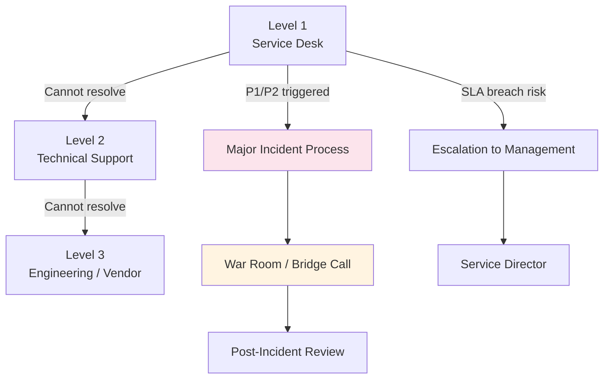

# ITSM Practical Operations Guide

**Last Updated:** February 2025  
**Version:** ITSM Best Practices  
**Level:** Advanced

---

## Overview

This guide covers the day-to-day operational work of running IT Service Management — the meetings, documents, tools, roles, and governance ceremonies that make ITSM real. It bridges the gap between ITSM theory and what a consultant or practitioner actually does on a weekly and monthly basis.

---

## Meeting Cadence

| Meeting | Frequency | Duration | Attendees | Purpose |
|---------|-----------|----------|-----------|---------|
| **Daily Stand-up / Ops Huddle** | Daily | 15 min | Service Desk lead, Shift leads, Major Incident Manager | Review overnight incidents, handover, priorities for the day |
| **Incident Review** | Weekly | 60 min | Incident Manager, Service Desk, Technical Leads | Review open incidents, escalations, SLA breaches, aging tickets |
| **Problem Management Board** | Bi-weekly | 60 min | Problem Manager, Technical SMEs, Change Manager | Review known errors, root cause progress, workaround effectiveness |
| **Change Advisory Board (CAB)** | Weekly | 60–90 min | Change Manager, App owners, Infra leads, Security, Business reps | Review, assess, and authorize changes for the upcoming window |
| **Service Review** | Monthly | 60–90 min | Service Owner, Account Manager, Customer sponsor, Key stakeholders | Review SLA performance, incidents, changes, improvement items |
| **Continual Improvement Review** | Monthly | 60 min | CSI Manager, Process Owners, Service Owners | Review improvement register, prioritize initiatives, track outcomes |
| **Service Management Steering** | Quarterly | 90 min | IT Director, Service Managers, Business stakeholders | Strategic review of service portfolio, budget, capability maturity |

### Sample Weekly Calendar

```
Monday:    Daily Ops Huddle → CAB Preparation
Tuesday:   Daily Ops Huddle → Change Advisory Board (CAB)
Wednesday: Daily Ops Huddle → Incident Review
Thursday:  Daily Ops Huddle → Problem Management Board (bi-weekly)
Friday:    Daily Ops Huddle → Week-in-Review / Retrospective
```

---

## Key Documents & Templates

| Document | Purpose | Owner | Update Frequency |
|----------|---------|-------|-----------------|
| **Service Catalog** | Published list of all IT services available to the business | Service Portfolio Manager | Quarterly |
| **Service Level Agreement (SLA)** | Formal agreement defining service targets (availability, response time, resolution time) | Service Level Manager | Annually (reviewed quarterly) |
| **Operational Level Agreement (OLA)** | Internal agreement between IT teams supporting the SLA | Service Level Manager | Annually |
| **Underpinning Contract (UC)** | Contract with third-party vendors supporting the SLA | Vendor Manager | Per contract term |
| **Known Error Database (KEDB)** | Repository of known errors and workarounds | Problem Manager | Ongoing |
| **Change Schedule / Forward Schedule of Change** | Calendar of approved and planned changes | Change Manager | Weekly (post-CAB) |
| **Incident Report (Major)** | Post-incident review document for major incidents | Major Incident Manager | Per major incident |
| **Service Improvement Plan (SIP)** | Prioritized register of improvement initiatives | CSI Manager | Monthly |
| **CMDB / Configuration Records** | Authoritative source of configuration items and relationships | Configuration Manager | Ongoing |
| **Capacity Plan** | Forecast of capacity requirements and recommendations | Capacity Manager | Quarterly |

---

## Tools & Technology Ecosystem

While ITSM is a practice, its execution depends heavily on enterprise platforms. Here is how the tooling landscape maps to ITSM operations:

### 1. Primary ITSM Platforms (Systems of Record)
- **ServiceNow (ITSM Module):** The enterprise market leader. Operations rely heavily on its native Incident, Problem, and Change workflows. CAB meetings often run directly out of the *CAB Workbench*, and service requests flow through the *Service Portal*.
- **Jira Service Management (JSM):** Highly favored by teams with a strong Agile/DevOps culture, linking tickets directly to Jira Software epics and sprints.
- **BMC Helix / Freshservice / Ivanti:** Strong alternatives depending on enterprise size and legacy footprint.

### 2. IT Operations Management (ITOM) & Observability
- **Tools:** Datadog, Dynatrace, Splunk, ServiceNow ITOM.
- **Usage:** These tools feed into Event Management. They detect anomalies, filter noise, and automatically generate Incidents in the ITSM platform when thresholds are breached.

### 3. CMDB & Discovery
- **Tools:** ServiceNow CMDB, Device42, Lansweeper.
- **Usage:** Uses auto-discovery probes across the network to automatically populate CI (Configuration Item) records, which are critical for Change impact analysis and Incident routing.

### 4. Communication & ChatOps
- **Tools:** MS Teams, Slack, PagerDuty, xMatters.
- **Usage:** Critical for Major Incident Management (MIM). Tools like PagerDuty handle on-call routing and instantly spin up Slack channels or Teams bridge calls for War Rooms.

---

## Roles & Responsibilities

| Role | Key Responsibilities |
|------|---------------------|
| **Service Desk Analyst** | First point of contact; log, categorize, prioritize, and resolve/escalate incidents |
| **Incident Manager** | Manage incident lifecycle; coordinate resolution; report on SLA compliance |
| **Major Incident Manager** | Lead crisis response for P1/P2 incidents; coordinate war rooms; produce PIR |
| **Problem Manager** | Identify root causes; manage known errors and workarounds; drive permanent fixes |
| **Change Manager** | Manage change lifecycle; chair CAB; assess risk and impact of changes |
| **Service Level Manager** | Negotiate and monitor SLAs/OLAs; report on service performance |
| **Service Owner** | Accountable end-to-end for a specific service; champion improvements |
| **Configuration Manager** | Maintain CMDB accuracy; manage CI lifecycle; support impact analysis |
| **CSI Manager** | Drive continual improvement; maintain improvement register; track benefits |

---

## Governance Ceremonies

### Escalation Framework



### Change Approval Tiers

| Change Type | Approval | CAB Required? | Example |
|-------------|----------|--------------|---------|
| **Standard** | Pre-approved | No | Password reset, user provisioning |
| **Normal (Low Risk)** | Change Manager | No | Minor config change, patch (non-production) |
| **Normal (Medium/High Risk)** | CAB | Yes | Production deployment, infrastructure change |
| **Emergency** | Emergency CAB (ECAB) | Yes (abbreviated) | Critical security patch, P1 fix |

---

## Reporting & Metrics

### Operational KPIs

| Metric | Target | Frequency |
|--------|--------|-----------|
| **First Contact Resolution (FCR)** | ≥70% | Weekly |
| **Mean Time to Resolve (MTTR)** | P1: <4h, P2: <8h, P3: <24h | Weekly |
| **SLA Compliance** | ≥95% per service | Monthly |
| **Change Success Rate** | ≥95% | Monthly |
| **Backlog Aging** | <5% tickets >30 days | Weekly |
| **Customer Satisfaction (CSAT)** | ≥4.0/5.0 | Monthly |
| **Known Error Closure Rate** | Trend improving | Monthly |

### Monthly Service Report Template

1. Executive Summary (SLA scorecard)
2. Incident Trends (volume, categories, top issues)
3. Major Incidents (detail per incident)
4. Problem Management (open problems, RCA progress)
5. Change Management (volume, success rate, failed changes)
6. Service Improvement Progress
7. Upcoming Risks & Actions

---

## Banking / Financial Services Context

> [!IMPORTANT]
> Financial institutions have additional ITSM requirements driven by regulation:

| Area | Requirement | Impact on ITSM |
|------|-------------|---------------|
| **Change Freeze Windows** | Regulators and internal policy restrict changes near financial close, quarter-end, year-end | CAB must maintain a change freeze calendar; emergency changes need heightened approval |
| **Regulatory Incident Reporting** | Major cyber incidents must be reported to regulators (e.g., OJK, BI, MAS) within hours | Major Incident process must include regulatory notification step |
| **Audit Trail** | All changes must have full audit trail | ITSM tool must capture who/what/when/why for every ticket and change |
| **DR/BCP Testing** | Annual disaster recovery tests required | Service Continuity Management must schedule and execute DR drills |
| **Third-Party Risk** | Outsourced services must meet same SLA and compliance standards | OLAs and UCs must include regulatory compliance clauses |

---

## Key Takeaways

- ITSM operations revolve around a **weekly rhythm** of incident reviews, CAB, and problem boards
- The **Service Catalog + SLA + OLA** trio forms the contractual backbone
- Tools like **ServiceNow** are central but must be configured to enforce process, not just track tickets
- In banking, **audit trails, change freeze windows, and regulatory reporting** add layers of governance

## Cross-References

- [ITSM Foundation — Concepts and Principles](../01_foundation/01_concepts_and_principles.md)
- [ITIL Practices — Practical Operations](../ITIL/04_practices/04_practical_operations.md)
- [COBIT Implementation — Practical Operations](../COBIT/03_implementation/05_practical_operations.md)
