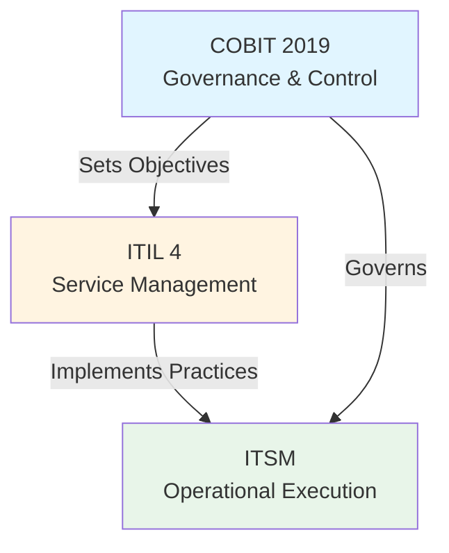

# ITSM, ITIL, and COBIT Learning Materials

**Last Updated:** January 2025  
**Versions:** ITIL 4 (2019, updated 2024-2025), COBIT 2019 (2018, current), ITSM Best Practices

---

## Overview

This directory contains comprehensive learning materials for four essential IT governance, service management, and cloud financial management frameworks:

- **ITSM** (IT Service Management) - The practice of designing, implementing, managing, and improving IT services
- **ITIL 4** (Information Technology Infrastructure Library) - The most widely adopted framework for IT service management
- **COBIT 2019** (Control Objectives for Information and Related Technologies) - A framework for IT governance and management
- **FinOps** (Financial Operations) - A cultural practice for managing cloud financial operations and optimizing cloud costs

---

## Framework Comparison

| Dimension | ITSM | ITIL 4 | COBIT 2019 | FinOps |
|-----------|------|--------|------------|--------|
| **Primary Focus** | IT Service Management Practice | Service Management Framework | IT Governance & Management | Cloud Financial Operations |
| **Scope** | Operational to Strategic | Service Lifecycle & Value | Governance & Control | Cloud Cost Management |
| **Level** | Practice/Approach | Framework/Standard | Governance Framework | Cultural Practice |
| **Key Concepts** | Service lifecycle, processes | Service Value System, 34 practices | 40 governance objectives, 5 domains | 6 capabilities, 3-phase lifecycle |
| **Best For** | Service delivery improvement | Standardizing service management | Governance, risk, compliance | Cloud cost optimization |
| **Certification** | Vendor-specific | PeopleCert (Foundation → Master) | ISACA (Foundation → Assessor) | FinOps Foundation (Practitioner → Engineer) |

---

## How Frameworks Complement Each Other



**Synergy:**
- **COBIT** establishes governance objectives and control requirements
- **ITIL 4** provides standardized practices to achieve those objectives
- **ITSM** operationalizes ITIL practices in day-to-day operations

**Example Integration:**
- COBIT defines "Align, Plan & Organize" objectives for change management
- ITIL 4 provides the Change Enablement practice with detailed guidance
- ITSM implements the practice through tools, processes, and people

---

## Learning Paths

### Path 1: Beginner (Foundation Level)
**Duration:** 4-6 weeks  
**Goal:** Understand core concepts and terminology

1. **Week 1-2:** ITSM Foundation
   - Start with `ITSM/01_foundation/` materials
   - Understand service lifecycle and key concepts

2. **Week 3-4:** ITIL 4 Foundation
   - Study `ITIL/01_foundation/` materials
   - Focus on Service Value System and core practices
   - Consider ITIL 4 Foundation certification

3. **Week 5-6:** COBIT Foundation
   - Review `COBIT/01_foundation/` materials
   - Understand governance vs management
   - Learn about 40 governance objectives

**Outcome:** Solid foundation in all three frameworks, ready for intermediate study

---

### Path 2: Intermediate (Professional Level)
**Duration:** 8-12 weeks  
**Goal:** Deep dive into implementation and practices

1. **ITIL Managing Professional Track** (4-6 weeks)
   - Study all modules in `ITIL/02_managing_professional/`
   - Focus on Create, Deliver & Support
   - Understand High-Velocity IT

2. **COBIT Implementation** (3-4 weeks)
   - Review `COBIT/03_implementation/` materials
   - Learn design factors and tailoring
   - Study maturity assessment

3. **ITSM Advanced Practices** (2-3 weeks)
   - Review `ITSM/03_advanced/` materials
   - Understand service strategy
   - Learn implementation best practices

**Outcome:** Professional-level understanding, ready for advanced topics

---

### Path 3: Advanced (Strategic Level)
**Duration:** 10-16 weeks  
**Goal:** Strategic leadership and framework integration

1. **ITIL Strategic Leader Track** (4-6 weeks)
   - Study `ITIL/03_strategic_leader/` materials
   - Focus on Digital & IT Strategy
   - Understand transformation leadership

2. **COBIT Advanced Topics** (4-6 weeks)
   - Review `COBIT/04_advanced/` materials
   - Deep dive into risk management
   - Study compliance and audit
   - Learn framework integration

3. **Framework Integration** (2-4 weeks)
   - Understand how to combine COBIT + ITIL + ITSM
   - Study real-world implementation cases
   - Learn to tailor frameworks to organizational needs

**Outcome:** Strategic understanding, capable of leading framework implementations

---

## Quick Start Guide

### For Complete Beginners
1. Start with `ITSM/01_foundation/concepts_and_principles.md`
2. Read `ITIL/README.md` for ITIL overview
3. Review `COBIT/README.md` for COBIT overview
4. Choose your learning path above

### For Those with Some Experience
1. Review framework README files to identify knowledge gaps
2. Jump to relevant sections based on your needs
3. Use reference indexes for official resources

### For Certification Preparation
1. **ITIL 4 Foundation:** Focus on `ITIL/01_foundation/` and `ITIL/references/practice_exams.md`
2. **COBIT Foundation:** Study `COBIT/01_foundation/` and review `COBIT/references/certification_paths.md`
3. Use practice questions and exam prep materials in each framework's references folder

---

## Directory Structure

```
frameworks_learning/
├── README.md (this file)
├── ITSM/
│   ├── 01_foundation/ (Core concepts and principles)
│   ├── 02_intermediate/ (Service lifecycle stages)
│   ├── 03_advanced/ (Strategy and implementation)
│   └── references/ (Resources and links)
├── ITIL/
│   ├── 01_foundation/ (ITIL 4 Foundation level)
│   ├── 02_managing_professional/ (MP track modules)
│   ├── 03_strategic_leader/ (SL track modules)
│   ├── 04_practices/ (All 34 practices)
│   └── references/ (Certification and resources)
├── COBIT/
│   ├── 01_foundation/ (COBIT 2019 Foundation)
│   ├── 02_governance_objectives/ (40 objectives)
│   ├── 03_implementation/ (Design and implementation)
│   ├── 04_advanced/ (Risk, compliance, integration)
│   └── references/ (ISACA resources)
└── FinOps/
    ├── 01_foundation/ (FinOps fundamentals)
    ├── 02_intermediate/ (Six capabilities)
    ├── 03_advanced/ (Implementation and best practices)
    └── references/ (FinOps Foundation resources)
```

---

## Key Concepts Overview

### ITSM Core Concepts
- **Service:** A means of delivering value to customers
- **Service Lifecycle:** Strategy → Design → Transition → Operation → Improvement
- **Process:** A structured set of activities designed to accomplish a specific objective
- **Function:** A team or group of people with specific responsibilities

### ITIL 4 Core Concepts
- **Service Value System (SVS):** How components work together to create value
- **Service Value Chain:** Six activities that create value
- **Guiding Principles:** Seven principles for service management
- **Four Dimensions:** Organizations & People, Information & Technology, Partners & Suppliers, Value Streams & Processes
- **34 Practices:** General, Service Management, and Technical Management practices

### COBIT 2019 Core Concepts
- **Governance vs Management:** Governance sets direction, management executes
- **40 Governance Objectives:** Organized into 5 domains
- **Design Factors:** 11 factors that influence framework design
- **Focus Areas:** Specific topics like security, risk, DevOps
- **Maturity Model:** 0-5 scale for capability assessment

---

## Version Information

### ITIL 4
- **Current Version:** ITIL 4 (released 2019)
- **Latest Updates:** 2024-2025 (updated modules and materials)
- **Status:** Active and current
- **Next Version:** No ITIL 5 announced as of 2025

### COBIT 2019
- **Current Version:** COBIT 2019 (released November 2018)
- **Latest Updates:** 2025 (extensions for AI governance, etc.)
- **Status:** Active and current
- **Next Version:** No newer version announced as of 2025

### ITSM
- **Type:** Best practices approach (not versioned)
- **Alignment:** Closely aligned with ITIL framework
- **Status:** Evolving with industry best practices

---

## Resources and Support

### Official Sources
- **ITIL:** [itil.com](https://www.itil.com) | [PeopleCert](https://www.peoplecert.org)
- **COBIT:** [ISACA.org](https://www.isaca.org/resources/cobit)
- **ITSM:** Various vendors and communities

### Study Communities
- Reddit: r/ITIL, r/ITSM
- LinkedIn: ITIL and COBIT groups
- ISACA: Local chapters and online communities

### Getting Help
- Review framework-specific README files
- Check references folders for official documentation
- Use practice questions to test understanding
- Join study groups for discussion

---

## Notes for Banking/Financial Services Context

These materials are particularly relevant for organizations that need to:
- Align IT operations with regulatory requirements
- Implement robust change management
- Plan strategic IT initiatives
- Ensure governance and compliance

**Key Applications:**
- **COBIT:** IT governance alignment with regulatory requirements
- **ITIL:** Standardizing change management processes
- **ITSM:** Improving service delivery and customer satisfaction
- **FinOps:** Optimizing cloud costs and financial operations

---

## Contributing and Updates

This is a living document. As frameworks evolve, materials will be updated. Check official sources for the latest information.

**Last Review:** January 2025  
**Next Review:** Quarterly or as frameworks update

---

## License and Usage

These materials are for educational purposes. For official certification, refer to:
- ITIL: PeopleCert/AXELOS official materials
- COBIT: ISACA official publications
- ITSM: Vendor-specific training

---

**Happy Learning!** 🚀

Start your journey by choosing a learning path above and diving into the framework that interests you most.
