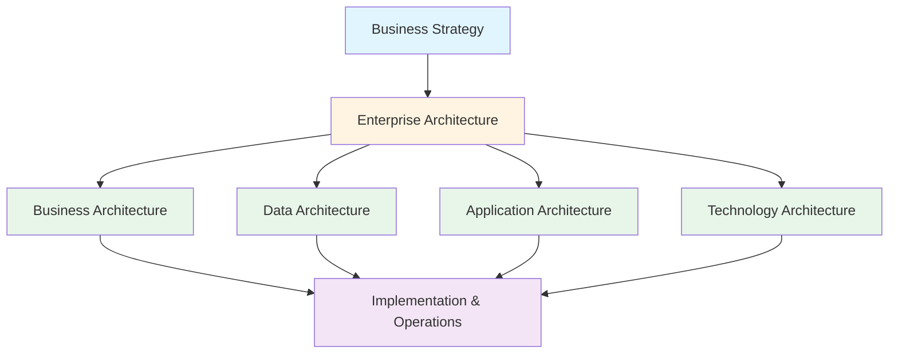

# TOGAF Overview and History

**Last Updated:** February 2025  
**Version:** TOGAF Standard, 10th Edition  
**Level:** Foundation

---

## Overview

TOGAF (The Open Group Architecture Framework) is the world's most widely adopted framework for enterprise architecture. It provides a systematic approach to designing, planning, implementing, and governing an enterprise information technology architecture. Since its first release in 1995, TOGAF has evolved through multiple versions to address the changing landscape of enterprise IT.

This document covers TOGAF's origins, its evolution, the governing body behind it, and what makes the 10th Edition a significant step forward.

---

## History of TOGAF

### Origins

TOGAF traces its roots to the **Technical Architecture Framework for Information Management (TAFIM)**, developed by the U.S. Department of Defense in the early 1990s. When the DoD made TAFIM publicly available, The Open Group adopted and evolved it into the first version of TOGAF in 1995.

### Version Timeline

| Version | Year | Key Milestones |
|---------|------|----------------|
| TOGAF 1.0 | 1995 | Initial release, based on TAFIM |
| TOGAF 7 | 2001 | Introduced the Architecture Development Method (ADM) |
| TOGAF 8 | 2002–2006 | Enterprise edition, expanded scope beyond IT |
| TOGAF 9.0 | 2009 | Major overhaul — content framework, Enterprise Continuum, governance |
| TOGAF 9.1 | 2011 | Refinements and clarifications |
| TOGAF 9.2 | 2018 | Business Architecture guidance, agile alignment, updated ADM |
| TOGAF Standard, 10th Edition | 2022 | Modular structure, expanded guidance, cloud/AI/digital focus |

### The Open Group

The **Open Group** is a global consortium of over 800 organizations that develops open, vendor-neutral technology standards and certifications. Key facts:

- **Founded:** 1996 (merger of X/Open and the Open Software Foundation)
- **Headquarters:** Operates globally with no single HQ
- **Other standards:** ArchiMate, Open FAIR, IT4IT
- **Certification:** Administers TOGAF certification exams via Pearson VUE and accredited training providers

---

## What is Enterprise Architecture?

Enterprise Architecture (EA) is the practice of analyzing, designing, planning, and implementing enterprise analysis to successfully execute on business strategies. EA considers the enterprise as a system of interconnected components:

EA answers questions like:
- **Where are we now?** (current state / baseline architecture)
- **Where do we want to be?** (target architecture)
- **How do we get there?** (transition architecture / roadmap)

---

## The 10th Edition: What Changed

The TOGAF Standard, 10th Edition (2022) is described by The Open Group as an "evolution, not a revolution." The most significant changes are structural and practical:

### Modular Document Structure

The monolithic TOGAF 9 document was split into two main components:

| Component | Content | Update Frequency |
|-----------|---------|-----------------|
| **Fundamental Content** | Core concepts, ADM, architecture content framework, Enterprise Continuum, capability framework | Stable, updated with major releases |
| **TOGAF Series Guides** | Topical guides on specific subjects (e.g., agile EA, security architecture, cloud) | Updated independently, more frequently |

> [!IMPORTANT]
> This modular approach means you no longer need to read the entire TOGAF document. You can start with the Fundamental Content and pick up Series Guides as needed for your specific context.

### ADM Flexibility

The 10th Edition removed directional arrowheads from the ADM cycle diagram, signaling that:
- Phases do **not** need to be performed in strict sequence
- The ADM supports iterative and agile approaches
- Architects can enter the cycle at any phase appropriate to their context

### Expanded Practical Guidance

- More "how-to" content for applying TOGAF in practice
- Guidance for emerging topics: cloud, AI, digital transformation
- Better support for agile enterprise architecture

### Broader Audience

The 10th Edition explicitly targets a wider range of roles beyond traditional Enterprise Architects:
- Business Architects, Solution Architects, Data Architects
- Digital and agile practitioners
- Product managers and C-suite executives

---

## Why TOGAF Matters

### For Organizations

- **Standardized approach** to enterprise architecture across teams and departments
- **Vendor-neutral** — works with any technology stack
- **Proven at scale** — used by 80% of Global 50 companies (per The Open Group)
- **Reduces risk** — structured governance and change management

### For Practitioners

- **Globally recognized certification** — enhances career prospects
- **Common language** — enables communication across business and IT
- **Reusable assets** — Enterprise Continuum promotes reuse of architecture patterns
- **Flexible** — can be tailored to any organization's size and industry

---

## Key Takeaways

- TOGAF originated from the U.S. DoD's TAFIM and has been maintained by The Open Group since 1995
- The 10th Edition (2022) introduced a modular structure and expanded practical guidance
- TOGAF's core is the Architecture Development Method (ADM), an iterative cycle
- Enterprise architecture bridges business strategy and IT implementation
- TOGAF certification is vendor-neutral, globally recognized, and does not expire

## Cross-References

- Related framework: [COBIT — IT Governance](../COBIT/README.md)
- Related framework: [ITIL — IT Service Management](../ITIL/README.md)
- Next topic: [Core Concepts](./02_core_concepts.md)

## Sources

- The Open Group — [TOGAF Standard](https://www.opengroup.org/togaf)
- The Open Group — [About The Open Group](https://www.opengroup.org/about)
- CIO.com — "What is TOGAF? An enterprise architecture methodology for business"
- Visual Paradigm — "Introduction to TOGAF 10th Edition"
