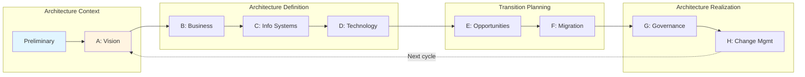
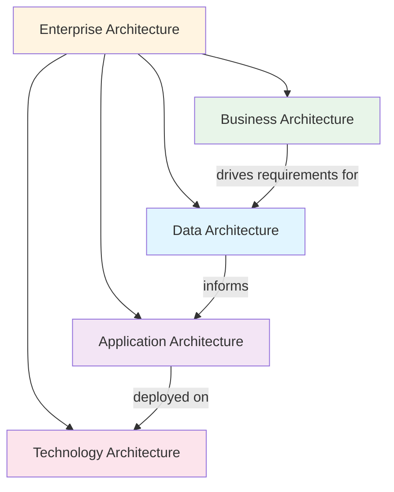
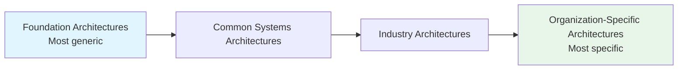

# TOGAF Core Concepts

**Last Updated:** February 2025  
**Version:** TOGAF Standard, 10th Edition  
**Level:** Foundation

---

## Overview

TOGAF is built around a set of interconnected core concepts that together form a comprehensive approach to enterprise architecture. This document covers the five pillars of TOGAF: the Architecture Development Method (ADM), the four architecture domains, the Enterprise Continuum, the Architecture Content Framework, and the Architecture Capability Framework.

---

## 1. Architecture Development Method (ADM)

The ADM is TOGAF's core — an iterative, phase-based method for developing and maintaining enterprise architecture.

### ADM Phases

| Phase | Name | Purpose |
|-------|------|---------|
| **Preliminary** | Framework & Principles | Prepare the organization for EA; tailor TOGAF; define architecture principles |
| **A** | Architecture Vision | Define scope, stakeholders, and high-level vision; obtain approval to proceed |
| **B** | Business Architecture | Develop the target business architecture; model capabilities and value streams |
| **C** | Information Systems Architecture | Develop data architecture and application architecture |
| **D** | Technology Architecture | Define the technology portfolio and platform design |
| **E** | Opportunities & Solutions | Identify delivery vehicles; group work packages |
| **F** | Migration Planning | Create detailed implementation and migration plans |
| **G** | Implementation Governance | Oversee the implementation of the architecture |
| **H** | Architecture Change Management | Manage ongoing changes to the architecture |
| **RM** | Requirements Management | Continuous process; manages requirements throughout all phases |

### ADM Iteration

The ADM is designed to be iterative:

> [!TIP]
> In the 10th Edition, phases do not need to follow a strict sequence. You can enter the ADM at any phase and iterate as needed for your context.

### Inputs and Outputs

Each ADM phase has defined:
- **Inputs** — What you need to begin the phase
- **Steps** — Activities to perform within the phase
- **Outputs** — Deliverables produced by the phase

---

## 2. Four Architecture Domains (BDAT)

TOGAF organizes enterprise architecture into four interrelated domains:

### Business Architecture

- **Scope:** Business strategy, governance, organization, key business processes
- **Key Deliverables:** Business capability maps, value streams, organizational charts, process models
- **ADM Phase:** Phase B

### Data Architecture

- **Scope:** Logical and physical data assets, data management resources
- **Key Deliverables:** Data models (conceptual, logical, physical), data flow diagrams, data catalogs
- **ADM Phase:** Phase C (first half)

### Application Architecture

- **Scope:** Individual application systems, their interactions, and their relationship to business processes
- **Key Deliverables:** Application portfolio catalog, application interaction matrix, interface catalogs
- **ADM Phase:** Phase C (second half)

### Technology Architecture

- **Scope:** Hardware, software, and network infrastructure to support deployment of services
- **Key Deliverables:** Technology portfolio catalog, platform decomposition diagram, environments and locations diagram
- **ADM Phase:** Phase D

---

## 3. Enterprise Continuum

The Enterprise Continuum is a classification mechanism for architecture and solution assets. It ranges from generic, industry-agnostic assets to organization-specific ones.

| Level | Description | Example |
|-------|-------------|---------|
| **Foundation** | Universal architecture patterns | TCP/IP networking, relational database patterns |
| **Common Systems** | Shared across industries | ERP systems, identity management |
| **Industry** | Sector-specific | Banking core systems, healthcare data standards |
| **Organization-Specific** | Tailored to one organization | Your company's specific architecture |

> [!IMPORTANT]
> The Enterprise Continuum encourages **reuse** — always check if existing architecture assets at a more generic level can be adapted before creating something from scratch.

---

## 4. Architecture Content Framework

The Architecture Content Framework provides a structural model for architecture content, defining:

### Deliverables

Formal work products that are contractually defined and reviewed. Examples:
- Architecture Definition Document
- Architecture Requirements Specification
- Architecture Roadmap
- Statement of Architecture Work

### Artifacts

Specific architectural representations (diagrams, catalogs, matrices). Examples:
- Catalogs (lists of things): Organization/Actor catalog, Application Portfolio catalog
- Matrices (relationships between things): Application/Data matrix, Role/Function matrix
- Diagrams (visual representations): Business Process diagram, Application Communication diagram

### Building Blocks

Reusable components of enterprise capability:
- **Architecture Building Blocks (ABBs)** — Define required functionality and specifications
- **Solution Building Blocks (SBBs)** — Specific products, tools, or implementations that realize ABBs

---

## 5. Architecture Capability Framework

The Architecture Capability Framework provides guidance for establishing and running an enterprise architecture practice:

- **Architecture Board** — Governance body overseeing architecture work
- **Architecture Compliance** — Processes to ensure implementations conform to architecture
- **Architecture Skills Framework** — Skills and competencies required for EA roles
- **Architecture Contracts** — Formal agreements between development teams and the architecture function
- **Architecture Repository** — Storage for all architecture outputs, classified via the Enterprise Continuum

---

## Key Takeaways

- The **ADM** is TOGAF's core — an iterative, flexible cycle for EA development
- **Four domains (BDAT)** — Business, Data, Application, Technology — structure all architecture work
- The **Enterprise Continuum** promotes reuse by classifying assets from generic to specific
- The **Content Framework** defines what you produce (deliverables, artifacts, building blocks)
- The **Capability Framework** defines how you organize your EA practice

## Cross-References

- Related framework: [COBIT Governance Objectives](../COBIT/02_governance_objectives/)
- Related framework: [ITIL Service Value System](../ITIL/01_foundation/service_value_system.md)
- Previous topic: [Overview and History](./01_overview_and_history.md)
- Next topic: [Key Terminology](./03_key_terminology.md)

## Sources

- The Open Group — [TOGAF Standard](https://www.opengroup.org/togaf)
- The Open Group — TOGAF Standard, 10th Edition: Fundamental Content
- Visual Paradigm — "TOGAF ADM Tutorial"
- Archimetric — "Understanding TOGAF 10th Edition"
