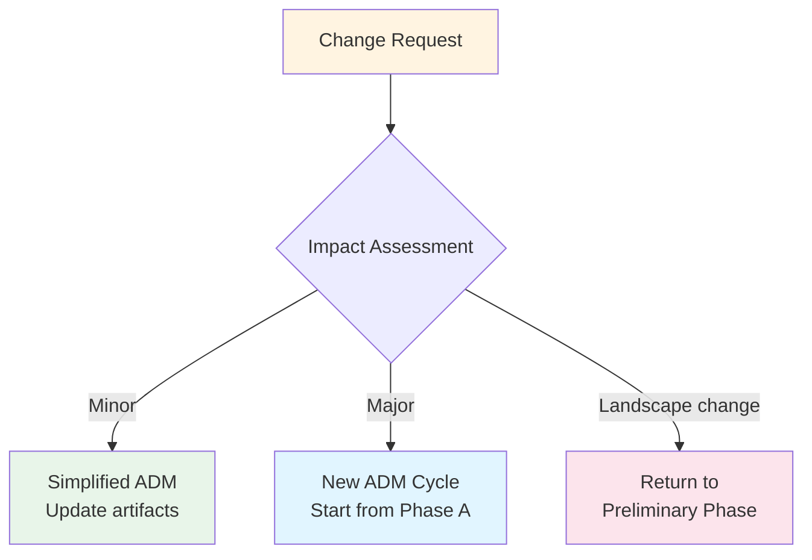

# ADM Phases — Detailed Guide

**Last Updated:** February 2025  
**Version:** TOGAF Standard, 10th Edition  
**Level:** Intermediate

---

## Overview

The Architecture Development Method (ADM) is the heart of TOGAF. This guide provides a detailed walkthrough of each phase — its objectives, key activities, inputs, outputs, and practical tips. While the ADM is presented as a sequential cycle, the 10th Edition emphasizes that phases can be performed iteratively and adapted to the organization's context.

---

## Preliminary Phase: Framework & Principles

**Purpose:** Prepare the organization for enterprise architecture work.

### Objectives

- Establish the architecture capability (team, roles, processes, tools)
- Tailor TOGAF to the organization's context
- Define architecture principles
- Secure executive sponsorship

### Key Activities

1. Define the scope of organizations affected by EA
2. Establish the EA governance framework
3. Define and establish the EA team and organization
4. Tailor TOGAF to the organization's needs
5. Develop architecture principles

### Inputs → Outputs

| Inputs | Outputs |
|--------|---------|
| Organizational context (strategy, structure, culture) | Tailored Architecture Framework |
| Existing architecture frameworks | Architecture Principles |
| Stakeholder expectations | Architecture Capability (roles, processes, tools) |
| Board directives and policies | Organizational Model for EA |
| | Request for Architecture Work (initial) |

> [!TIP]
> In banking/financial services, the Preliminary Phase should explicitly address regulatory requirements (e.g., OJK, BI regulations) and establish principles around data residency, security, and compliance.

---

## Phase A: Architecture Vision

**Purpose:** Set the scope, constraints, and expectations for the architecture project.

### Objectives

- Establish the architecture project scope and vision
- Identify stakeholders and their concerns
- Validate business goals and strategic drivers
- Obtain formal approval to proceed (Statement of Architecture Work)

### Key Activities

1. Establish the architecture project
2. Identify stakeholders, concerns, and business requirements
3. Confirm and elaborate business goals and drivers
4. Evaluate capabilities and assess readiness for transformation
5. Define the scope and develop Architecture Vision
6. Assess risks and develop mitigation strategies
7. Develop the Statement of Architecture Work and obtain approval

### Inputs → Outputs

| Inputs | Outputs |
|--------|---------|
| Request for Architecture Work | Approved Statement of Architecture Work |
| Business principles, goals, drivers | Architecture Vision |
| Organizational Model for EA | Refined business goals and drivers |
| Tailored Architecture Framework | Draft Architecture Definition Document |
| Architecture Repository | Communications Plan |

---

## Phase B: Business Architecture

**Purpose:** Develop the target business architecture that aligns with the Architecture Vision.

### Objectives

- Describe the baseline business architecture (as-is)
- Develop the target business architecture (to-be)
- Perform gap analysis between baseline and target
- Define the roadmap for business architecture

### Key Activities

1. Select reference models, viewpoints, and tools
2. Develop the baseline business architecture description
3. Develop the target business architecture description
4. Perform gap analysis
5. Define roadmap components and resolve impacts

### Key Artifacts

- **Catalogs:** Organization/Actor, Driver/Goal/Objective, Role, Business Service/Function, Location, Process/Event/Control/Product
- **Matrices:** Business Interaction, Actor/Role
- **Diagrams:** Business Footprint, Business Service/Information, Functional Decomposition, Product Lifecycle

> [!IMPORTANT]
> For financial institutions, the Business Architecture phase should map regulatory compliance requirements to business capabilities and identify how regulations impact business processes.

---

## Phase C: Information Systems Architecture

**Purpose:** Develop the target data and application architectures.

This phase has two components:

### C1: Data Architecture

**Key Activities:**
1. Select reference models and tools
2. Develop baseline data architecture
3. Develop target data architecture
4. Perform gap analysis
5. Define data migration requirements

**Key Artifacts:**
- **Catalogs:** Data Entity/Component
- **Matrices:** Data Entity/Business Function, Application/Data
- **Diagrams:** Conceptual Data, Logical Data, Data Dissemination, Data Lifecycle

### C2: Application Architecture

**Key Activities:**
1. Select reference models and tools
2. Develop baseline application architecture
3. Develop target application architecture
4. Perform gap analysis
5. Define application interactions and integration requirements

**Key Artifacts:**
- **Catalogs:** Application Portfolio
- **Matrices:** Application/Organization, Application/Function, Application/Role
- **Diagrams:** Application Communication, Application and User Location, Application Use Case

---

## Phase D: Technology Architecture

**Purpose:** Develop the target technology architecture that enables the data and application architectures.

### Key Activities

1. Select reference models, viewpoints, and tools
2. Develop baseline technology architecture
3. Develop target technology architecture
4. Perform gap analysis
5. Define technology standards and guidelines

### Key Artifacts

- **Catalogs:** Technology Standards, Technology Portfolio
- **Matrices:** Application/Technology
- **Diagrams:** Environments and Locations, Platform Decomposition, Processing, Networked Computing/Hardware

---

## Phase E: Opportunities & Solutions

**Purpose:** Identify the major implementation projects and group them into work packages.

### Key Activities

1. Determine key corporate change attributes
2. Identify and consolidate gaps from Phases B, C, D
3. Assess readiness factors and determine constraints
4. Review and consolidate gap analysis results
5. Group work packages and define architectures necessary
6. Identify transition architectures
7. Create the implementation portfolio

### Output

- **Implementation and Migration Strategy** — prioritized work packages
- **Transition Architectures** — intermediate states between baseline and target

---

## Phase F: Migration Planning

**Purpose:** Create a detailed implementation and migration plan.

### Key Activities

1. Confirm management framework interactions (project management, governance)
2. Assign business value to each work package
3. Estimate resource requirements and availability
4. Prioritize and sequence migration projects
5. Confirm the Architecture Roadmap
6. Generate the Implementation and Migration Plan

### Output

- **Architecture Roadmap** (finalized)
- **Implementation and Migration Plan** (detailed)

> [!TIP]
> In banking environments, migration planning must account for regulatory change windows, minimal downtime requirements for core banking systems, and data migration compliance (e.g., data integrity validation).

---

## Phase G: Implementation Governance

**Purpose:** Ensure that the implementation conforms to the defined architecture.

### Key Activities

1. Confirm scope and priorities with implementation management
2. Identify architecture deployment resources
3. Guide development toward the target architecture
4. Perform compliance reviews
5. Review implementation progress and address issues
6. Close completed implementation projects

### Key Artifacts

- Architecture Contracts
- Compliance Assessments
- Architecture-conformant implementations

---

## Phase H: Architecture Change Management

**Purpose:** Ensure the architecture evolves in response to business changes.

### Key Activities

1. Establish a value realization process
2. Deploy monitoring tools (business and technology)
3. Manage risks and perform architecture compliance reviews
4. Assess change requests — do they need a new ADM cycle?
5. Manage the EA governance process

### Decision: New ADM Cycle?

---

## Requirements Management

**Purpose:** Continuous process that operates across all ADM phases.

Requirements Management is not a linear phase — it runs in parallel with every ADM phase and ensures:

- Architecture requirements are identified, stored, and managed
- Requirements are fed into the appropriate ADM phase
- Conflicts between requirements are resolved
- Changes to requirements trigger re-evaluation of affected phases

---

## Key Takeaways

- The ADM is **iterative and flexible** — phases can overlap, be reordered, or be simplified
- Each phase has defined **inputs, activities, and outputs** — but these are guidelines, not rigid mandates
- **Gap analysis** is performed in phases B, C, and D to compare baseline vs. target
- **Phases E and F** bridge architecture definition and implementation
- **Phase G** ensures implementation stays true to architecture; **Phase H** ensures the architecture evolves
- **Requirements Management** is continuous and touches every phase

## Cross-References

- Foundation overview: [Core Concepts — ADM section](../01_foundation/02_core_concepts.md)
- Related: [COBIT Implementation](../COBIT/03_implementation/)
- Related: [ITIL Direct, Plan & Improve](../ITIL/02_managing_professional/direct_plan_improve.md)
- Next topic: [Architecture Domains in Depth](./02_architecture_domains.md)

## Sources

- The Open Group — TOGAF Standard, 10th Edition: ADM
- The Open Group — [ADM Phases Overview](https://pubs.opengroup.org/togaf-standard/)
- Visual Paradigm — "TOGAF ADM Phases Tutorial"
- QualiWare — "TOGAF ADM Phase Guide"
