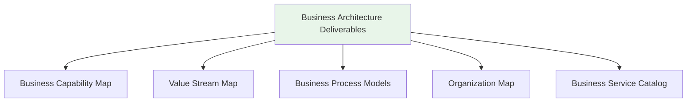
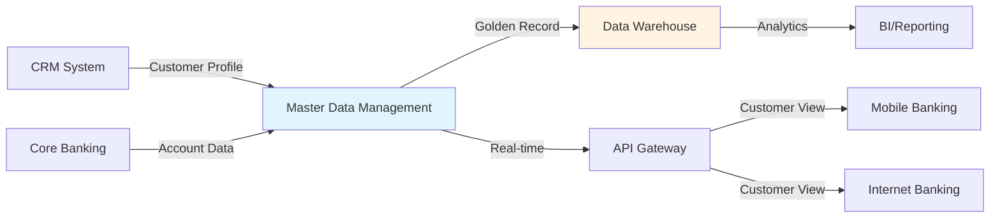
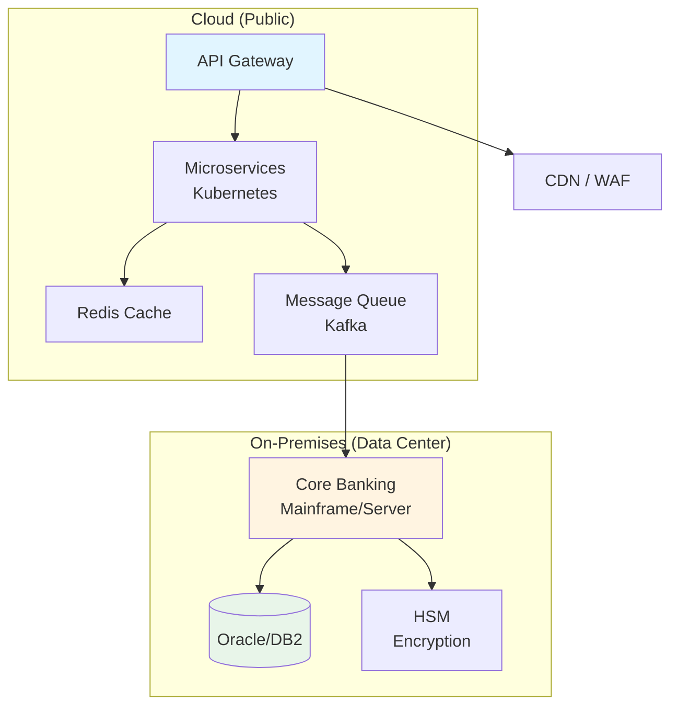
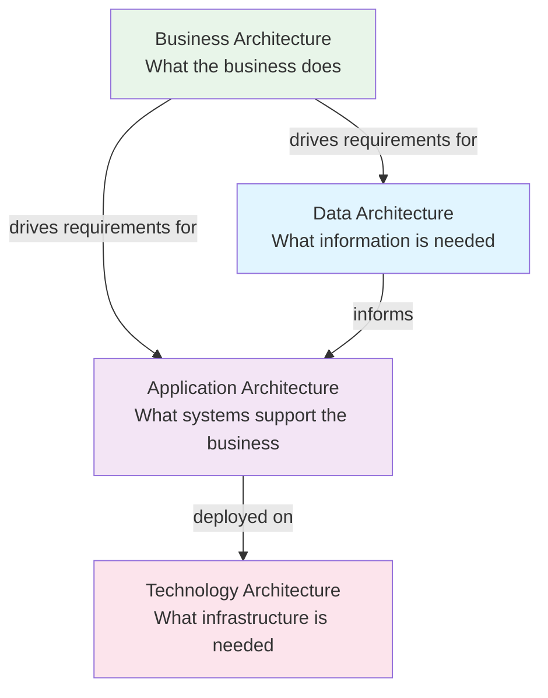

# Architecture Domains in Depth

**Last Updated:** February 2025  
**Version:** TOGAF Standard, 10th Edition  
**Level:** Intermediate

---

## Overview

TOGAF defines four architecture domains — Business, Data, Application, and Technology (BDAT) — that together provide a holistic view of the enterprise. This document explores each domain in detail, covering its scope, deliverables, techniques, and practical examples relevant to financial services and banking.

---

## Business Architecture (Phase B)

### Scope

Business Architecture defines the business strategy, governance, organization, and key business processes of an enterprise. It serves as the foundation that drives requirements for the other three domains.

### Key Concepts

| Concept | Description |
|---------|-------------|
| **Business Capability** | A high-level description of what the business does (e.g., "Loan Processing," "Customer Onboarding") |
| **Value Stream** | An end-to-end sequence of activities that delivers value to a stakeholder (e.g., "Account Opening Journey") |
| **Business Process** | A detailed set of steps that implements a capability within a value stream |
| **Business Service** | A service exposed to customers, partners, or internal consumers |
| **Organization Map** | Defines roles, responsibilities, and reporting lines |

### Deliverables

### Banking Example: Customer Onboarding

A business architecture view of a customer onboarding process:

| Layer | Components |
|-------|-----------|
| **Value Stream** | Account Opening Journey |
| **Capabilities** | Identity Verification, KYC/AML Screening, Account Provisioning, Product Assignment |
| **Processes** | Collect customer data → Verify identity → Screen against sanctions → Create account → Assign products |
| **Services** | Digital Onboarding Portal, Branch Onboarding Service |
| **Stakeholders** | Retail customers, Compliance team, Branch staff, IT operations |

> [!TIP]
> In banking, Business Architecture should always map capabilities to regulatory requirements (KYC, AML, data privacy) to ensure compliance is embedded at the business level, not retrofitted.

---

## Data Architecture (Phase C — Part 1)

### Scope

Data Architecture describes the structure of an organization's logical and physical data assets and the associated data management resources. It answers: *What data do we need, how is it organized, and how does it flow?*

### Key Concepts

| Concept | Description |
|---------|-------------|
| **Data Entity** | A fundamental category of data (e.g., Customer, Account, Transaction) |
| **Conceptual Data Model** | High-level view of data entities and their relationships |
| **Logical Data Model** | Detailed model independent of technology — attributes, keys, relationships |
| **Physical Data Model** | Technology-specific implementation — tables, columns, indexes |
| **Data Flow Diagram** | Shows how data moves between systems, processes, and external entities |
| **Data Lifecycle** | How data is created, stored, used, archived, and disposed |

### Deliverables

- **Data Entity/Component Catalog** — Inventory of all data entities
- **Data Entity/Business Function Matrix** — Which business functions create/use which data
- **Application/Data Matrix** — Which applications consume/produce which data
- **Conceptual, Logical, and Physical Data Models**
- **Data Dissemination Diagram** — How data flows across the enterprise
- **Data Lifecycle Diagram** — States and transitions of key data entities

### Banking Example: Customer Data Architecture

> [!IMPORTANT]
> Financial institutions must address data residency, data sovereignty, and regulatory reporting requirements (e.g., Basel III/IV, IFRS 9) within their Data Architecture.

---

## Application Architecture (Phase C — Part 2)

### Scope

Application Architecture provides a blueprint for individual application systems to be deployed, their interactions, and their relationships to core business processes. It answers: *What applications do we need, and how do they interact?*

### Key Concepts

| Concept | Description |
|---------|-------------|
| **Application Component** | A self-contained unit of application functionality (e.g., "Loan Origination System") |
| **Application Portfolio** | The complete set of applications in the enterprise |
| **Application Interface** | The point of interaction between applications (APIs, messaging, file transfers) |
| **Application Integration** | How applications exchange data and functionality |

### Deliverables

- **Application Portfolio Catalog** — Full inventory of applications with ownership, status, technology stack
- **Application/Organization Matrix** — Which business units use which applications
- **Application/Function Matrix** — Which business functions are supported by which applications
- **Application Communication Diagram** — How applications interact
- **Application Use Case Diagram** — Key scenarios and user interactions

### Banking Example: Application Landscape

| Application Category | Systems | Integration Pattern |
|---------------------|---------|-------------------|
| **Core Banking** | T24, Finacle, or Flexcube | Hub — integrates with all other systems |
| **Digital Channels** | Mobile app, Internet banking, ATM | API Gateway to Core Banking |
| **Risk & Compliance** | AML screening, Credit scoring, Regulatory reporting | Batch + real-time feeds from Core Banking |
| **Customer Management** | CRM (Salesforce, Dynamics) | REST API to Core Banking + MDM |
| **Payments** | SWIFT, RTGS, domestic clearing | Message-based (ISO 20022) |

> [!WARNING]
> Application portfolio rationalization is a key goal of Application Architecture. Financial institutions often have hundreds of legacy applications — the architecture should identify redundancies, sunset candidates, and consolidation opportunities.

---

## Technology Architecture (Phase D)

### Scope

Technology Architecture describes the hardware, software, and network infrastructure required to support the deployment of the other architecture domains. It answers: *What technology platforms and infrastructure do we need?*

### Key Concepts

| Concept | Description |
|---------|-------------|
| **Technology Component** | A physical or virtual technology resource (server, database, middleware) |
| **Platform** | A combination of technology components providing a specific capability (e.g., container platform, API platform) |
| **Technology Standard** | An agreed-upon technology choice for a particular purpose (e.g., "PostgreSQL for relational databases") |
| **Deployment Model** | How services are deployed — on-premises, cloud, hybrid, multi-cloud |

### Deliverables

- **Technology Standards Catalog** — Approved technologies by category
- **Technology Portfolio Catalog** — Inventory of all technology components
- **Application/Technology Matrix** — Which applications run on which technology
- **Platform Decomposition Diagram** — How platforms are structured
- **Environments and Locations Diagram** — Data centers, cloud regions, availability zones

### Banking Example: Technology Platform

---

## Domain Interdependencies

The four domains are not independent — they form a layered architecture:

| Dependency | Example |
|-----------|---------|
| Business → Data | "We need to onboard customers" → "We need Customer, KYC, Account entities" |
| Business → Application | "We need loan processing" → "We need a Loan Origination System" |
| Data → Application | "Customer data must be mastered" → "We need an MDM platform" |
| Application → Technology | "Loan system needs high availability" → "Deploy on Kubernetes with auto-scaling" |

---

## Key Takeaways

- **Business Architecture is the driver** — the other domains derive their requirements from it
- **Data and Application Architecture** form Information Systems Architecture (Phase C)
- Each domain has defined **catalogs, matrices, and diagrams** as artifacts
- In banking, each domain must account for **regulatory compliance, security, and resilience**
- **Gap analysis** between baseline and target is performed for every domain

## Cross-References

- Foundation overview: [Core Concepts — BDAT section](../01_foundation/02_core_concepts.md)
- Related: [COBIT — APO Domain (Align, Plan and Organize)](../COBIT/02_governance_objectives/)
- Related: [FinOps — Cloud Architecture Optimization](../FinOps/03_advanced/)
- Previous topic: [ADM Phases Detailed](./01_adm_phases_detailed.md)

## Sources

- The Open Group — TOGAF Standard, 10th Edition: Architecture Content Framework
- The Open Group — [TOGAF Architecture Domains](https://pubs.opengroup.org/togaf-standard/)
- Medium — "Understanding TOGAF Architecture Domains (BDAT)"
- SnapLogic — "TOGAF Enterprise Architecture Framework Explained"
