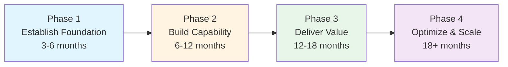
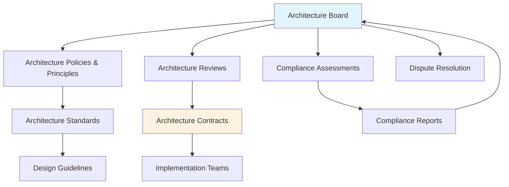

# TOGAF Implementation and Governance

**Last Updated:** February 2025  
**Version:** TOGAF Standard, 10th Edition  
**Level:** Advanced

---

## Overview

Establishing an enterprise architecture practice is as much an organizational change effort as it is a technical one. This guide covers how to implement TOGAF in an organization, set up architecture governance, address common challenges, and integrate TOGAF with other frameworks such as COBIT, ITIL, and FinOps.

---

## Setting Up an EA Practice

### Architecture Capability Maturity

Before implementing TOGAF, assess the organization's current EA maturity:

| Level | Description | Characteristics |
|-------|-------------|-----------------|
| **0 — None** | No EA practice | Ad-hoc decisions, no architecture governance |
| **1 — Initial** | Informal, person-dependent | Some architecture awareness, no formal process |
| **2 — Under Development** | EA process beginning to form | Architecture principles defined, ADM being adopted |
| **3 — Defined** | Formal EA practice established | Governance board in place, repository populated, ADM institutionalized |
| **4 — Managed** | EA practice measured and reported | Compliance tracked, value of EA demonstrated to leadership |
| **5 — Optimized** | EA continuously improving | EA embedded in business strategy, proactive innovation |

### Implementation Roadmap

| Phase | Activities | Deliverables |
|-------|-----------|-------------|
| **1. Establish Foundation** | Define EA vision, secure executive sponsorship, tailor TOGAF, hire/assign EA team | Tailored framework, architecture principles, governance charter |
| **2. Build Capability** | Run first ADM cycle, populate architecture repository, set up governance board | Baseline architecture, initial target architecture, Architecture Roadmap |
| **3. Deliver Value** | Execute architecture-driven projects, demonstrate ROI, expand scope | Completed transitions, compliance reports, stakeholder buy-in |
| **4. Optimize & Scale** | Embed EA in strategic planning, automate compliance, expand across business units | Mature governance, cross-domain integration, continuous improvement |

---

## Architecture Governance

### Governance Framework

Architecture governance ensures that architecture decisions are made systematically and implementations conform to the defined architecture.

### Architecture Board

The Architecture Board is the governance body responsible for:

| Responsibility | Description |
|---------------|-------------|
| **Set direction** | Define architecture vision, principles, standards |
| **Review & approve** | Review architecture work products; approve or reject proposals |
| **Ensure compliance** | Verify implementations conform to architecture |
| **Resolve disputes** | Arbitrate when implementation teams deviate from architecture |
| **Manage change** | Decide when changes to the architecture require a new ADM cycle |

**Composition:**

- Chief Architect (chair)
- Domain architects (Business, Data, Application, Technology)
- Senior business stakeholders
- IT leadership representatives
- Compliance/risk representative (critical for financial services)

### Architecture Compliance

Compliance levels range from full conformance to total deviation:

| Level | Description | Action Required |
|-------|-------------|-----------------|
| **Irrelevant** | Architecture standard does not apply | Document rationale |
| **Consistent** | Implementation supports the architecture | None |
| **Compliant** | Implementation fully conforms | None |
| **Conformant** | Implementation fills in details not covered by architecture | Document for future reference |
| **Non-Conformant** | Implementation deviates with justification | Seek Architecture Board dispensation |
| **Non-Compliant** | Implementation conflicts with architecture | Escalate to Architecture Board |

---

## Common Implementation Challenges

### Organizational Challenges

| Challenge | Mitigation |
|-----------|-----------|
| **Lack of executive sponsorship** | Tie EA to business outcomes (cost savings, risk reduction, faster delivery) |
| **"Ivory tower" perception** | Embed architects in project teams; produce actionable deliverables |
| **Shadow IT / architecture bypass** | Make the Architecture Board a facilitator, not a bottleneck; streamline approval processes |
| **Too much documentation** | Focus on deliverables that create value; leverage architecture tools to automate |
| **Skills gap** | Invest in TOGAF certification; hire experienced architects; establish EA community of practice |

### Technical Challenges

| Challenge | Mitigation |
|-----------|-----------|
| **Legacy spaghetti architecture** | Start with application portfolio rationalization; define isolation boundaries |
| **Unclear scope** | Begin with narrow scope (e.g., one business domain) and expand iterally |
| **Tool overload** | Start simple (even spreadsheets); introduce EA tools (e.g., Sparx EA, LeanIX, Mega) as maturity grows |
| **Keeping architecture current** | Automate repository updates; integrate with CI/CD and ITSM tools |

> [!WARNING]
> The most common failure mode for EA programs is over-engineering the initial effort. Start small, deliver visible value early, and expand based on demonstrated results.

---

## Integrating TOGAF with Other Frameworks

### TOGAF + COBIT

| TOGAF | COBIT | Integration Point |
|-------|-------|-------------------|
| ADM governance (Phase G) | EDM — Evaluate, Direct, Monitor | COBIT governs the architecture function |
| Architecture principles | APO01 — Managed IT Framework | Architecture principles inform IT management policies |
| Architecture compliance | MEA01 — Monitor, Evaluate, Assess | COBIT's MEA domain tracks architecture compliance |
| Risk identification (Phase A) | APO12 — Managed Risk | TOGAF risks feed into COBIT's risk management |

**Practical approach:** Use COBIT to define *what* governance objectives apply to EA, and TOGAF's ADM to define *how* architecture work is performed.

### TOGAF + ITIL

| TOGAF | ITIL | Integration Point |
|-------|------|-------------------|
| Application Architecture | Service Design | Architecture defines the blueprint; ITIL operationalizes it |
| Phase G — Implementation Governance | Change Enablement | Architecture compliance reviews during change management |
| Phase H — Change Management | Continual Improvement | Architecture evolution aligns with ITIL's improvement cycle |
| Technology Architecture | Infrastructure & Platform Management | Architecture standards guide ITIL technology operations |

**Practical approach:** TOGAF defines *what* the target architecture looks like; ITIL ensures the *services running on that architecture* are managed effectively.

### TOGAF + FinOps

| TOGAF | FinOps | Integration Point |
|-------|--------|-------------------|
| Technology Architecture (cloud) | Cloud Cost Management | Architecture decisions directly impact cloud costs |
| Phase E — Opportunities & Solutions | FinOps Lifecycle (Inform → Optimize → Operate) | Architecture options analysis includes FinOps cost modeling |
| Architecture Roadmap | FinOps Budgeting & Forecasting | Migration roadmap feeds FinOps financial planning |

**Practical approach:** When TOGAF's Technology Architecture involves cloud, embed FinOps principles into architecture decisions from Phase D onward.

---

## Measuring EA Value

### Key Metrics

| Category | Metric | Target |
|----------|--------|--------|
| **Efficiency** | Application portfolio rationalization (% reduction) | 15-30% over 3 years |
| **Compliance** | Architecture compliance rate | >90% for new projects |
| **Speed** | Time from architecture decision to implementation | Reduce by 30% |
| **Cost** | IT infrastructure cost optimization | 10-20% savings |
| **Risk** | Audit findings related to architecture | Reduce year-over-year |
| **Alignment** | % of IT projects aligned to architecture roadmap | >80% |

### Reporting to Leadership

Create a quarterly EA value dashboard:
- Architecture compliance trends
- Portfolio rationalization progress
- Cost savings attributed to architecture decisions
- Risk reduction (audit findings resolved)
- Strategic project alignment

---

## Key Takeaways

- Implementing TOGAF is an **organizational change effort** — executive sponsorship is essential
- Architecture governance through a **Board, compliance reviews, and contracts** ensures value
- Start small, deliver visible value early, and **expand incrementally**
- TOGAF integrates naturally with **COBIT** (governance), **ITIL** (service management), and **FinOps** (cloud costs)
- Measuring EA value with **concrete metrics** sustains organizational support

## Cross-References

- Related: [COBIT Governance Objectives](../COBIT/02_governance_objectives/)
- Related: [COBIT Implementation](../COBIT/03_implementation/)
- Related: [ITIL Continual Improvement](../ITIL/04_practices/)
- Related: [FinOps Cloud Optimization](../FinOps/03_advanced/)
- Foundation overview: [Core Concepts — Capability Framework](../TOGAF/01_foundation/02_core_concepts.md)

## Sources

- The Open Group — TOGAF Standard, 10th Edition: Architecture Governance
- The Open Group — TOGAF Standard, 10th Edition: Architecture Capability Framework
- Archimetric — "Implementing TOGAF in Practice"
- Detecon — "TOGAF 10th Edition: What Changed and Why It Matters"
- ISACA — "Integrating COBIT with TOGAF"
