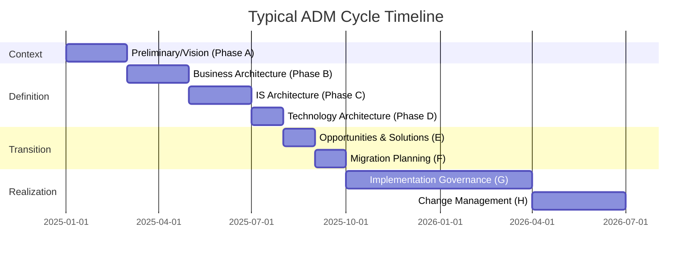
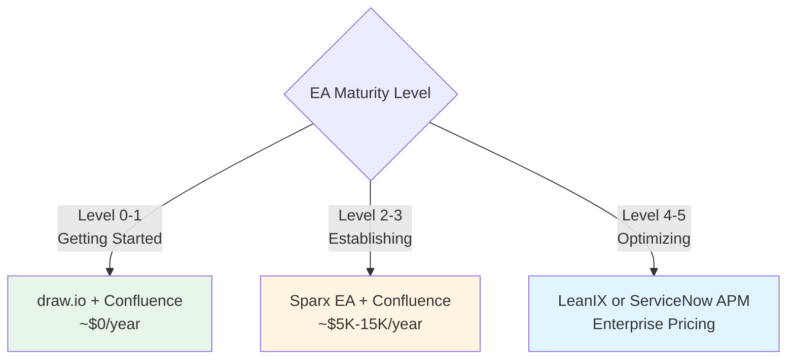
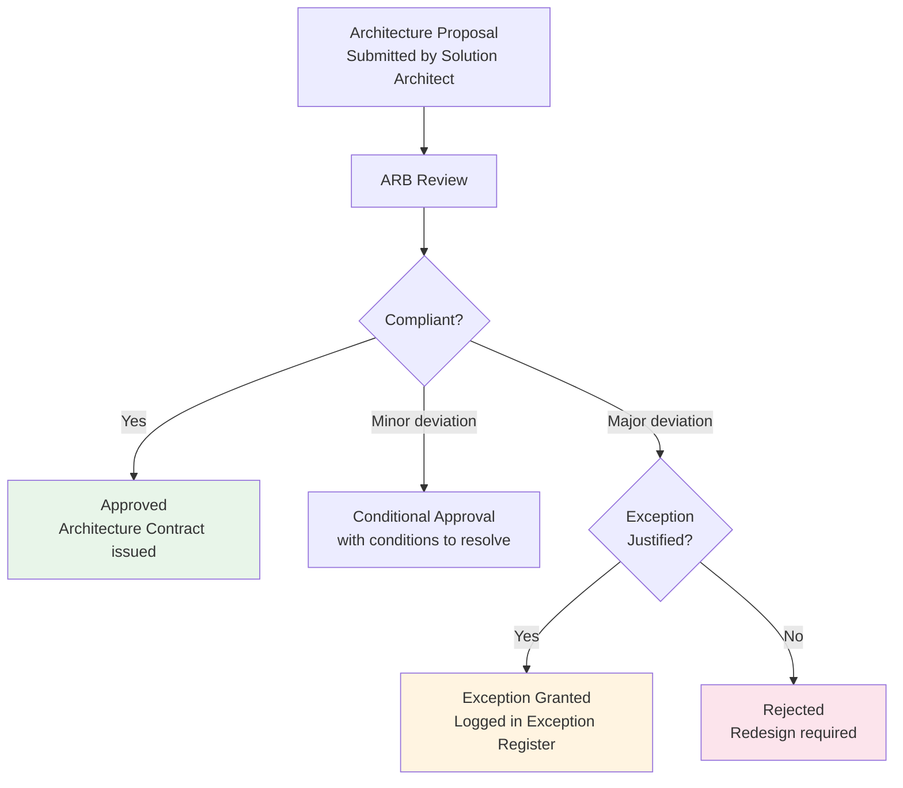

# TOGAF Practical Operations Guide

**Last Updated:** February 2025  
**Version:** TOGAF Standard, 10th Edition  
**Level:** Advanced

---

## Overview

This guide covers the real-world operational cadence for running an enterprise architecture practice using TOGAF — the meetings, documents, tools, roles, and governance ceremonies. It bridges the gap between the ADM as described in TOGAF and what an EA team actually does week-to-week.

---

## Meeting Cadence

| Meeting | ADM Alignment | Frequency | Duration | Attendees | Purpose |
|---------|--------------|-----------|----------|-----------|---------|
| **EA Team Standup** | All phases | Weekly | 30 min | Chief Architect, Domain architects | Sync current work, blockers, priorities |
| **Architecture Review Board (ARB)** | Phase G (Governance) | Bi-weekly | 60–90 min | Chief Architect, Domain architects, IT leads, Business reps | Review architecture proposals, approve/reject, grant exceptions |
| **ADM Phase Workshop** | Active ADM phase | As needed | 2–4 hours | Architects, SMEs, Stakeholders | Working sessions for the current ADM phase (vision, domain analysis, etc.) |
| **Stakeholder Engagement** | Phase A (Vision) | Monthly | 60 min | Enterprise Architect, Business sponsors, IT leadership | Align architecture direction with business priorities |
| **Architecture Compliance Review** | Phase G | Monthly | 60 min | Chief Architect, Project leads | Assess implementation compliance with architecture standards |
| **Technology Radar Review** | Phase D / RM | Quarterly | 90 min | Technology Architect, R&D leads, CTO | Evaluate emerging technologies; update technology standards |
| **EA Steering Committee** | Preliminary / Phase A | Quarterly | 90 min | CIO, CTO, Business VPs, Chief Architect | Strategic direction, portfolio alignment, EA investment decisions |
| **Architecture Retrospective** | Phase H | Quarterly | 60 min | EA team | Review EA effectiveness, lessons learned, process improvements |

### ADM Cycle Calendar (Typical)

> [!TIP]
> Most organizations run **multiple ADM cycles in parallel** — a strategic cycle for the full enterprise and smaller, faster cycles for specific domains or projects.

---

## Key Documents & Templates

### Architecture Governance Documents

| Document | ADM Phase | Purpose | Review Cycle |
|----------|----------|---------|-------------|
| **Architecture Principles** | Preliminary | Enduring rules guiding architecture decisions | Annually |
| **Architecture Vision** | Phase A | High-level scope, stakeholders, value proposition | Per ADM cycle |
| **Statement of Architecture Work** | Phase A | Contract between EA and sponsor defining scope and deliverables | Per ADM cycle |
| **Architecture Definition Document** | Phases B–D | Baseline and target architecture descriptions per domain | Per ADM cycle |
| **Architecture Requirements Specification** | Phases B–D | Detailed architecture requirements incl. gap analysis | Per ADM cycle |
| **Architecture Roadmap** | Phases E–F | Time-sequenced plan of work packages and transition architectures | Quarterly update |
| **Implementation & Migration Plan** | Phase F | Detailed project plans for executing the roadmap | Per ADM cycle |
| **Architecture Compliance Report** | Phase G | Assessment of implementation conformance | Monthly |
| **Architecture Contract** | Phase G | Formal agreement between EA and implementation teams | Per project |

### Reference Documents

| Document | Purpose | Review Cycle |
|----------|---------|-------------|
| **Technology Standards Catalog** | Approved, restricted, and retired technologies | Quarterly |
| **Architecture Repository Index** | Master index of all architecture assets | Ongoing |
| **Design Patterns Library** | Reusable architecture patterns and reference architectures | Ongoing |
| **Exception Register** | Approved deviations from architecture standards | Monthly |

---

## Tools & Technology Ecosystem

Enterprise Architecture requires specialized tooling to manage complex models, relationships, and portfolios. The tool landscape generally scales with EA maturity.

### 1. Enterprise Architecture Management (EAM) Platforms
- **LeanIX / Ardoq:** Modern, SaaS-based data-driven EA tools. Highly focused on Application Portfolio Management (APM), technology obsolescence, and business capability mapping. Very popular for Agile EA.
- **ServiceNow APM (Application Portfolio Management):** Gaining massive traction because it leverages the existing ServiceNow CMDB, seamlessly mapping operational applications and infrastructure up to EA business capabilities without requiring a separate tool integration.
- **Sparx Enterprise Architect / BiZZdesign / Mega HOPEX:** Traditional, rigorous modeling tools supporting ArchiMate and UML. Best for deep, complex technical architecture and systems engineering.

### 2. Modeling & Diagramming
- **Tools:** draw.io (diagrams.net), Lucidchart, Visio, Miro.
- **Usage:** Used heavily in Phase A (Vision) and workshops for conceptual diagramming, brainstorming, and stakeholder presentations before formal modeling in an EAM platform.

### 3. Technology Radar & Lifecycle
- **Tools:** ThoughtWorks Tech Radar, Backstage (Spotify), LeanIX.
- **Usage:** Used in Phase D (Technology Architecture) to explicitly track which technologies are "Adopt," "Trial," "Assess," or "Hold," guiding developer choices based on approved EA standards.

### Tool Selection Guidance

---

## Roles & Responsibilities

| Role | Scope | Key Responsibilities |
|------|-------|---------------------|
| **Chief Architect** | Enterprise-wide | Lead EA practice; chair ARB; report to CIO/CTO; set architecture direction |
| **Business Architect** | Business domain | Model business capabilities, value streams, processes; liaise with business stakeholders |
| **Data Architect** | Data domain | Design data models, data governance; ensure data quality standards |
| **Application Architect** | Application domain | Manage application portfolio; design integration patterns; rationalize applications |
| **Technology/Infrastructure Architect** | Technology domain | Define platforms, infrastructure standards; manage technology lifecycle |
| **Solution Architect** | Per project/solution | Design solution architecture; ensure compliance with EA standards; bridge EA and project teams |
| **EA Governance Officer** | Governance | Manage ARB logistics; track compliance; maintain exception register |

### RACI: Architecture Review Board Decision

| Activity | Chief Architect | Domain Architect | Solution Architect | ARB Members | Project Manager |
|----------|----------------|-----------------|-------------------|-------------|-----------------|
| Submit Architecture Proposal | I | C | R | I | I |
| Review & Assess Compliance | A | R | C | C | I |
| Approve / Reject / Request Changes | A | C | I | R | I |
| Grant Exception (if needed) | A | C | I | R | I |
| Track Compliance Post-Approval | I | R | R | I | C |

---

## Governance Ceremonies

### Architecture Decision Process

### Compliance Assessment Levels

| Level | Meaning | Action |
|-------|---------|--------|
| **Compliant** | Fully conforms to architecture standards | Approve |
| **Conformant** | Adds details not covered by standards | Approve and document |
| **Non-Conformant** | Deviates with justification | Exception required |
| **Non-Compliant** | Conflicts with standards, no justification | Reject |

---

## Reporting & Metrics

### EA Value Dashboard

| Metric | Target | Frequency |
|--------|--------|-----------|
| **Architecture Compliance Rate** | ≥90% for new projects | Monthly |
| **ARB Proposals Processed** | 100% within 2 weeks of submission | Monthly |
| **Exception Rate** | <15% of proposals | Quarterly |
| **Application Rationalization** | 10-20% portfolio reduction over 3 years | Quarterly |
| **Technology Standards Compliance** | ≥85% of technology stack on approved list | Quarterly |
| **Architecture Roadmap Delivery** | ≥80% of milestones on track | Quarterly |
| **Stakeholder Satisfaction** | ≥4.0/5.0 | Annually |
| **Time to Architecture Decision** | <10 business days average | Monthly |

---

## Banking / Financial Services Context

> [!IMPORTANT]
> EA in banking has specific considerations:

| Area | Banking Requirement | EA Impact |
|------|-------------------|-----------|
| **Core Banking Architecture** | Core banking is the architectural anchor — changes are high-risk, multi-year | Architecture Roadmap must include core banking modernization as a strategic program |
| **API & Open Banking** | PSD2/Open Banking regulations require API ecosystem | Application Architecture must include API gateway, partner integration, consent management |
| **Data Residency** | Customer data must reside in specific jurisdictions | Data and Technology Architecture must enforce locality constraints |
| **Disaster Recovery** | RPO/RTO requirements defined by regulators | Technology Architecture must specify DR topology, failover architecture |
| **Multi-Channel** | Branch, mobile, internet, ATM all consume shared services | Application Architecture must define omnichannel integration pattern |
| **Vendor Lock-In** | Regulators scrutinize single-vendor dependency | Technology standards must mandate multi-vendor or open-source alternatives for critical layers |

---

## Key Takeaways

- EA practice runs on a **weekly ARB → monthly compliance → quarterly strategic steering** cadence
- The **Architecture Review Board** is the central governance body — it approves, rejects, and grants exceptions
- Start with simple tools (draw.io + Confluence) and scale to enterprise EA platforms as maturity grows
- **Architecture Contracts and Compliance Reports** are the key operational governance artifacts
- In banking, **core banking modernization, API strategy, and data residency** are perennial architecture concerns

## Cross-References

- [TOGAF Implementation & Governance](./01_implementation_and_governance.md)
- [COBIT Practical Operations](../COBIT/03_implementation/05_practical_operations.md)
- [ITIL Practical Operations](../ITIL/04_practices/04_practical_operations.md)
