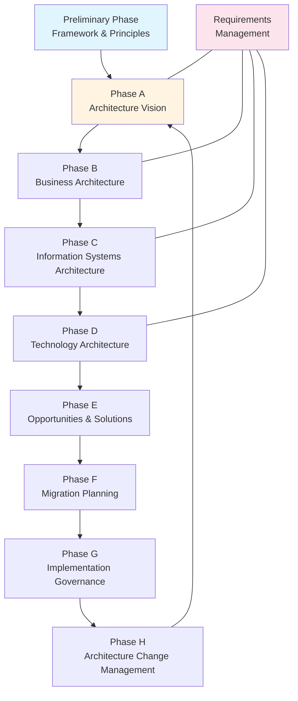

# TOGAF Learning Materials

**Version:** TOGAF Standard, 10th Edition (2022)  
**Last Updated:** February 2025

---

## Overview

TOGAF (The Open Group Architecture Framework) is a globally recognized framework for enterprise architecture (EA). It provides a comprehensive approach for designing, planning, implementing, and governing enterprise information architecture. Developed and maintained by The Open Group, TOGAF is used by organizations worldwide — from startups to large government agencies — to align IT strategy with business goals.

TOGAF's hallmark is the **Architecture Development Method (ADM)**, a step-by-step approach to developing and managing an enterprise architecture lifecycle. The 10th Edition introduced a modular structure, splitting the framework into **Fundamental Content** (core concepts) and **TOGAF Series Guides** (detailed topical guidance), making it more flexible and easier to adopt incrementally.

---

## What is TOGAF?

TOGAF provides:

- **Architecture Development Method (ADM)** — An iterative, phase-based method for developing enterprise architecture
- **Four Architecture Domains** — Business, Data, Application, and Technology (BDAT)
- **Enterprise Continuum** — A classification system for architecture and solution assets
- **Architecture Content Framework** — A structured metamodel for architecture deliverables
- **Architecture Capability Framework** — Guidance for establishing an EA practice

### Key Changes in the 10th Edition

| Aspect | TOGAF 9.2 | TOGAF Standard, 10th Edition |
|--------|-----------|------------------------------|
| **Structure** | Single monolithic document | Modular: Fundamental Content + Series Guides |
| **ADM** | Prescriptive phase sequencing | Flexible, removed directional arrowheads |
| **Guidance** | Limited how-to material | Greatly expanded practical guidance |
| **Scope** | Traditional EA | Cloud, AI, digital transformation, agile EA |
| **Updates** | Infrequent whole-document releases | Series Guides updated independently |

---

## TOGAF Core Structure

### Architecture Development Method (ADM)

The ADM is the core of TOGAF — an iterative cycle for developing enterprise architecture:

### Four Architecture Domains (BDAT)

| Domain | Focus | Key Deliverables |
|--------|-------|------------------|
| **Business Architecture** | Strategy, governance, organization, key processes | Business capability maps, value streams, org charts |
| **Data Architecture** | Logical and physical data assets, data management | Data models, data flow diagrams, data catalogs |
| **Application Architecture** | Application systems, interactions, business process mapping | Application portfolio, interface catalogs |
| **Technology Architecture** | Hardware, software, network infrastructure | Technology portfolio, platform decomposition |

---

## Certification Paths

### TOGAF 9 Path (Version 9.2)

| Level | Certification | Exam | Pass Mark |
|-------|--------------|------|-----------|
| Level 1 | TOGAF 9 Foundation | Part 1: 40 MCQ, 60 min | 55% (22/40) |
| Level 2 | TOGAF 9 Certified | Part 2: 8 scenario-based, 90 min | 60% |

### TOGAF 10th Edition Path

| Level | Certification | Focus |
|-------|--------------|-------|
| Level 1 | TOGAF EA Foundation | Core concepts, common language, framework structure |
| Level 2 | TOGAF EA Practitioner | Applying TOGAF in EA use cases |
| Specialist | TOGAF Business Architecture | Business modeling, scenarios, information mapping |

> [!TIP]
> Existing TOGAF 9 Certified holders can earn the TOGAF EA Practitioner via a bridge exam (OGEA-10B).

**Certifying Body:** The Open Group (vendor-neutral, globally recognized, no expiration)

---

## Learning Path

### Foundation Level (`01_foundation/`)

Start here for core TOGAF concepts and certification prep:

1. `01_overview_and_history.md` — TOGAF evolution, The Open Group, 10th Edition changes
2. `02_core_concepts.md` — ADM overview, four domains, Enterprise Continuum
3. `03_key_terminology.md` — Comprehensive glossary of TOGAF terms

### Intermediate Level (`02_intermediate/`)

Deep dive into ADM phases and architecture domains:

1. `01_adm_phases_detailed.md` — All ADM phases with inputs, outputs, and techniques
2. `02_architecture_domains.md` — BDAT domains in depth with deliverables and examples

### Advanced Level (`03_advanced/`)

Strategy, implementation, and framework integration:

1. `01_implementation_and_governance.md` — EA practice setup, governance, organizational change

### References (`references/`)

Official resources and certification guidance:

1. `01_official_resources.md` — The Open Group links, communities, publications
2. `02_certification_paths.md` — Detailed exam info, study strategies, bridge paths

---

## Key Concepts

### Architecture Development Method (ADM)

The ADM comprises:

- **Preliminary Phase** — Set up the architecture capability, tailor TOGAF, define principles
- **Phase A: Architecture Vision** — Define scope, stakeholders, vision, obtain approval
- **Phase B: Business Architecture** — Develop business architecture, model capabilities and value streams
- **Phase C: Information Systems Architecture** — Data architecture and application architecture
- **Phase D: Technology Architecture** — Technology portfolio and platform design
- **Phase E: Opportunities & Solutions** — Identify delivery vehicles, group work packages
- **Phase F: Migration Planning** — Detailed implementation and migration plans
- **Phase G: Implementation Governance** — Oversee architecture implementation
- **Phase H: Architecture Change Management** — Manage changes to the architecture
- **Requirements Management** — Central, continuous process managing architecture requirements

### Enterprise Continuum

A classification for architecture and solution assets, from generic (Foundation Architectures) to specific (Organization-Specific Architectures).

### Architecture Content Framework

Defines the deliverables, artifacts, and building blocks produced during the ADM cycle.

---

## TOGAF in Banking/Financial Services

TOGAF is particularly valuable for financial institutions that need to:

- **Align IT with business strategy** — EA bridges business vision and IT implementation
- **Manage regulatory compliance** — Architecture governance supports audit trails and control
- **Drive digital transformation** — ADM supports cloud migration, API strategy, and fintech integration
- **Rationalize application portfolios** — Application architecture identifies redundancy and optimization opportunities
- **Support the merger and acquisition (M&A) process** — Enterprise architecture maps enable smoother integration

---

## Related Frameworks

| Framework | Relationship to TOGAF |
|-----------|----------------------|
| **COBIT** | COBIT governs IT; TOGAF architects it — they complement at governance ↔ architecture boundary |
| **ITIL** | ITIL manages services; TOGAF designs the architecture those services run on |
| **ArchiMate** | The Open Group's modeling language, designed to work with TOGAF |
| **Zachman** | A classification schema for EA artifacts; can be used alongside TOGAF |
| **SAFe** | Agile-at-scale framework; TOGAF's ADM can be adapted for agile enterprise architecture |

---

## Getting Started

1. **Start with Foundation:** Read `01_foundation/` materials
2. **Understand ADM:** Core to all TOGAF work
3. **Learn the Domains:** Business → Data → Application → Technology
4. **Prepare for Exam:** Use reference materials and practice exams
5. **Explore Integration:** See how TOGAF works with COBIT, ITIL, and other frameworks in this repo

---

**Remember:** TOGAF is about aligning IT with business strategy through structured architecture development. The ADM is iterative — architecture is never "done," it evolves with the organization.
